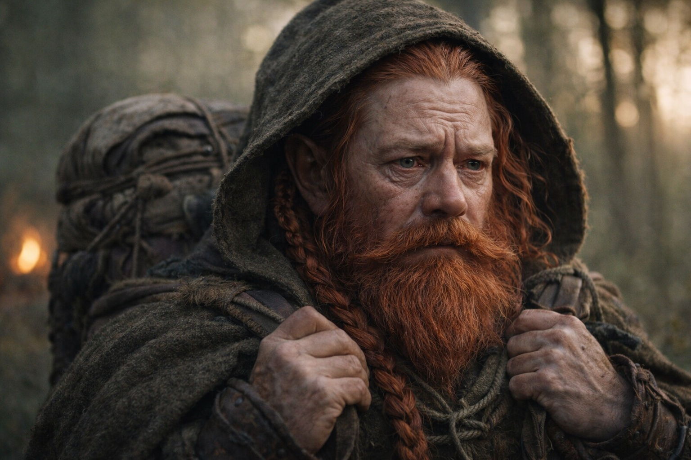

## Chapter 33 | Part 2 | The Realization

---

Maris reached for the vision and found him walking.

East, between black crystal formations. His two companions were with him, and a tall woman in armor walked ahead. No one held a weapon on him.

Maris pressed her palms against the cold ground. She could still feel the camp beneath her while she watched him.

She could feel the other artifact.

The Null lay beneath his shirt. She recognized its shape against his chest. The Beacon's pull shifted when he turned, though she couldn't tell whether it followed him or the artifact.

She opened her eyes. Blood from both nostrils this time. She didn't wipe it. Let it drip.

"She sees him," Maris said.

The group was gathered around the dead fire. Dulint sat with the pack between his knees, protective, instinctive. Balin was beside him, walking stick across his lap. Aldric stood. Xandor was closest to Maris, his good hand still pressed against the spruce trunk, listening with whatever senses his training had given him access to.

"The dark elf?" Xandor said.

"The Null. She saw it again." She pressed the bridge of her nose. "The pull moves with him. We treated it as a place to reach. It won't stay in one place."

"It was pointing at him," Xandor said. Not a question.

"Him and what he carries. She can't separate them." She looked at Dulint. "We need to keep checking the bearing."

"And now he's moving," Aldric said.

"Now he's moving."

Aldric looked down at the route he'd drawn beside the fire.

Balin was the first to speak. "So everything we've been walking toward. The barrier. The convergence. The thing at the end of the northeast pull." He tapped his walking stick against his boot. "It's a person."

"A person carrying one piece," Maris said. "There were other signals too. She doesn't know why this one is strongest now."

"Does he know?" Dulint asked.

"He felt our signal in the running vision. She doesn't know whether he knows who we are."

"Can he feel the Beacon?"

She closed her eyes and reached again. Pain struck behind her left eye. She clenched her jaw and held the image until she could see him.

He was eating beside a crystal formation. His pack lay open within reach. He looked less strained than he had in the earlier visions.

The armored woman stood near him, watching while he ate.

Maris could see her face but felt nothing from her. She tried again, and the pain sharpened without revealing anything more.

"There is a pull on his side too." She opened her eyes and waited for the pain to ease. "She can't tell what he makes of it."

Xandor took his hand from the tree. "Sense locates other components. That much fits the texts. We shouldn't assume Erase itself is active. We know only that our bearing follows its bearer."

"And she can't read the woman beside him," Maris said. "She sees her, but feels nothing."

"Can she hide others from it?" Aldric asked, his hand on his sword. Maris shook her head; she had no way to tell.

"We could reach the place we marked and find he'd left," Dulint said.

"Yes."

"Then we follow him."

"If we want to find that piece."

Dulint gripped the pack straps. Maris waited while he looked at the map.

The Beacon's pull held east-northeast. She could feel it changing by small degrees.

"What do we do?" Balin asked.

Aldric crouched beside the map.

---

**End of Chapter 33.2 —> 33.3: [What the Beacon Lost: The Course Change](/what-the-beacon-lost-the-course-change/)**
