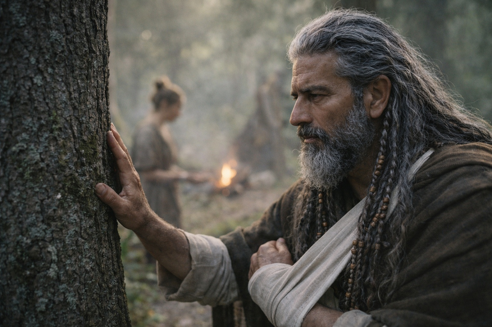

## Chapter 33 | Part 1 | The Stutter

---

---

The Beacon stopped pointing north.

Maris felt it first, the way she'd felt every shift since the spruce forest, as a disturbance in the space behind her ribs where the pull lived. The pull had been constant since they'd crossed the Frostgard border. Northeast. Steady. Reliable in the way a compass was reliable, giving direction without explanation, asking nothing in return for its clarity.

Then it stuttered.

Not a break. Not a stop. A stutter, the kind of hesitation that machines make when their inputs suddenly disagree. The pull fragmented, scattered, and for one breath it pointed everywhere at once, as if the thing it was tracking had multiplied or dissolved or moved in a direction that didn't correspond to any geography she understood.

"Maris?" Xandor's voice. He was watching her from across the morning camp. His left arm sat in its sling, still, the hand curling and uncurling in the involuntary exercises he'd been doing since the feeling started returning. "What is it?"

She held up a hand. Wait.

The Beacon was in Dulint's pack, ten feet away. She could feel it through the leather and cloth and whatever wrapping the old dwarf had put around it. It was humming. Not the directional hum that meant northeast. A searching hum. The sound a tuning fork makes when someone changes the note it's supposed to match.

Then it settled.

The pull returned. Not northeast. Not north. A direction she couldn't name because it wasn't fixed. It moved. Slowly, continuously, like a finger tracing a path on a map.

"Something changed," she said.

Aldric was beside her in three steps. He'd been checking the southern tree line, the habitual perimeter scan that had become as automatic as breathing since the grey cloaks had started following. His hand rested on the pommel of his sword, not drawing, just touching. Confirming.

"Changed how?"

"The direction. It was northeast. Now it's..." She reached for the pull. Followed it. The Beacon was tracking something that moved. "It's shifting. East-northeast. And moving."

"The barrier doesn't move."

"No."

Balin limped over, his walking stick finding soft ground in the camp clearing. His calf had improved enough that the stick was a precaution rather than a necessity, but he kept it. "Did we go wrong? Did we miss a turn?"

"Beacons don't have turns," Xandor said. He was standing now, his good hand pressed against the nearest spruce trunk, which Maris had stopped finding strange weeks ago. "If the direction changed, the target changed."

"Targets don't change."

"This one did."

Dulint was quiet. He sat beside his pack with his hands on his knees and his iron-ore eyes on Maris, and his quietness had the quality it always had when the artifact was involved: the particular stillness of a man holding a secret that was becoming less and less his to hold.

"The pull is different," Maris said. She closed her eyes. Reached. The Beacon responded, its frequency clear and sharp, sharper than it had been in days. But the quality was wrong. Not geographic anymore. Not a direction pointing toward a fixed place on a map. Personal. The frequency had the weight of a person in it. The texture of someone's breathing, someone's movement, someone's fear.

She opened her eyes.

"It's not pointing at the barrier."

Five faces looked at her. Five different versions of the same question.

"It's pointing at something that moves. Something alive." She pressed a hand against her sternum where the pull lived. "The target changed. It's not tracking a place anymore."

For one breath, it had pointed everywhere. Then it had settled on a direction that moved. Not north. Not the barrier. Something else. Something that carried the other half of what sat in Dulint's pack and moved through a landscape Maris couldn't see but could feel, vast and wrong and burning.

The Beacon hummed. The new frequency was clear and certain and aimed, and it followed a thing that walked.

Blood ran from Maris's left nostril. She wiped it with the back of her hand and didn't look at it.

"We need to talk," she said.

---

**End of Chapter 33.1 —> 33.2: [What the Beacon Lost: The Realization](/what-the-beacon-lost-the-realization/)**