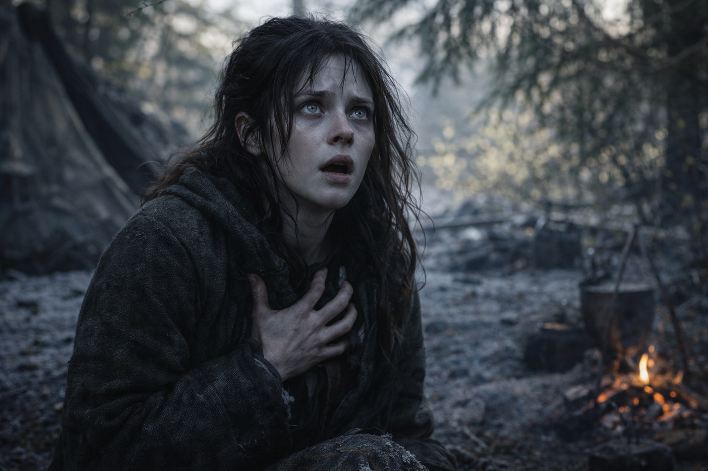
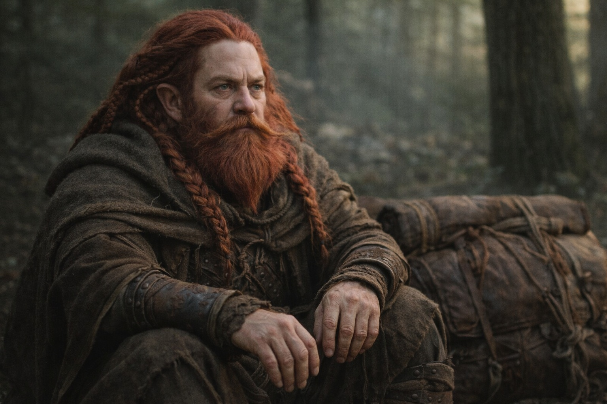
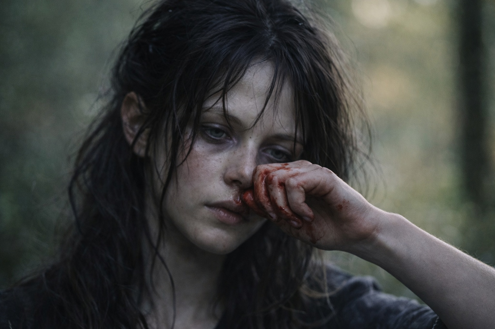

## Chapter 33 | Part 1 | The Stutter

---

---

The Beacon lost its northeast bearing.

Maris stopped beside the morning fire. The pull she'd followed since the border was weakening.

Then it stuttered.

For one breath she couldn't separate the directions. She turned her head, but none held steady.

"Maris?" Xandor's voice. He was watching her from across the morning camp. His left arm sat in its sling, still, the hand curling and uncurling in the involuntary exercises he'd been doing since the feeling started returning. "What is it?"

She held up a hand. Wait.

The Beacon hummed in Dulint's pack, ten feet away. The note rose and fell while she tried to find the pull again.

Then it settled.

The pull returned at a different angle. As she held it, the bearing continued to shift.

"Something changed," she said.

Aldric left his place by the southern tree line and came to her. His hand rested on his sword pommel.

"Changed how?"

"The direction. It was northeast. Now it's..." She reached for the pull. Followed it. The Beacon was tracking something that moved. "It's shifting. East-northeast. And moving."

"The barrier doesn't move."

"No."

Balin limped over, his walking stick finding soft ground in the camp clearing. His calf had improved enough that the stick was a precaution rather than a necessity, but he kept it. "Did we go wrong? Did we miss a turn?"

"Beacons don't have turns," Xandor said. He was standing now, his good hand pressed against the nearest spruce trunk, which Maris had stopped finding strange weeks ago. "If the direction changed, the target changed."

"Targets don't change."

"This one did."

Dulint sat beside the pack, watching Maris. He hadn't touched the clasp since she'd raised her hand.

"It feels different." She closed her eyes. Beneath the pulse she caught a rhythm she recognized: someone walking, breathing hard.

She opened her eyes.

"It's not pointing at the barrier."

The other four watched her.

"The man from the visions. She thinks it has settled on him." She pressed a hand to her chest. "She can follow his movement now."

In the spruce forest she'd felt him following their signal. Now the Beacon gave her his direction with every step.

She turned her head to follow it. The pull continued eastward.

Blood ran from Maris's left nostril. She wiped it with the back of her hand and didn't look at it.

"We need to talk," she said.

---

**End of Chapter 33.1 —> 33.2: [What the Beacon Lost: The Realization](/what-the-beacon-lost-the-realization/)**
