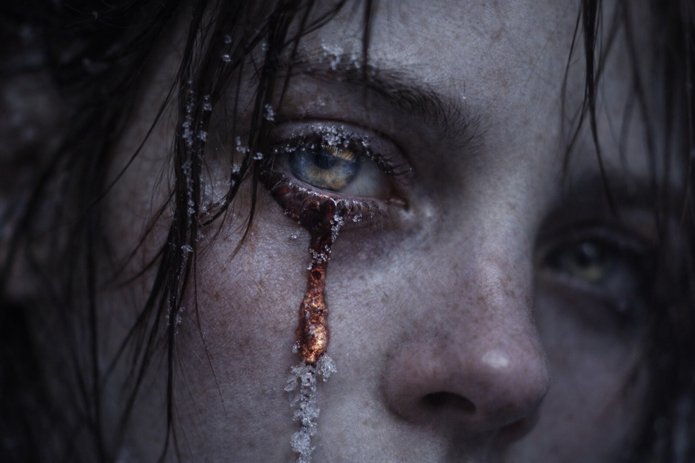
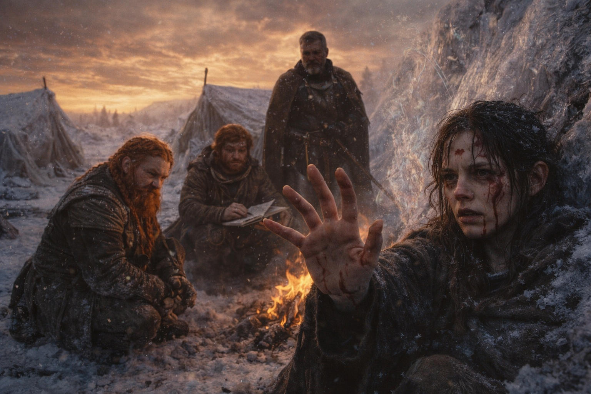

## Chapter 41 | Part 1 | The Connection

---

The connection shouldn't have been possible.

The Beacon was dead. Cold stone in Dulint's pack, dark as the day they'd found it if they hadn't known it had ever been anything else. The system it belonged to had been disrupted. The signal it carried had been severed. The artifact that had guided them across a continent was a piece of shaped rock that weighed exactly what rock weighs and nothing more.

But Maris could still feel him.

Not through the Beacon. Through the residual thread that the Beacon had calibrated during weeks of contact, the sympathetic resonance between her seer sensitivity and the barrier-adapted frequency of a person she had never met but whose signal she had tracked until the signal became as familiar as her own pulse. The Beacon had built the bridge. The bridge remained after the builder fell. Barely. Running on the echo of a connection that had been severed, the way a tuning fork vibrates after the note that struck it has stopped.

She was going to push through.

"Maris." Dulint's voice. He was kneeling beside her in the frozen camp beneath the ridge, the bruised gold sky above them, the icy ground beneath, the dead Beacon a weight in his pack that he carried because carrying dead things was what Dulint did when the dead things had mattered. "Don't."

"She has to." The distance language. The shield. But the shield was cracked, the mortar between the words visible, the construction shaking with the effort of maintaining distance from something that required presence. "The residual thread is fading. Hours. Less. If she doesn't push through now, the thread dissolves and there's nothing left to see through."

"The cost—"

"She knows the cost." Maris opened her eyes. One clear. One clouded, the left pupil slow, the damage from her last vision permanent or nearly so. "The cost is the cost. The thread is all that's left."

She closed her eyes. Reached.

The reaching was different from before. Before, the Beacon had carried the weight of the connection, amplifying her sensitivity, providing the signal she followed like a road. Now there was no road. There was a goat track. A thread of resonance stretching from her damaged seer sensitivity across the one league that had never closed, through the barrier's disrupted influence zone, to the person on the other side who was still alive and still adapted and still carrying the frequency that the Beacon had taught her to recognize.

The thread burned. Not metaphor. The residual energy in the connection was raw, unfiltered, the Beacon's mediation gone, and without the mediation the signal arrived at her nervous system the way ungrounded electricity arrives at flesh: hot, direct, damaging.

Blood came from her nose. Both nostrils. She felt it and didn't wipe it. The blood was the entry fee. She pushed past it.

The vision opened.

Fragments. Not the clear images the Beacon had provided. Broken pieces arriving in her consciousness like shards of a mirror, each one reflecting a different angle of the same scene, each one arriving a half-second late, each one costing her something she could feel leaving but couldn't name.

She saw him.

A drow. Obsidian-dark skin. White hair. Standing inside something that was not a place. The barrier's interior. She couldn't see it clearly, the residual thread providing impressions rather than images, but she could feel the wrongness of the environment he occupied, the dimensional pressure, the pulsing ground, the light that bent. He was alone. An artifact in his hands, pulled from his pack, held before him, glowing with alignment.

"I can see him," she said. Her voice arrived at her ears from a distance, as if she was speaking from inside the vision rather than from the frozen ground where her body sat. Blood ran down her upper lip. "He's there. He's at the edge. He knows it's wrong."

"Can you stop him?" Dulint's voice. Close. Steady. The voice of a man asking a question he already knew the answer to.

"I can see him," she repeated.

That was her answer.

She could feel his fear. Not as emotion. As frequency. The thread carried his state the way a wire carries current: the fear and the certainty and the debts pulling like gravity, each one a weight she could sense without understanding, the accumulated obligation of a journey she had tracked but never witnessed directly. He was afraid. He was certain. The two states coexisted in him the way they coexist in a person jumping from a height: the fear of the fall and the certainty that the jump is necessary occupying the same body at the same time.

"He's scared," Maris said. Blood at her ears now. The thread burning through more of her sensitivity. "He's walking anyway. The thing inside him, the clock. It's not ticking anymore. It's done counting. He's past the counting. He's at the place where counting stops and acting starts."

She could see the convergence point. Barely. A thinning in the barrier's fabric, a place where the mechanism concentrated, where the maintenance interface lived. The artifact in his hands was responding to it, heat and light and alignment, the Nexus component recognizing the system it belonged to.

"He's going to touch it," she whispered. "The barrier. The interface. He's going to—"

The thread pulsed. The vision flickered. Blood came from her left eye, the damaged one, a red tear tracking down her cheek and freezing in the Frostgard cold.

"Maris." Balin's voice. Close. His hand on her arm. "Stop. You're bleeding from your eye."

"She knows." Maris kept reaching. The thread was thinning. Minutes left. Seconds. The residual energy burning itself out like a fuse approaching the charge. "He's there. He's at the edge. She can see him and she can't reach him and the thread is dying and this is all there is."

She held the connection. Blood on her face. Ice in her hair. The frozen ground beneath her and the bruised gold sky above and the one league between her and a catastrophe she could see beginning and could not prevent.

She held it because holding was all she had left.

---

**End of Chapter 41.1 —> 41.2: [What They Saw: The Witness](/what-they-saw-the-witness/)**