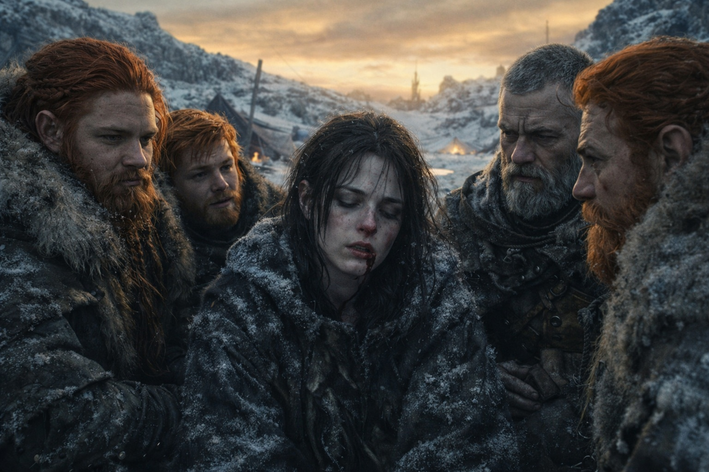
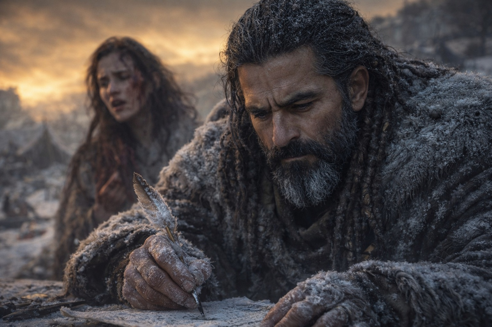
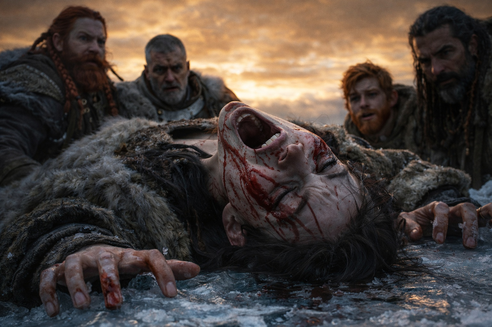
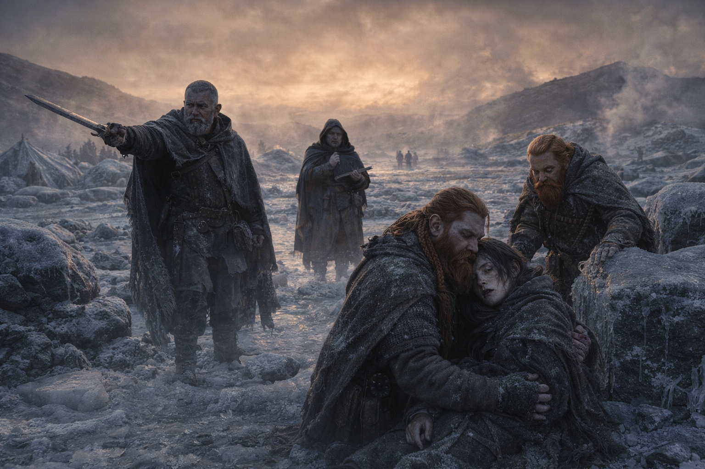

## Chapter 41 | Part 2 | The Witness

---

She narrated in pieces.

"He's holding it. The artifact. Both hands." Blood on her lip, freezing. The frozen camp around her silent. Five people in winter furs on ice-covered ground beneath a bruised gold sky, watching one of their own bleed the truth from a connection that was dying while she used it. "It's warm. She can feel the heat from here. The thing recognizes the barrier. They're synchronizing."

Dulint didn't move. Didn't speak. Didn't reach for her or tell her to stop. He had made that decision the first time she started bleeding and she had continued, and the decision had held through every escalation since, because stopping her meant losing the only window they had into what was happening one league and a dimension away, and Dulint understood the mathematics of necessary costs the way he understood inventory: without sentiment, without rounding.

"He's stepping forward." Her voice changed. Flattened. The distance language collapsing under the weight of what she was seeing, the third person and the first person merging into something that was neither, a voice that belonged to the vision rather than to the woman having it. "Contact. The artifact and the barrier. It's—"

She paused. Her hands curled against her chest. Her breathing stopped for one beat, two, three, then resumed as a gasp.

"The system is reading him. She can feel it checking. Compatible. Authorized. It's running through him like—" Her voice broke. "Wrong. The timing. The system found the timing. It's not—the window isn't open. He's not in the window."

Xandor was writing. His hand shaking. Ink freezing on parchment in the cold. He was recording what Maris said the way he had recorded every fragment, every analysis, every piece of the mechanism they had assembled from prophecy and vision and the Beacon's dying signal. The scholar in him refused to stop documenting, even now, even at the end of the thing he was documenting.

"It's reclassifying," Maris said. "He felt it. She can feel him feeling it. Like a blade. The system changed what it thinks he is. He was maintenance. Now he's—"

"Threat," Xandor said. His voice a whisper. The analysis arriving at its conclusion one league too late.

"The barrier is responding. It's—" Maris's eyes flew open. Both of them. The left one clouded, the right one sharp, and both of them seeing something that wasn't in the frozen camp. "It's opening. The barrier is opening at the point of contact. Not breaking. Opening. The defense mechanism. It's doing what Xandor said it would do. It's opening to let what's behind it through."

Aldric's sword was in his hand. The warrior who had been standing at the ridge's edge staring northeast had drawn without deciding to, the reflex responding to a threat that no sword could address, the blade pointed at the northeast distortion as if steel could stop a mechanism that had been operating for a thousand years.

"He's touching it," Maris whispered. Her voice had gone small. Not the distance language. Not the shield. The smallness of witness. "The barrier is—"

Light.

Not from the northeast. Not from the horizon. From the thread itself. The residual connection between Maris and the barrier pulsed with a light that existed in her nervous system rather than in the visible spectrum, but the pulse was so intense that it bled into her face, her posture, the way her body contracted around the thing she was receiving. The pulse hit her and she arched backward, her spine leaving the frozen ridge, her hands clawing at the ice beneath her.

Sound. Not sound they could hear with ears. Sound they could feel in the frozen ground, a vibration that traveled from the northeast through one league of folded terrain and arrived in the camp as a tremor that shifted the stones and cracked the ice and sent the thin fire guttering sideways.

"It's opening," she said. Then she screamed.

The scream was not hers. It was the sound the connection made when the event it was calibrated to detect exceeded the capacity of the thread to transmit it. The signal overloading the wire. The note shattering the glass. Maris's scream was the thread's death cry, carrying the last fragment of what she was seeing through the final instant of residual energy before the connection burned out entirely.

Then silence.

Maris fell sideways. Balin caught her. Her eyes were closed. Her breathing was ragged. Blood on her face, her ears, the corners of her eyes. The frozen blood mapping the cost on her skin like a diagram of everything she had paid to see what she had seen.

The ground shook again. Harder. A single tremor that traveled from the northeast and arrived beneath them as a judgment.

Dulint steadied himself on the frozen stone. Looked northeast. The distortion on the horizon had changed. Not growing, not shrinking. Transforming. The colors that had been wrong for days were now wrong in a different way, the unnamed hues shifting, rearranging, as if the palette of impossibility had been reorganized by the event that had just occurred.

Xandor's pen was still. His parchment on the frozen ground. His face grey.

Aldric's sword was still drawn. Pointed at the northeast. Pointed at nothing.

Balin held Maris. Her breathing shallow. Her heartbeat visible in her throat. Alive. Barely.

The silence after the scream held.

---

**End of Chapter 41.2 —> 41.3: [What They Saw: The Light](/what-they-saw-the-light/)**