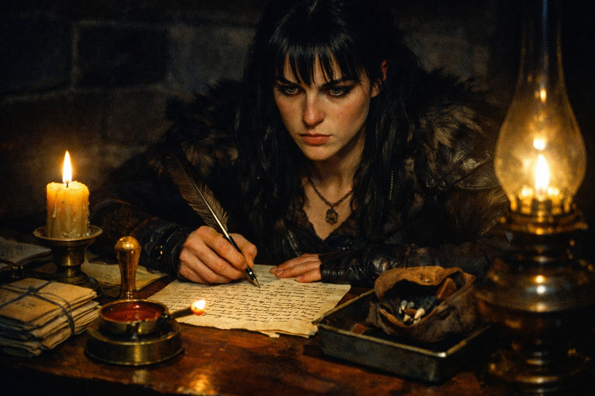
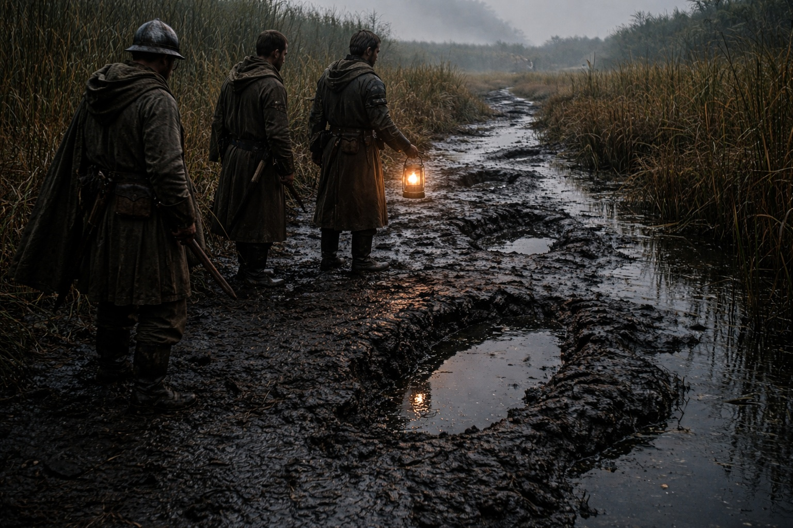

## Lore | The Unruly Might of the Grukmar Tribes

---

The goblin messenger rubbed the stump of a finger against the cold cell bar. He was missing two more, and most of one ear.

Captain Morrigan studied him through the bars of the border post's holding cell. The creature had been found a league inside Lumeshirean territory, carrying nothing but a leather pouch filled with teeth—not goblin teeth, she noted—and what appeared to be a poorly drawn map.

"He claims he's a defector," Sergeant Hollis said. "Says he wants to trade information for sanctuary."

"Goblins don't defect."

"That's what I told him."

The goblin pressed his face against the bars, grinning with what remained of his teeth.

"Zikvik crossed your fence alive," he said in halting Common. "You want know why? Ask about deep tribes. Ask what moves in bogs."

Morrigan stayed beyond reach of the bars. His eyes kept going to the door behind her, though his grin remained fixed on her face.

"What moves in the bogs?"

"A bed this side of fence. Then Zikvik tells."

---

> *"No agreement with one Grukmar chief binds the neighboring camps."*

Morrigan knew the line from the intelligence brief. It explained the broken agreements in her files, but not the change in the raids. In earlier years, scattered goblin bands and orc warbands had crossed during the dry season to seize supplies.

This year was different.

Now the outward raids had almost stopped. Scouts still brought reports of fighting between camps and smoke above the bogs. Peace seemed unlikely to Morrigan, but she had no account from inside those camps.

Command called it a victory. Morrigan called it worrying.

She had asked which tribes Command believed defeated. The reply had named none.

"The deep tribes," she said to the goblin. "Which ones?"

Zikvik stopped grinning. He drew his damaged hand inside his sleeve.

"No names. You write names down." He glanced at Hollis. "Something wakes in bogs. Chiefs say kneel to it. Others say flood, bad water, move camp. Zikvik not waiting for them to agree."

"And where were you going?"

"Here. Unless you open wrong door." He pointed past her toward the gate.

---

Morrigan filed her report that evening.

*Captured goblin claims awareness of unusual activity in Grukmar interior. Details vague. Recommend increased reconnaissance.*

The response came three days later: *Reconnaissance assets currently allocated to northern theater. Maintain standard patrol schedule. Treat captured subject per protocol seven.*

Protocol seven meant release at the border with a warning. Morrigan watched the goblin scramble back into the treeline, moving faster than she'd expected for something with so many missing parts.

He didn't look back.

Morrigan waited until she lost sight of him before telling Hollis to close the gate.

---

> *"Beyond this gate, no recovery is promised."*

The warning was carved above the gate. An old register dated the last imperial expedition a century earlier, but its report was sealed. Morrigan had found no later entry explaining why the expeditions stopped.

Morrigan had served on this border for six years. She'd fought goblins, tracked orc warbands, catalogued the creatures that emerged from the bogs during storm season. She thought she understood Grukmar.

But lately, the patrols reported things that didn't fit the usual patterns. Orc encampments abandoned mid-meal. Goblin warrens empty except for the very old and the very young. Tracks leading deeper into the swamps—massive tracks, from things she couldn't identify.

Zikvik's account would explain the empty camps. It did not explain why the tracks led farther into the swamps. She asked the scouts to check the direction again.

She wrote another report. This one went further up the chain: *Recommend formal assessment of Grukmar interior activity. Unusual migration patterns suggest possible regional destabilization.*

The response was the same as before. Resources allocated elsewhere. Maintain standard patrol schedule.

The quiet continued.

Morrigan increased the patrols anyway, on her own authority. If something was coming out of Grukmar, she wanted to see it before it reached the walls.

No new raiding party reached the wall. The scouts found more tracks, but disagreed about their direction. One sketch showed a broad heel where another marked the spread of toes.

She laid both sketches beside Zikvik's map. Nothing on it gave her a scale.

She had sent away the only person she could have asked.

**End of Lore 2 — continues in Lore 2: [The Umbra'kor Dominion's Pact with Darkness](/shadows-reign-the-umbrakor-dominions-pact-with-darkness/)**
