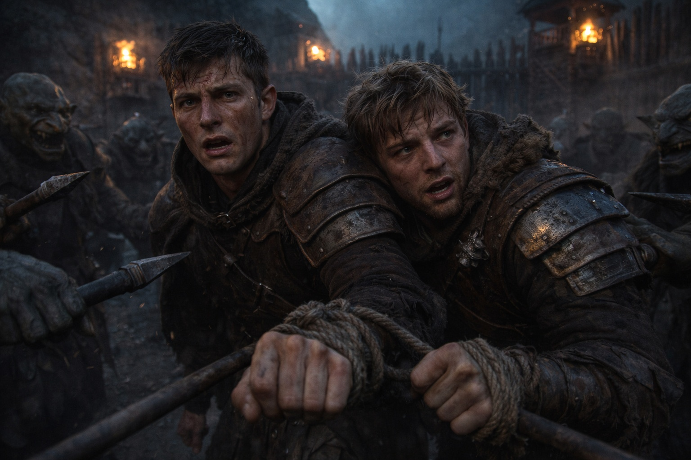
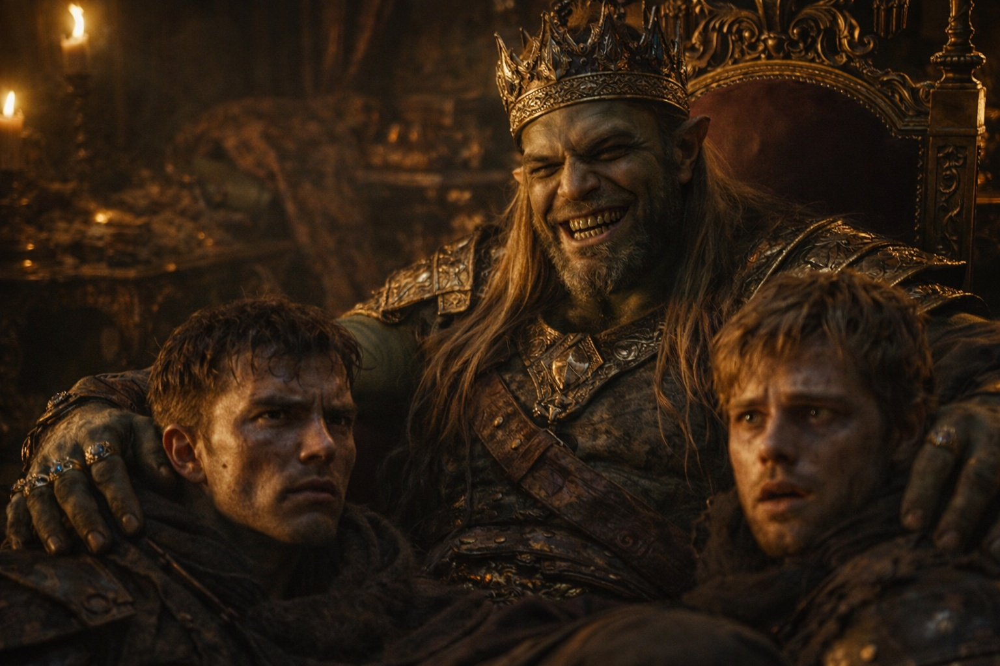

## Prologue | March of Despair

--- 

Consciousness returned in fragments. First the ache in his limbs. Then rough rope scraping skin. Varian blinked—and found himself staring into a ring of grotesque faces.

Goblins. A dozen at least, crowded around the net, eyes gleaming.

*"Look!"* One cackled. *"The mice are awake!"*

Varian twisted against the bonds. Useless.

*"Let us go!"* The demand came out hoarse. Pathetic.

A spear point punched through the netting and stopped an inch from his eye. He went very still.

*"Quiet, meat."* The goblin's breath was foul. *"Or we start carving early."*

---

They hauled him from the net and his legs buckled. Before he could find footing, a reeking cloth covered his eyes. Darkness again.

What followed was a nightmare of stumbling and prodding—unseen roots catching his feet, rocks biting his knees, the constant jab of spears at his back. Varian lost track of the turns. Lost track of time.

How long since the Rusty Axe? Hours? Days? He'd failed. That much was clear. Failed his duty, failed Garrick, failed every soul he'd sworn to protect.

---

Rough hands tore the blindfold away. Light stabbed his eyes. He blinked, watering.

A fortress took shape. Crude watchtowers along walls of sharpened logs. Orcs—massive, tusked—watched their approach with flat yellow eyes. The goblins prodded Varian and Garrick through a gate that gaped like a mouth.

The stench hit first: blood, smoke, and rot thick enough to taste. They were marched through winding corridors. Varian caught glimpses with each turn—cages packed with prisoners so gaunt they barely looked human, offering slabs dark with old blood, pyres crackling with green flame.

---

Then a grand chamber. Plush carpets. Gilded furniture. So at odds with the squalor that Varian wondered if the fumes had driven him mad.

At the center, sprawled across an ornate throne, sat a figure that stopped his breath.

The half-orc wore fine silks. Jewels glittered at throat and fingers. One leg draped casually over the throne's arm. When he smiled, Varian noticed his teeth had been filed to points.

*"Welcome, gentlemen."* The voice was a purr—cultured, cold. *"I am Korgath. And you are now my honored guests."*

Varian glanced at Garrick. His friend's face had gone the color of old ash.

---

Korgath leaned forward. *"I have a proposition for you. Your freedom, in exchange for some information. Nothing onerous. Just a few details about your city's defenses."*

*"Go to hell."* Garrick's voice was steady, even if his hands weren't.

That smile never wavered. *"Now, now. Let's not be hasty."* A gesture. Two massive orcs stepped forward, carrying instruments that caught the torchlight—cruel things, made for pain. *"I'd hate to see you suffer unnecessarily."*

Another gesture. *"Separate them. We'll speak to each privately."*

Guards seized Varian's arms. He struggled. Shouted. Useless. The last thing he saw before a door slammed between them was Garrick's face—pale, set, meeting his eyes.

---

Alone with the half-orc, Varian felt his resolve crumbling.

*"I'm not like the others, you know."* Korgath's voice dropped to an intimate murmur. *"Half human, after all. I understand civilization."*

He gestured toward a robed figure in the shadows—a druid, by the look of him. *"My friend here has prepared a special draught. A potion. You'll forget everything. We'll leave you near your village. Safe. Sound. Your fellow guards won't come looking."*

Relief flooded through Varian so powerfully his knees nearly buckled.

*"But first."* Korgath's smile sharpened. *"The information. Just to ensure its accuracy."*

The cages. The offering slabs. A woman's voice, screaming in the dark.

*"I'll tell you."* Barely louder than a breath. *"Whatever you want to know."*

---

He did. Guard rotations, weak points in the walls, the secret tunnels—it all poured out while Korgath listened with that satisfied gleam, nodding, never interrupting.

When Varian fell silent, Korgath clapped his hands. *"Excellent! Cooperation makes everything simpler."*

They led him away. Through the closing door he glimpsed Garrick being brought in, face twisted between anguish and dread.

Time crawled. Varian waited in a small stone cell, alone with his fear and his shame, until the door scraped open and Garrick was shoved in beside him. His friend looked pale. Defeated.

Korgath appeared in the doorway. His smile had grown wider.

*"And now, my friends, I believe our business is concluded."* He turned to the druid. *"They're yours now. I trust you'll find them useful."*

The meaning took a moment to penetrate.

Varian lunged—a hoarse shout tearing from his throat—but the guards were faster, driving him back.

The last thing he saw before they shoved a hood over his head was Korgath's face. Still smiling.

He'd given away everything. And it had bought them nothing at all.

**End of Prologue 8 — continues in Chapter 1: [The Sacred Chamber](/the-sacred-chamber/)**