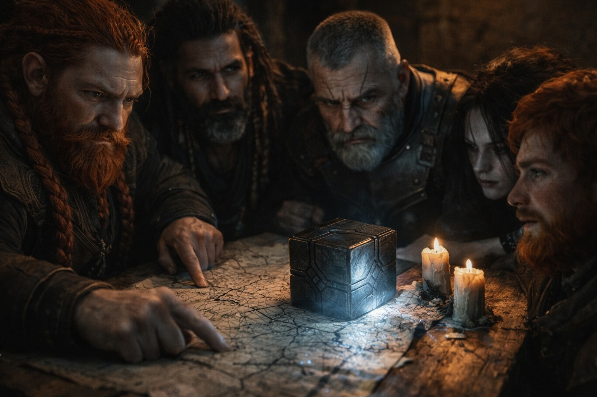
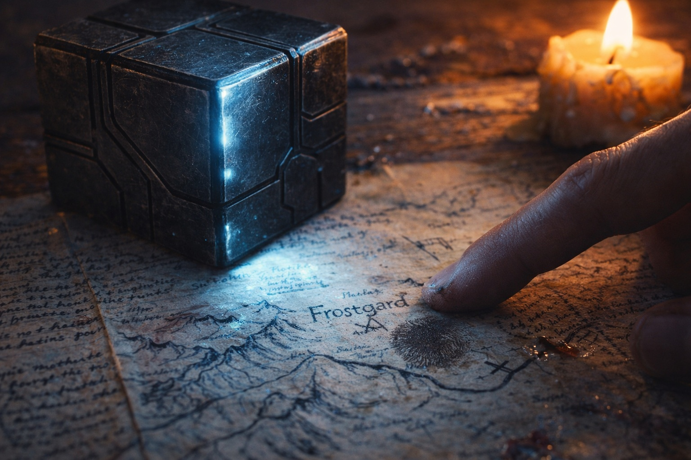
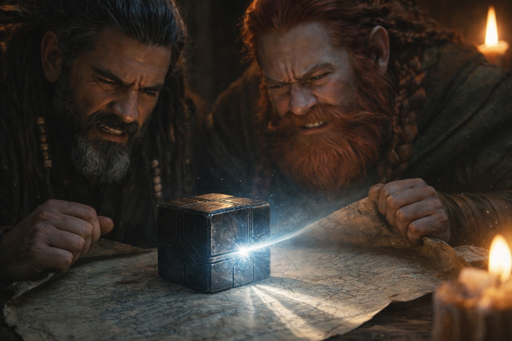

## Chapter 14 | Part 4

---

"We need somewhere to go."

Dulint stood over the table while Xandor searched a shelf.

"North isn't somewhere," Eldric said. "It's a direction."

"I know."

"Frostgard is half a continent."

"I know."

Balin leaned toward Maris. "He enjoys this."

"I know," Maris said.

Xandor ignored them.

He found a thin folio bound with cracked cord and opened it near the middle.

"This came from a Frostgard skald twenty-two years ago. Not prophecy. A catalogue."

Eldric stepped closer.

"Of what?"

"Old songs, memorial stones, copied inscriptions. Things the skald thought a southern scholar might pay for."

"Did you?"

"Too much."

Xandor laid the folio beside the five marks.

One entry carried the same sequence.

Sense. Erase. Alter. Bind. Rewrite.

Dulint bent closer. "Where?"

"Jotunheim."

That changed the room.

Even Balin knew the name.

Xandor traced the catalogue entry.

"The skald recorded a stone tablet kept with older songs. Five marks in this exact order. He copied the marks, but not the inscription beneath them."

"Why not?" Eldric asked.

"He wrote that the verse was 'winter nonsense' and charged me extra for the drawing."

Balin stared at him.

"I hope he's dead."

"He was eighty when I met him."

"Then I hope he died wealthy."

Xandor opened his map.

"Jotunheim gives us something we did not have yesterday: a source tied to the same five-part sequence, in a place where the original may still exist."

"May," Eldric said.

"May."

Maris looked at the Beacon. "And north is where it keeps pointing."

"Mostly," Xandor said.

"That's two reasons," Dulint said.

"One piece of evidence and one dangerous object with opinions," Eldric replied. "I'll accept one and a half."

Dulint looked at the roads north.

"How soon?"

"Not three days," Eldric said.

Dulint glanced at him.

"Wasn't going to say three."

"Good."

Maris pushed herself upright using the table.

Her knees shook.

"Not tonight," Dulint said.

"I can walk."

"You can stand."

"Currently."

Balin moved a chair behind her without comment.

Dulint looked at the window. Evening had already swallowed the street.

"At first light we buy what we can carry. No perfect kit. No waiting for better information."

Eldric nodded.

Xandor began rolling the map.

"There's one more problem."

Balin groaned.

"Of course there is."

"Jotunheim keeps records. That doesn't mean they'll let us read them."

Dulint shouldered his pack.

"Then at least we finally have a problem with an address."

The Beacon turned a fraction north.

No one needed it to.

---

**End of Chapter 14.4 —> 15.1: [The Goblin Who Counts Costs: The Wanderers](/the-goblin-who-counts-costs-the-wanderers/)**
