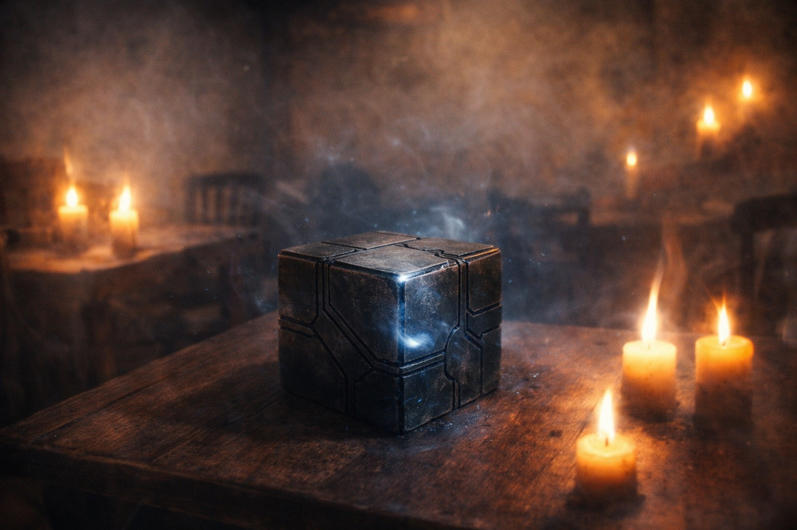

## Chapter 14 | Part 3

---

"Give me the other four names."

Eldric eased his grip on the back of the chair. "Please," he added.

Xandor arranged his copies by age rather than source. The oldest was mostly ash at one edge.

"Sense. Erase. Alter. Bind. Rewrite."

Balin waited.

"That's all?"

"They are what the copies agree on. Beyond the names, the accounts begin to separate."

"I was hoping forty years bought more."

"So was I."

Xandor pointed to the second mark.

"Erase appears beside words for absence, clearing, and removal. One fragment mentions memory. Another may refer to a road. I cannot tell whether those are examples, metaphors, or bad copies."

Maris narrowed her eyes. "So don't tell us it removes memories."

"I wasn't going to."

Eldric nodded once.

"Alter?"

"'The hand that shapes.' That line survives in two sources."

"Shapes what?"

"Neither says."

"Bind?"

"The words are used for joining and holding. The line ends before it tells us what is held."

"Rewrite?"

Xandor hesitated.

That made Dulint look up.

"Here they stop describing anything," Xandor said. "The next lines are prayers. The writer is asking to be spared."

Balin's mouth tightened. "Doesn't make me want to touch it."

"Nor me."

Xandor unfolded the most damaged copy.

"One line says *what was may be written otherwise*. I have six possible translations for *otherwise*."

"Any pleasant ones?" Balin asked.

"No."

Dulint studied the five names.

"Do they have to be used in that order?"

"The marks are always written in that order. That is not the same thing."

"Do they become more powerful?"

"I don't know."

"Does finding one wake the next?"

"Nothing here says it does. I would rather not find out by accident."

Eldric shifted the lamp away from the cube so nobody would have to reach across it.

Xandor gathered the copies.

"Someone copied these names long after the language around them changed." Xandor laid two sheets side by side. "Here they kept the old marks but rewrote the words beneath."

"Meaning?" Dulint asked.

"They wanted the names to survive. I wish they had taken the same care with the rest."

"And somebody else burned the explanations."

Xandor looked at the blackened edge in his hand.

"These pages burned. I cannot tell you who lit the fire."

The Beacon pulsed.

Sense.

Four names remained on the page.

No instructions. No promise that finding them would help.

---

**End of Chapter 14.3 —> 14.4: [Naming Without Explaining: The Direction](/naming-without-explaining-the-direction/)**
