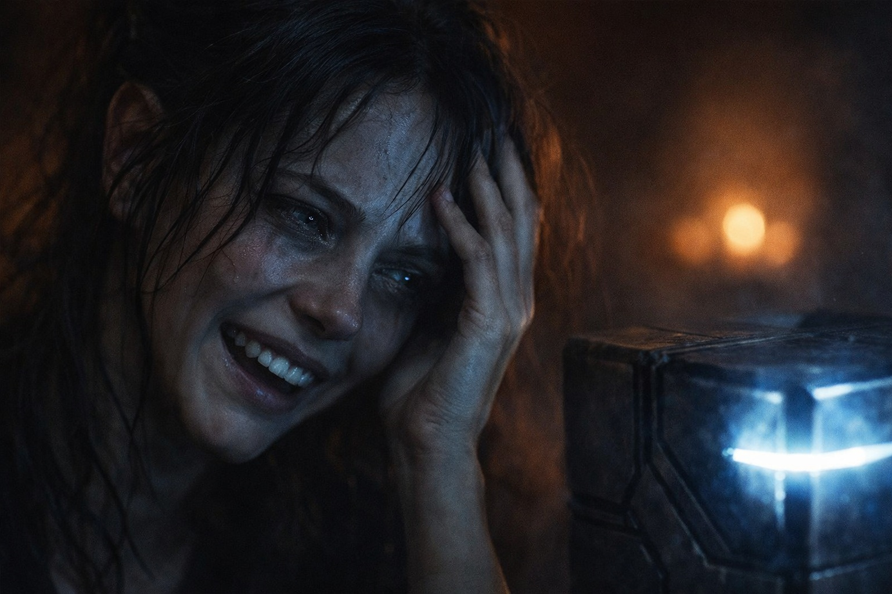

## Chapter 14 | Part 2

--- 

"There's something worse."

Xandor laid three copied fragments beside the Beacon.

Eldric remained standing.

"New evidence?"

"An old translation I mistranslated."

Balin sighed. "Comforting."

"No."

Xandor pointed to a line he had copied years ago.

"I rendered this as *the call passes the closed road*. I thought it described distance."

Dulint frowned. "And now?"

"Another copy uses the same phrase beside a Barrier glyph."

Maris went still.

Eldric asked, "Claim or proof?"

"Claim. Three sources, two damaged. Enough to worry me. Not enough to call fact."

"Good."

Balin looked between them. "Someone explain the worrying part."

Xandor tapped the line.

"Sense may not stop at the Barrier."

"The signal crosses worlds."

"The texts say the *call* does."

"Difference?"

"Possibly a very important one."

Dulint looked at the cube. "If it calls, what is it calling?"

"I don't know."

"Other pieces?"

"I don't know."

"Then what do you know?"

Xandor turned the third fragment around.

A second line sat beneath the first.

"What calls is heard. What hears may answer."

No one spoke for a moment.

Maris stared at the words.

"The black water."

Xandor did not answer.

"The boat. The drowning man."

"Maris—"

"You think that was an answer."

"I think it might have been."

Her chair scraped back.

"No. You don't get to use me to make the pieces fit."

Xandor stopped.

She was breathing too fast.

He took his charcoal and drew a line through the conclusion beneath his notes.

"You're right."

Maris watched him do it.

"Observed," Xandor said. "Your visions worsened as you approached the artifact. Textual claim: Sense can call across the Barrier. Hypothesis: your visions may be related."

"May."

"May."

Her breathing slowed by a fraction.

Eldric went to the window.

"If something on the other side can hear it, can moving shut it up?"

"No."

"Can we stop the broadcast?"

"I don't know how."

"Can we destroy it?"

Dulint's hand closed around the edge of the table.

Xandor looked at the cube.

"I don't know what destroying one part of an incomplete system would do."

"Another useful answer."

Balin rubbed his face. "So we carry a thing that shouts through the Barrier, and we don't know who is listening."

Xandor looked at the second line again.

"Or what."

The Beacon pulsed once.

This time nobody called it a search.

---

**End of Chapter 14.2 —> 14.3: [Naming Without Explaining: The Fragments](/naming-without-explaining-the-fragments/)**
