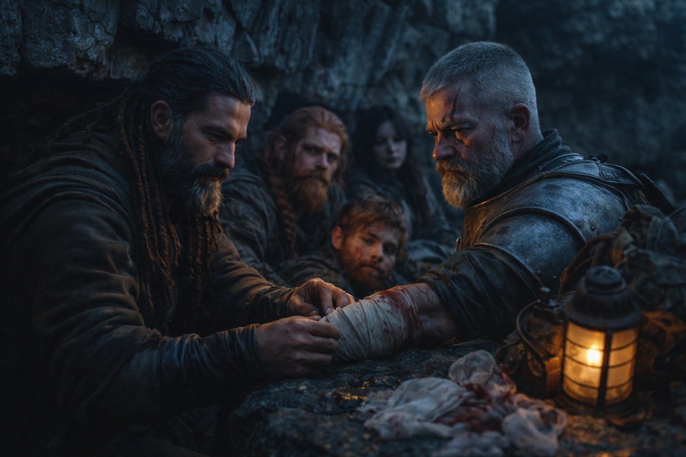
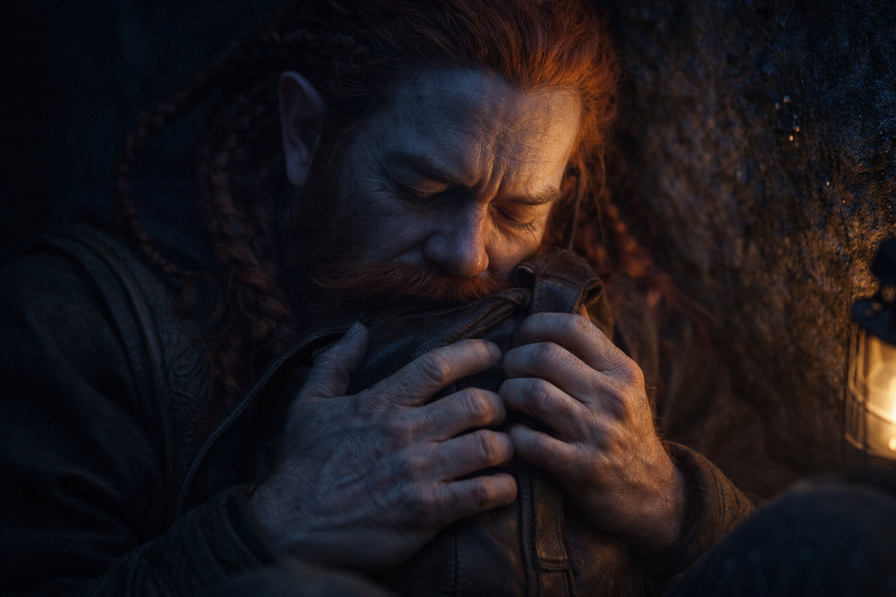
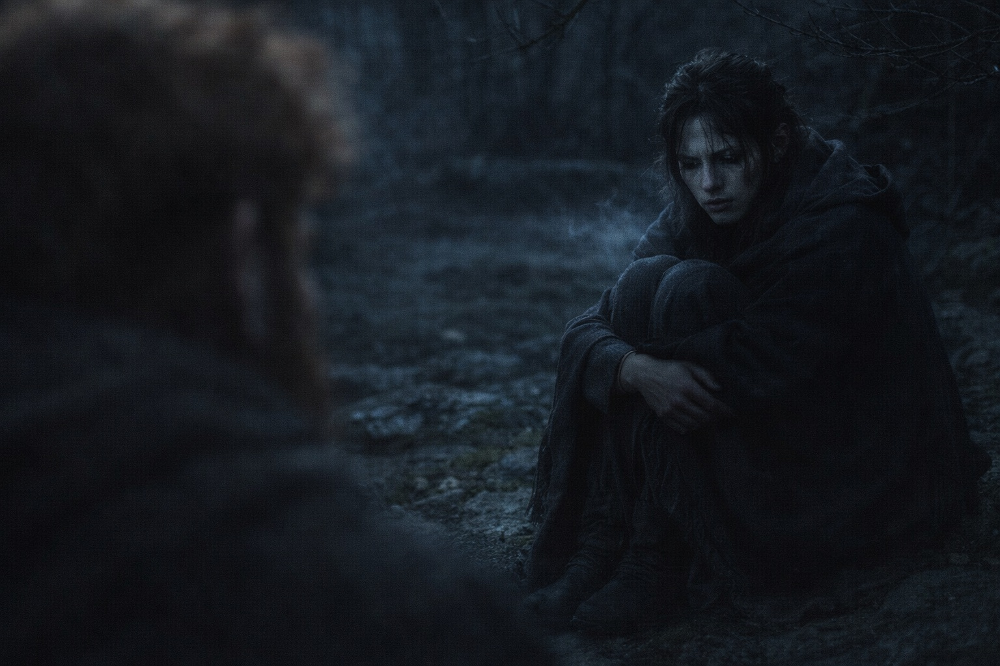

## Chapter 18 | Part 5

--- 

They didn't stop until dusk.

The camp was makeshift—barely more than a clearing where they could collapse against rocks and pretend they were safe. Xandor tended to wounds: a gash on Eldric's arm, bruises on Dulint's ribs, cuts on Balin's hands he didn't remember getting.

The artifact sat between them, pulsing and pointing as always, its call undiminished.

"They'll come back." Eldric's voice was flat, matter-of-fact. "We hurt them, but we didn't break them. They'll regroup, gather reinforcements, try again."

"Then what's the point?" Balin's voice came out sharper than he intended. "We fight, they retreat, they come back, we fight again. How long until we lose?"

"We keep moving. Stay ahead of them. Reach somewhere defensible."

"People almost died today."

Eldric looked toward the darkening trail. "Yes."

Dulint was silent, clutching the pack with the artifact. His face looked older than it had that morning—lined with something beyond exhaustion.

"Uncle?" Balin moved closer. "Are you all right?"

"No." Dulint's voice was barely a whisper. "I'm not all right. I haven't been all right since Stonehold."

"What do you mean?"

"I mean—" Dulint stopped. Started again. "I mean we keep moving. That's all we can do. It's all we've ever been able to do."

There was something in his uncle's voice. Something being held back. But Balin was too tired, too shaken, too empty to push.

Maris sat apart from the others, knees drawn to her chest, eyes fixed on nothing.

"She saw it coming," Balin said quietly. "The ambush."

"She sees many things," Xandor replied. "Seeing and stopping aren't the same skill. Don't blame her for powers she never asked for."

"I don't blame her. I just..." Balin trailed off. "I don't know what I feel. I don't know how to feel."

Xandor's ancient eyes softened. "Then don't force an answer tonight."

Balin looked at his hands. Still stained, despite the water Xandor had given him.

He could still feel the sword going in wrong. Still hear the sound the Grukmar made as it died.

*First time killing someone.*

"Eldric." Balin's voice cracked. "When does it stop feeling like this?"

Eldric sat beside him.

"Not tonight," he said.

Balin waited for the rest. None came.

They sat in silence as darkness fell.

Balin rubbed at the stain on his hands. Xandor's water had washed them clean hours ago.

He could still see it.

At first light, they would keep going north.

---

**End of Chapter 18.5 —> 19.1: [Direction: Recovery](/direction-recovery/)**