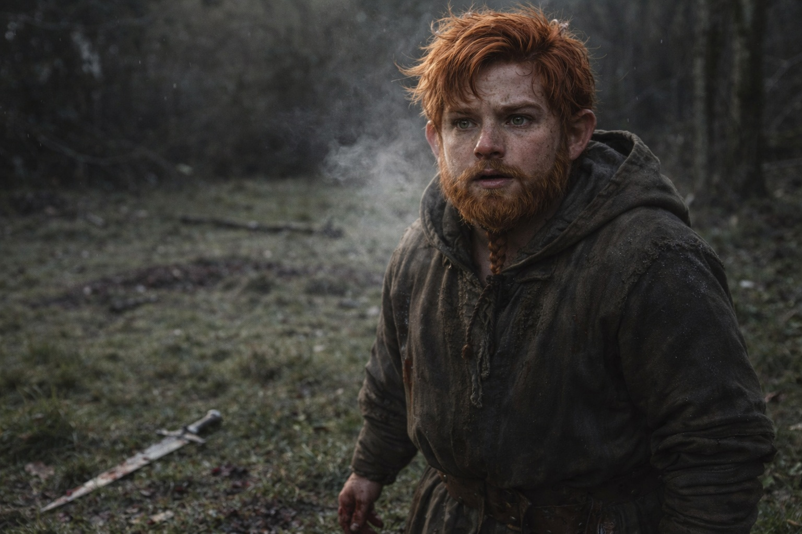
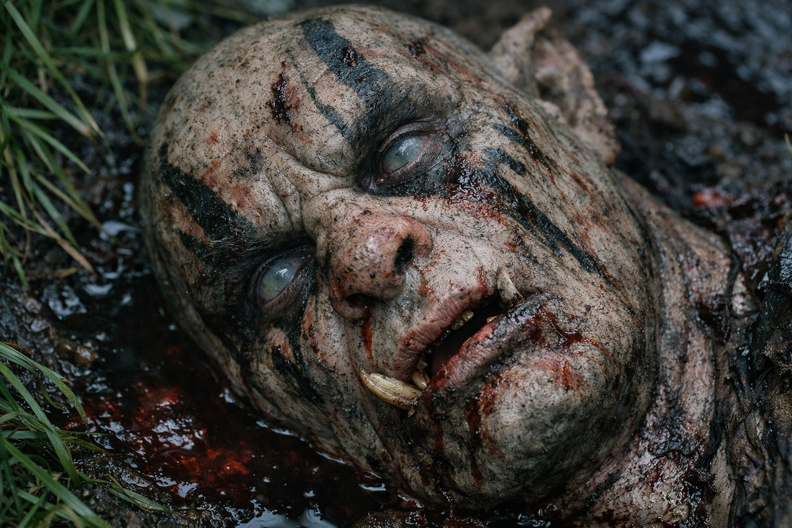
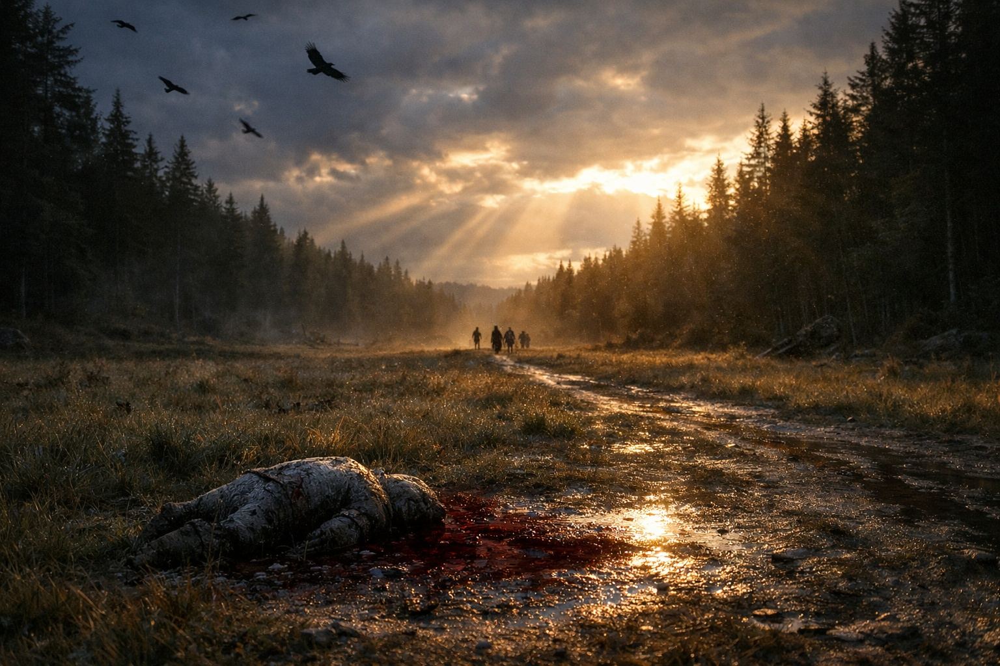

## Chapter 18 | Part 4

--- 

The fight ended.

Not with victory—with retreat. The Grukmar pulled back, dragging their wounded, leaving three bodies on the blood-wet ground. Eldric had killed two of them. Xandor's magic had driven off more.

And Balin had killed one.

He couldn't stop staring at it. The grey-green body, the pool of dark blood spreading beneath it, the way its eyes had gone flat and empty. In his head, the kill had been clean. A thrust, a fall, a noble end.

The blade had gone in wrong, angled, scraping between ribs instead of sliding through. The Grukmar hadn't died instantly. It had made sounds. Wet, gurgling sounds that weren't quite words but might have been.

*First time killing someone.*

He tried to put it on the list.

His stomach heaved. Balin barely made it three steps before he was on his knees, vomiting into the grass. His whole body shook.

A hand on his shoulder. Eldric.

"Don't look at it."

"I can't—I can't stop—"

"I know." Eldric pulled him upright.

"I killed—" Balin couldn't finish. Another wave of nausea.

"You're alive. Move. We talk later."

"But—"

"Process later. Move now."

Balin moved.

The body stayed where it fell. He couldn't look at it again. Couldn't not look at it. Every few steps his eyes dragged back toward it.

Maris fell into step beside him. Her face was pale, eyes haunted.

"I saw the violence," she said quietly. "I didn't know it was ours until it started."

"You saw me?"

"A moment. You on the ground with blood on your hands. I couldn't tell where, or when, or whose blood it was."

"It wasn't mine."

"I know that now." She looked at him with those grey eyes that saw too much. "How does it feel?"

Balin searched for words. Found nothing that fit.

"Wrong," he said finally. "It feels wrong. In the stories, killing the enemy feels right. Justified. But he—it—" He swallowed. "He didn't look like a monster when he died. He looked... surprised. Like he hadn't expected it to end that way."

Maris looked away.

They walked in silence.

Behind them, blood soaked into the earth.

Balin tried once more to add the kill to his list.

He couldn't.

They kept walking.

---

**End of Chapter 18.4 —> 18.5: [Northbound: The Aftermath](/northbound-the-aftermath/)**