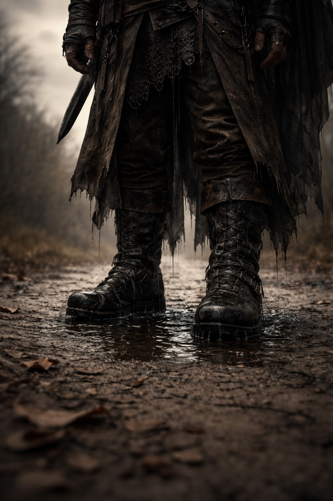
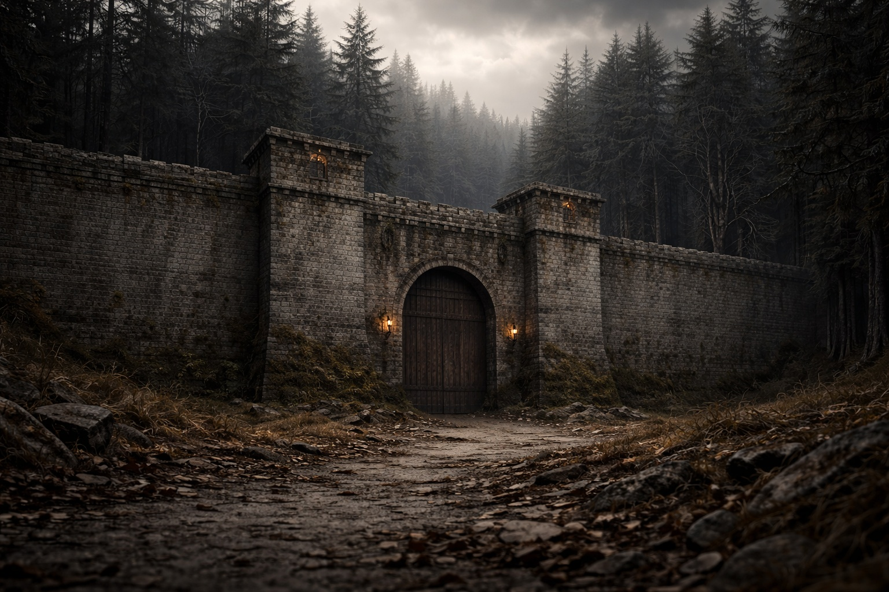
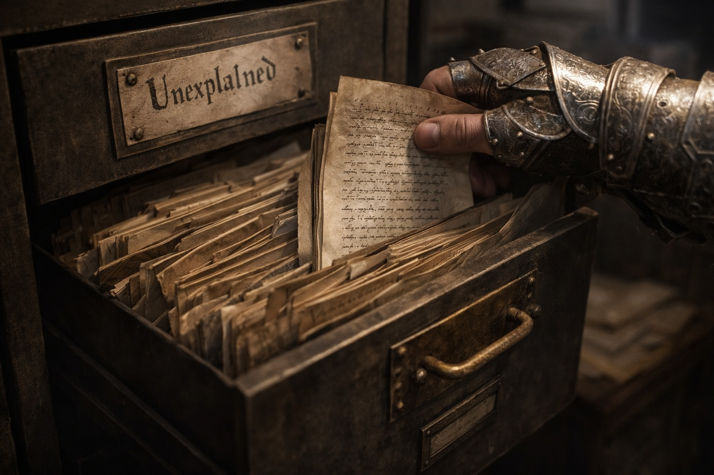

---
publication_order: 105
order: 105
title: The Resilient Defense of the Lumeshirean Divine Empire
date: 2024-04-06
language: en
chapter: null
subchapter: null
storyline: lore
canon_phase: lore
canon_sequence: LUM-L-001
narrative_weight: medium
category: Lumeshire
author: Valarian
type: Lore
tags: ['#the resilient defense of the lumeshirean divine empire', '#lore', '#lumeshire']
thumbnail: image.jpg
featured: false
counterpart_path: site/content/posts/es/lumeshire/escudos-arriba-la-defensa-resiliente-del-imperio-divino-de-lumeshire/index.mdx
counterpart_title: La Defensa Resiliente del Imperio Divino de Lumeshire
---

## Lore | The Resilient Defense of the Lumeshirean Divine Empire

--- 

Valarian's boots were wet.

That was the first wrong thing about the morning. He'd taken the eastern path from the barracks—the dry path, the sensible path, the path every guard took during the autumn rains. There should have been no puddles. There had been no puddles yesterday.

He looked down. Water pooled around his feet, dark and still, reflecting nothing.

*Strange*, he thought. Then he kept walking, because strange things weren't his responsibility. Border patrol was his responsibility. Strange things belonged to the priests.

The garrison wall came into view: a thirty-foot barrier of gray stone, old but solid, marking where Lumeshire ended and the treeline began. Beyond the trees lay Grukmar territory—swamps and ruins and things that didn't bear thinking about.

Corporal Bren was waiting at the checkpoint, rubbing his hands together for warmth. A young man from the capital, still convinced his posting mattered.

"Anything overnight?" Valarian asked.

"Goblin tracks near the southern fence. Small band, maybe six. They didn't cross."

"They never cross during harvest season. Too much patrol traffic."

Bren nodded, but his expression was odd. "Something else, though. Venn filed a report. Said he saw lights in the eastern woods."

"Venn sees lights every time he drinks."

"He wasn't drinking. He was on third watch. Said the lights were moving, like lanterns, but there was no one carrying them."

Valarian took the report from Bren's hands and scanned it. Standard form, Venn's cramped handwriting, the section for witness signatures conspicuously empty.

"He needs two witnesses to make this official."

"I know. That's why he's upset. Marrek was on watch with him, but Marrek says he didn't see anything."

Valarian folded the report and tucked it into his belt. "Then it goes in the unverified file. Same as last time."

Bren hesitated. "What if there was something?"

"Then we wait until someone else sees it. That's procedure." Valarian clapped him on the shoulder. "Don't worry. The empire has survived stranger things than floating lights."

He walked the perimeter, checking the fence posts, counting the sentries. Everything looked normal. Everything always looked normal. That was the strange thing about border duty: nothing happened, until suddenly everything did.

At the western gate, he found Marrek smoking a pipe and staring at the mountains.

"You didn't see the lights," Valarian said.

Marrek didn't turn. "I saw something. I'm not sure it was lights."

"What was it?"

A long pause. Smoke curled from the pipe.

"A shape," Marrek said finally. "At the edge of the trees. Tall. Too tall to be a man. It was just standing there, watching the wall."

"And you didn't report that?"

"Report what? 'I saw a shape'? That's not a report. That's a poem."

Valarian couldn't argue with that logic. The forms had boxes for goblin tracks, orc sightings, unusual weather. There was no box for *tall shapes that felt wrong*.

He looked toward the eastern treeline. The trees stood still in the morning air, dark and dense. Beyond them, the land sloped upward toward Stonehold's mountains. Beyond those, according to the old maps, lay territories even the scouts didn't patrol.

*Umbra'kor*. Dark elves. Fairy tales, mostly. Soldiers told stories around campfires—shadow magic, blood rituals, cities built underground. Nobody actually believed them.

And beyond the Umbra'kor?

*Wyrmreach*.

Valarian had never met anyone who'd been there. He'd met plenty of people who claimed to know someone who had. The stories never matched. That was the reliable part: no two accounts agreed on anything except that you didn't want to go.

"Captain Eldric thinks Venn was dreaming," Marrek said.

"Eldric thinks everything is dreams or discipline problems."

"What do you think?"

Valarian considered the question. The wet boots. The strange puddle. The lights Venn saw and Marrek didn't. The shape at the treeline, too tall to be a man.

"I think," he said slowly, "that we're not equipped to think about things like that. We're equipped to check fence posts and count goblins. That's what we should do."

Marrek nodded. Neither of them felt satisfied by the answer.

The morning shift passed without incident. Valarian filed reports on grain shipment delays, approved a requisition for new boots, and signed a patrol schedule for the coming week. Normal work. Safe work.

At midday, a messenger arrived from the eastern watchtower. A single page, sealed with the minor seal that meant *unusual but not urgent*.

Valarian broke the wax.

*Patrol Seven returned early. Report attached. One member missing—Private Coller. Search party dispatched. No traces found.*

He read it twice. Then he walked to the Commander's quarters and placed the report on his desk.

"Missing how?" the Commander asked without looking up.

"The report doesn't say. Just that he was with the patrol at sunset and gone by dawn. No tracks. No struggle. His gear was still in his tent."

The Commander sighed. It was the sigh of a man who had seen too many reports like this one. "File it."

"Shouldn't we—"

"File it, Valarian. Under 'unexplained.' We have three dozen unexplained disappearances in that filing cabinet. None of them led anywhere. None of them ever do."

Valarian hesitated. "Do you think it's connected? The lights Venn saw, the shape Marrek mentioned—"

"I think," the Commander said, finally looking up, "that the empire has one hundred and forty-seven border garrisons. Each one files two or three unexplained reports per season. If we investigated every strange light and missing patrol member, we'd have no soldiers left to guard anything."

He returned to his paperwork.

Valarian stood there a moment longer, then left.

Outside, the sky was gray and ordinary. The trees were silent. The sentries walked their routes with the mechanical certainty of men who believed their routines meant safety.

Valarian understood that belief. He relied on it. The alternative—considering what the routines might be failing to prevent—was not something he could afford to think about.

He filed Venn's sighting report in the unverified drawer.

He filed the missing soldier report in the unexplained cabinet. He completed his shift, ate his dinner, and slept without dreaming.

In the morning, his boots were wet again.

This time, there was no puddle.

---

*Report filed. Status unchanged. Recommend continued observation.*

*Lumeshire believed it had time.*

*It always believed it had time.*

**End of Lore 1 — continues in Lore 1: [Forge and Fire: The Mountain Kingdom of Stonehold](/forge-and-fire-the-mountain-kingdom-of-stoneholds-stand-against-chaos/)**