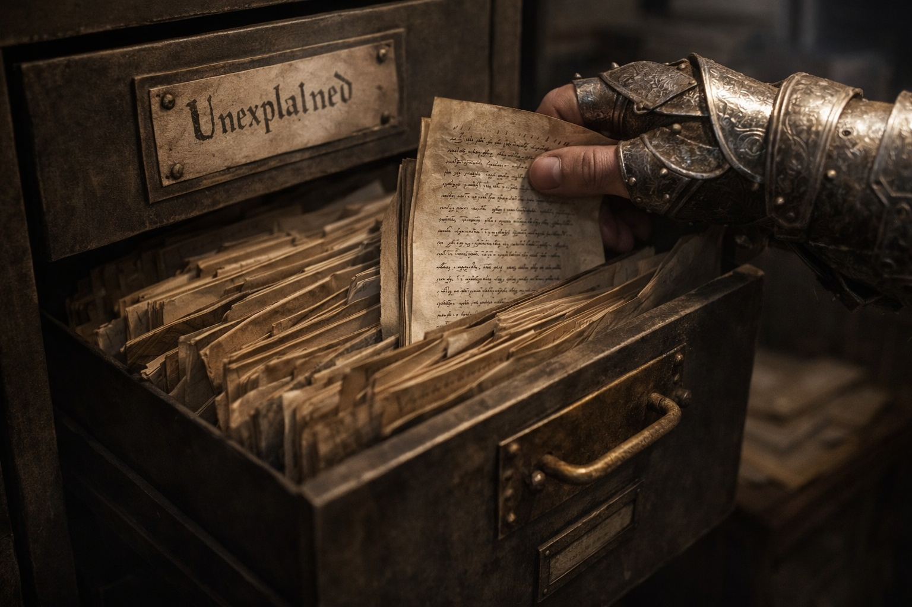

## Lore | The Resilient Defense of the Lumeshirean Divine Empire

---

Valarian's boots were wet.

He had taken the eastern path from the barracks. Its raised gravel usually stayed dry through the autumn rains, and yesterday he had crossed it without muddying a sole.

He looked down. Water pooled around his feet, dark and still, reflecting nothing.

He tipped one foot to let the water drain. The watch bell was sounding; he could ask a priest about the puddle after his round.

The garrison wall came into view, thirty feet of gray stone between the barracks and the treeline. Beyond the trees, the patrol maps marked Grukmar's swamps and ruins.

Corporal Bren waited at the checkpoint, rubbing his hands together. His report was already unfolded for Valarian to read.

"Anything overnight?" Valarian asked.

"Goblin tracks near the southern fence. Small band, maybe six. They didn't cross."

"They never cross during harvest season. Too much patrol traffic."

Bren nodded, but his expression was odd. "Something else, though. Venn filed a report. Said he saw lights in the eastern woods."

"Venn sees lights every time he drinks."

"He wasn't drinking. He was on third watch. Said the lights were moving, like lanterns, but there was no one carrying them."

Valarian took the report from Bren's hands and scanned it. Standard form, Venn's cramped handwriting, the section for witness signatures conspicuously empty.

"He needs two witnesses to make this official."

"I know. That's why he's upset. Marrek was on watch with him, but Marrek says he didn't see anything."

Valarian folded the report and tucked it into his belt. "Then it goes in the unverified file. Same as last time."

Bren hesitated. "What if there was something?"

"Then we wait until someone else sees it. That's procedure." Valarian clapped him on the shoulder. "Don't worry. The empire has survived stranger things than floating lights."

He walked the perimeter. At each post he checked the sentry's name against the roster. Water worked between his toes whenever he stopped.

At the western gate, he found Marrek smoking a pipe and staring at the mountains.

"You didn't see the lights," Valarian said.

Marrek didn't turn. "I saw something. I'm not sure it was lights."

"What was it?"

A long pause. Smoke curled from the pipe.

"A shape," Marrek said finally. "At the edge of the trees. Tall. Too tall to be a man. It was just standing there, watching the wall."

"And you didn't report that?"

"Report what? 'I saw a shape'? That's not a report. That's a poem."

Valarian couldn't argue with that logic. The forms had boxes for goblin tracks, orc sightings, unusual weather. There was no box for *tall shapes that felt wrong*.

He looked toward the eastern treeline. The trees stood still in the morning air, dark and dense. Beyond them, the land sloped upward toward Stonehold's mountains. Beyond those, according to the old maps, lay territories even the scouts didn't patrol.

*Umbra'kor.* He had heard soldiers describe cities under the mountains and rites performed without light. Each man swore a different part was true. Valarian had never seen a report from there.

And beyond the Umbra'kor?

*Wyrmreach*.

He had never met anyone who had been to Wyrmreach either. One campfire account put it beyond a sea; another claimed there was a road through the earth. Both tellers had heard it from someone else.

"Captain Eldric thinks Venn was dreaming," Marrek said.

"Eldric thinks everything is dreams or discipline problems."

"What do you think?"

Valarian looked down at the water darkening his boots, then back at the unmarked treeline.

"I have a roster to finish," he said. "If you see it again, call the next post. Give me a second witness."

Marrek nodded and drew on his pipe. He kept watching the trees.

Back inside, Valarian filed the grain delays and approved a requisition for boots. He loosened his own laces under the desk while he signed the coming week's patrol schedule.

At midday, a messenger arrived from the eastern watchtower. A single page, sealed with the minor seal that meant *unusual but not urgent*.

Valarian broke the wax.

*Patrol Seven returned early. One member missing: Private Coller. Search party dispatched. No traces found.*

He read it twice. Then he walked to the Commander's quarters and placed the report on his desk.

"Missing how?" the Commander asked without looking up.

"The report doesn't say. Just that he was with the patrol at sunset and gone by dawn. No tracks. No struggle. His gear was still in his tent."

The Commander set down his pen beside the unopened reports. "File it."

"Shouldn't we—"

"File it, Valarian. Under 'unexplained.' We have three dozen unexplained disappearances in that filing cabinet. None of them led anywhere. None of them ever do."

Valarian hesitated. "Could it be connected to the sightings? Venn's lights, or what Marrek saw?"

"The search found nothing." The Commander looked up. "Send them out again and they miss tonight's watch. Whose post do you propose leaving empty?"

He returned to his paperwork.

Valarian stood there a moment longer, then left.

Outside, a sentry reached the corner and turned back along the wall. Valarian waited for him to pass before crossing the yard.

He still held Coller's report. He folded it to fit the smaller drawer.

He filed Venn's sighting report in the unverified drawer.

He filed the missing soldier report in the unexplained cabinet. He completed his shift, ate his dinner, and slept without dreaming.

In the morning, his boots were wet again.

This time, he had not left his room.

---

*From the duty register: Venn's lights unverified; Marrek disputes the description. Captain Eldric recommends no change to the watch. Coller's equipment remains unclaimed.*

**End of Lore 1 — continues in Lore 1: [Forge and Fire: The Mountain Kingdom of Stonehold's Stand Against Chaos](/forge-and-fire-the-mountain-kingdom-of-stonehold-stand-against-chaos/)**
