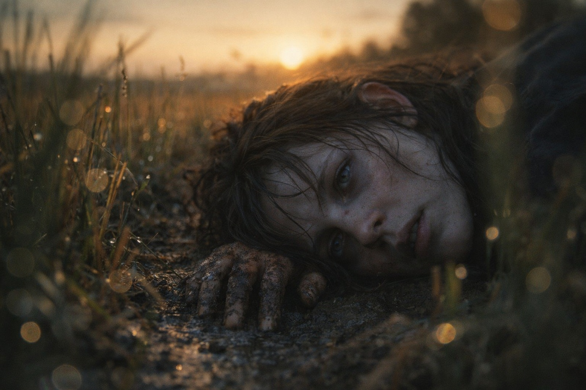
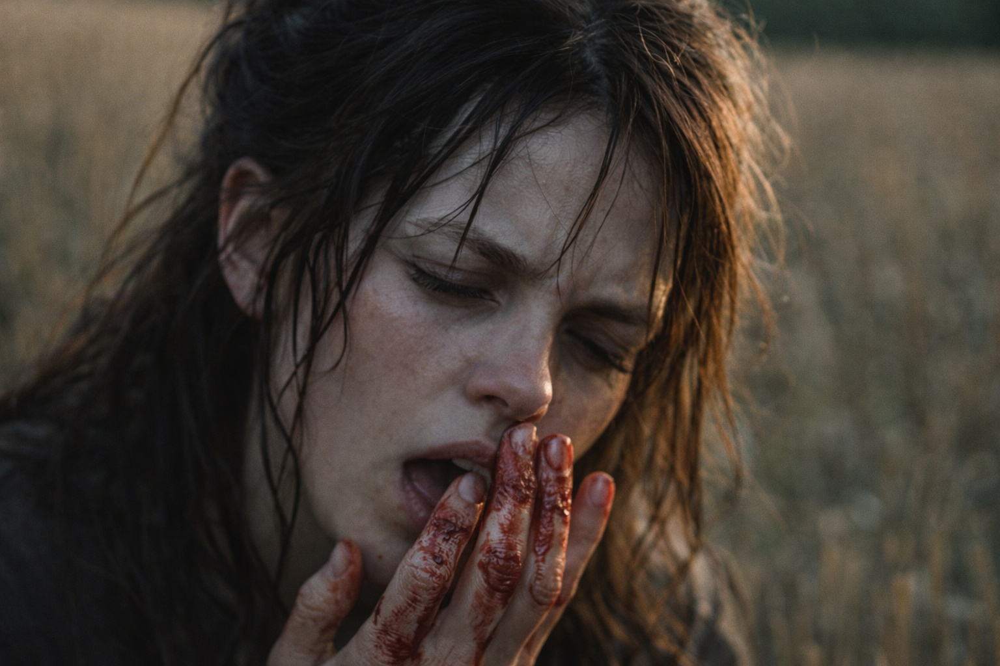
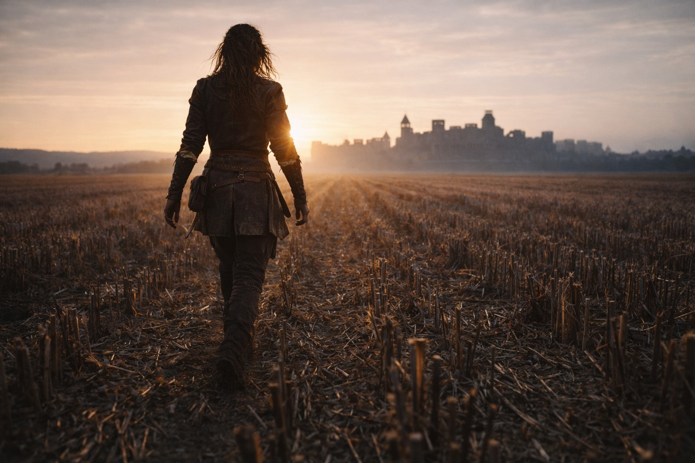

## Chapter 12 | Part 1

---

Hours before she reached Xandor's door, Maris woke in a field outside Riverhold, with cold grass pressed against her cheek.

Mud had packed beneath her nails. She tried to open her mouth and found her jaw aching.

Maris Hale lifted her head.

The sun had moved.

It had been morning when she was walking toward Riverhold. Now the light lay low across the field.

Hours gone.

Again.

She pushed herself onto one elbow.

Her skull objected.

Her tongue hurt too. She touched it carefully and tasted blood.

Bitten during the vision.

The boat was still there when she shut her eyes. A hand clung to its edge above black water, then lost its grip.

She opened her eyes and waited for the field to stop tilting.

Wind brushed her wet cheek. Somewhere to her left a lark was calling, far too loudly for such a small bird.

She got one knee under herself.

Then the other.

"Right," she said.

Her voice sounded terrible.

"That was fun."

Riverhold sat on the horizon, close enough to see roofs and smoke.

She could not remember leaving the road. Her footprints crossed a ditch and ended where she had fallen, so she must have walked here.

That was normal enough to be frightening.

She looked toward Riverhold, but the hand kept slipping into the water in front of its roofs.

Usually she lost the faces before she could put names to them. By the time she stood, she could seldom remember what had happened first.

This one stayed.

Maris stood.

Her legs shook hard enough that she had to wait before moving.

She pressed her thumbnail into the old scar at the base of her palm.

The scar hurt where she expected it to. She loosened her hand once she could feel the weight of her boots against the ground.

The field stayed a field.

She started toward Riverhold.

The hand returned once while she walked.

Exactly the same.

That was new.

---

**End of Chapter 12.1 —> 12.2: [The Grass Where She Fell: The Stable Image](/the-grass-where-she-fell-the-stable-image/)**
