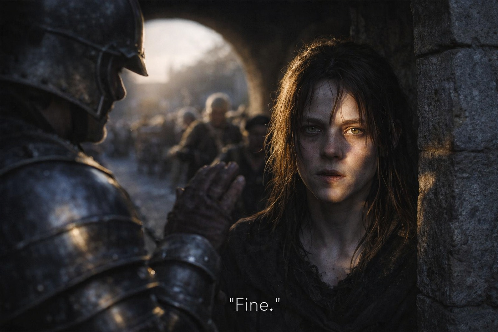

## Chapter 12 | Part 3

---

The road to Riverhold was dusty and ordinary.

Maris was grateful for both.

Farm carts passed her.

A merchant train rolled west.

One guard looked at the blood dried near her mouth and decided not to ask.

Good man.

The stable image surfaced again.

She let it pass without fighting.

Boat.

Black water.

Hand.

Then road again.

She pressed her thumbnail into the scar on her palm until the sting became specific.

*This is real.*

Dust under her boots.

Cart wheels.

Sweat cooling at her neck.

*The road is real.*

The question came anyway.

*Am I awake now?*

She hated that question because it had survived every answer she'd ever given it.

Riverhold's gate appeared ahead.

Maris joined the queue.

When her turn came, the guard barely looked up.

"Name?"

"Maris Hale."

"Business?"

"Trade."

That was easier than explaining the truth.

"How long?"

"A day. Maybe two."

He waved her through.

Inside, the town sounded aggressively normal.

Shop shutters.

Arguments over fruit.

A child crying because another child had something red and apparently important.

A dog barking at a cart wheel.

Maris stopped beside a wall and listened until none of it became anything else.

Still Riverhold.

Still evening.

Still awake.

Probably.

The pressure behind her eyes shifted.

Not stronger.

Directional.

She turned her head left.

Worse.

Right.

Less.

Maris frowned.

"Of course."

She walked right.

At the next junction she tried the same thing.

Straight made the pressure spike.

Left eased it.

She went left.

No voice told her where to go.

No vision gave her a street.

Good.

She could work with discomfort.

At least drowning in someone else's black water was new.

She laughed once.

Then followed the headache.

---

**End of Chapter 12.3 —> 12.4: [The Grass Where She Fell: The Conduit](/the-grass-where-she-fell-the-conduit/)**
