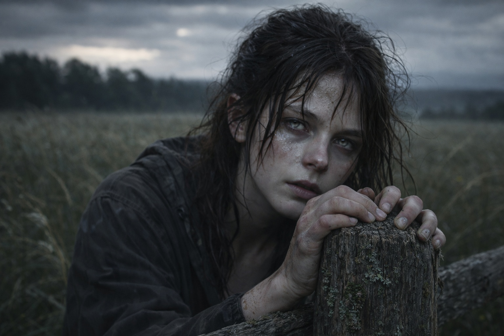
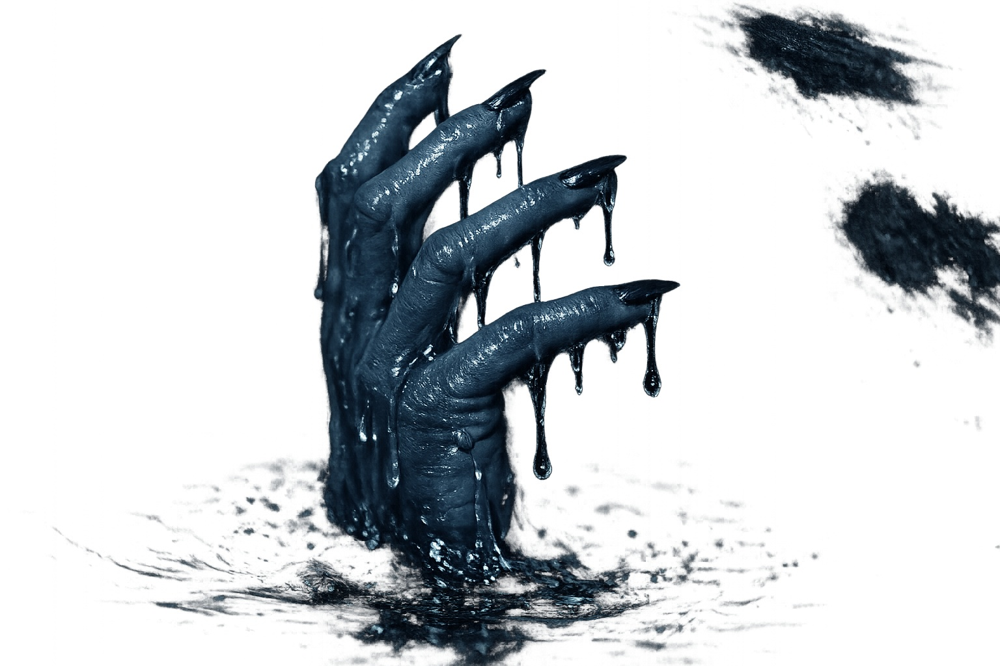
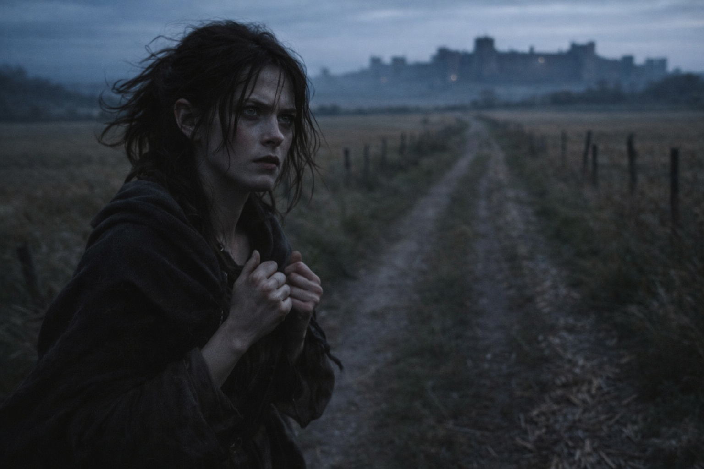

## Chapter 12 | Part 2

---

At the edge of the field, the image returned.

Maris caught the fence before her knees gave way.

A small boat rode on black water. The same hand clutched its edge, blue-grey fingers spread against the wood.

Even the little finger bent at the same angle. She waited for more of the arm to appear, for a face, anything she could recognize.

Nothing changed. That was all she meant when she called an image stable.

The hand slipped.

The water closed over it.

She tried to look beyond the hand. Her own lungs strained for air before the image let her go.

Maris came back against the fence with both hands locked around the wood.

A fresh stab of pain drove through her temple.

She waited.

A splinter caught her palm. She shifted her grip, watching a beetle travel along the fence rail until the sunlit road came back into focus.

"Fine," she said.

Nothing answered.

She had seen deaths before they happened.

She had seen arguments that never happened at all.

She had once watched a house burn three times and later discovered that the owner had only dreamed of fire.

She had warned him after the first vision. After the third, he had stopped opening his door to her.

She rubbed her palm against her skirt and found the splinter still there.

The hand returned.

She bent over the fence, breathing through her teeth until it passed.

"Very helpful."

Her own bitterness sounded almost normal.

That helped too.

She pushed away from the fence and kept walking.

Whatever the image was, Riverhold still lay ahead.

And the closer she came to the town, the worse the pressure behind her eyes became.

She had to stop at the next gatepost, nearer the town than she had meant to get.

---

**End of Chapter 12.2 —> 12.3: [The Grass Where She Fell: The Disorientation](/the-grass-where-she-fell-the-disorientation/)**
