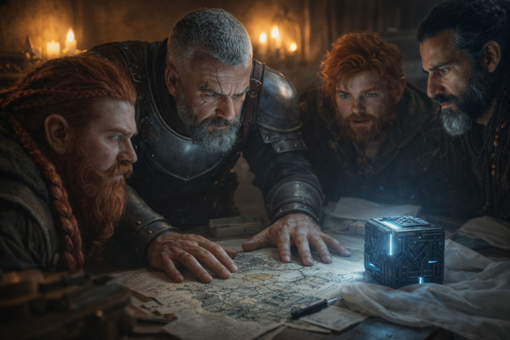
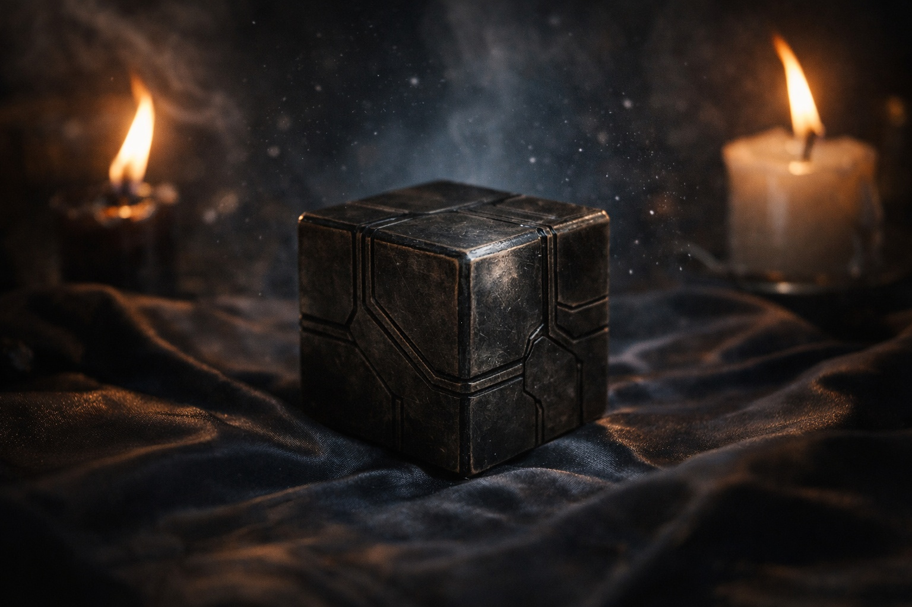

## Chapter 10 | Part 3

---

Dulint spread a road map across the table, holding one curled corner down with his mug. He began with the wall beneath Stonehold.

Eldric let him get as far as Zuraldi before asking him to point out where they had first seen the men.

At the culvert, Balin took over. He drew their hiding place beside the road and the route they had used to retrieve the cube.

"Two stayed here. The other two went through the scrub." Balin marked both routes with a dirty thumbnail.

"That part matters," Eldric said.

"Why?" Balin asked.

"They tried to cut you off after you recovered it. They can change their approach."

Dulint nodded.

"Aye. Nearly had us at the wood."

"If we have to move, we choose two routes before we leave."

Balin rubbed the bramble scratches on his wrist.

Eldric pushed the map toward him so he could mark the forest.

Beside the map lay Xandor's copied text. He had underlined *resonance* and filled the margin with possible readings.

The cube hummed on its folded silk. When Dulint reached past it for his mug, he kept his sleeve clear of the hot metal.

"Where has it pointed since Riverhold?" Eldric asked.

Dulint pointed north.

"Mostly that direction. Frostgard, perhaps. But it started shifting this afternoon."

"How?"

"Small corrections. Then larger ones."

"Moving target."

"Maybe," Xandor said.

Eldric watched the light on the cube.

"Did it turn before we came in?"

"Several times. Never far."

"Then watch whether it comes back to north."

Xandor marked the present bearing beside the earlier ones.

The light shifted across the cube.

All four men noticed.

The brightest patch moved several degrees toward Eldric.

Then stopped.

Balin looked between them.

"Well."

Eldric moved left.

The cube did not follow.

He moved right.

Nothing.

"Not tracking me."

Xandor frowned.

"It shifted when you came in."

"Or while I entered."

Eldric looked behind himself.

Through the open door, the stairs led down toward the street.

"If something was approaching from that direction, I would have stood between the cube and it."

Xandor stared at the orientation.

"Possible."

"Better than deciding I'm magical because I count exits."

Balin snorted.

Dulint hid a smile.

The light shifted again.

Toward the door.

Eldric's hand settled near his knife.

"How long until whatever that is reaches us?"

"We don't know," Xandor said.

"Then we decide whether to move."

"We looked at the northern roads this morning," Dulint said. "Balin saw two of those same men near the toll gate. We came back separately."

"Minor roads?"

"With the cube exposing us?"

Eldric considered the map.

"Show me which gate. We need another way out."

Balin leaned against the window.

"So we wait?"

"Watch the street," Eldric said. "Especially anyone who stops to look up at this window."

Balin straightened and turned back to the glass. Dulint stayed beside the cube while Xandor added the toll gate to his map.

Eldric took the door.

The light moved another fraction toward the doorway.

Eldric eased the door wider so he could see the landing.

---

**End of Chapter 10.3 —> 10.4: [The Knot at Riverhold: The Pull](/the-knot-at-riverhold-the-pull/)**
