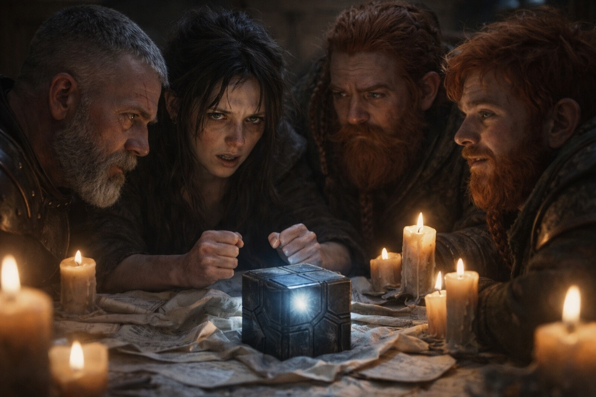
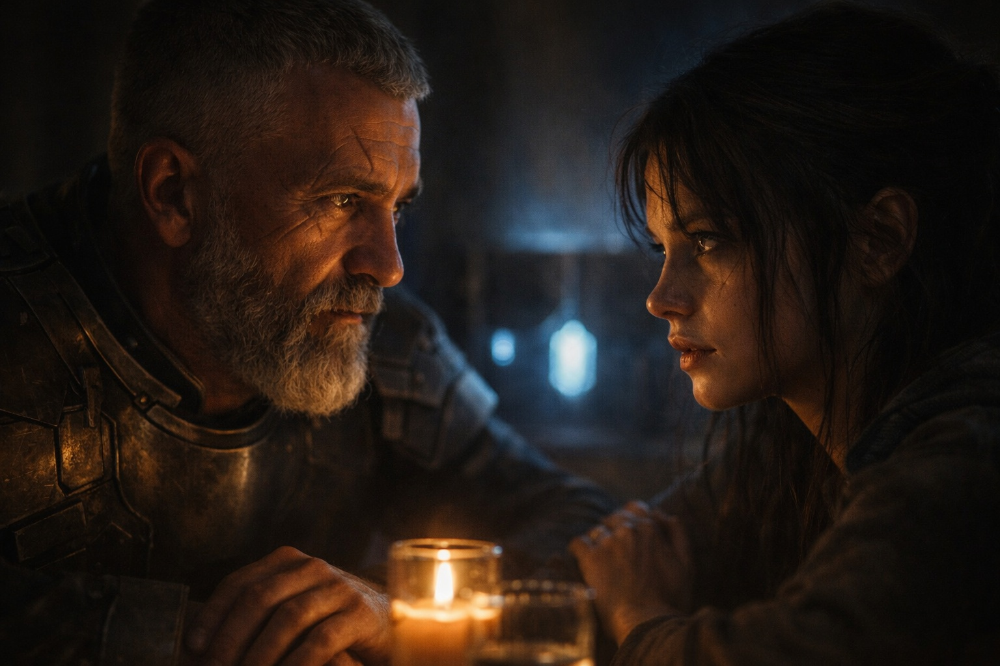

## Chapter 10 | Part 5

--- 

Maris described the vision again because Xandor asked for sequence, not meaning.

Boat.

Black water.

A hand slipping beneath the surface.

"No face?" Xandor asked.

"No."

"No landmarks?"

"No."

"Does the water move normally?"

Maris stared at him.

"No."

Xandor wrote that down.

"How long have you seen this exact image?"

"Since this morning. Other things before. Not this."

"And the pull toward Riverhold?"

"After I woke in the field."

Xandor added another line beneath **Observed**.

He did not add anything beneath **Conclusion**.

Dulint leaned against the table.

"So the cube sensed her."

"Maybe," Xandor said. "Or she sensed it. Or both are reacting to the same resonance. We have correlation, not mechanism."

Maris pointed toward him.

"Him I dislike less."

Balin smiled.

"The standard is low."

Maris almost smiled back.

Almost.

"The visions come whether I want them or not," she said. "They leave me on the ground. People stop believing me after the third warning that sounds impossible."

"I believe you," Eldric said.

She looked at him.

He did not explain.

Balin broke the silence.

"What do we actually do?"

Eldric liked him more every time he asked that question.

"We don't take the northern roads tonight," Eldric said. "They're watched."

"Agreed," Dulint said.

"We don't separate while we still don't know who can follow the cube."

Dulint nodded again.

Maris looked toward the door.

"How temporary is this arrangement?"

"Until morning," Eldric said. "Then we reassess."

"Good."

Xandor turned one of his pages around.

Observed.

Text.

Hypothesis.

"We also stop promoting guesses to facts."

Balin pointed to *Text*.

"Sense phase stays?"

"One surviving text calls it that. So yes, as a label."

"And resonance?"

"A word in the same text."

"Meaning?"

"Unknown."

Balin sighed.

"You're getting very good at that."

"Practice."

Eldric looked around the table.

Five people.

Three exits.

One artifact none of them understood.

That was enough information for tonight.

"Nobody leaves alone," he said. "Nobody carries the cube without a second person present. We set watches in pairs."

Maris looked at him.

"That I can agree to."

Dulint nodded.

"So can I."

Balin shrugged. "Better than being chased alone."

Xandor gathered his notes.

"Morning, then."

Eldric took the first watch by the window.

Not because they were a team.

Because the street gave him the best line of sight.

---

**End of Chapter 10.5 —> 11.1: [The Kind Man: The Savior](/the-kind-man-the-savior/)**
