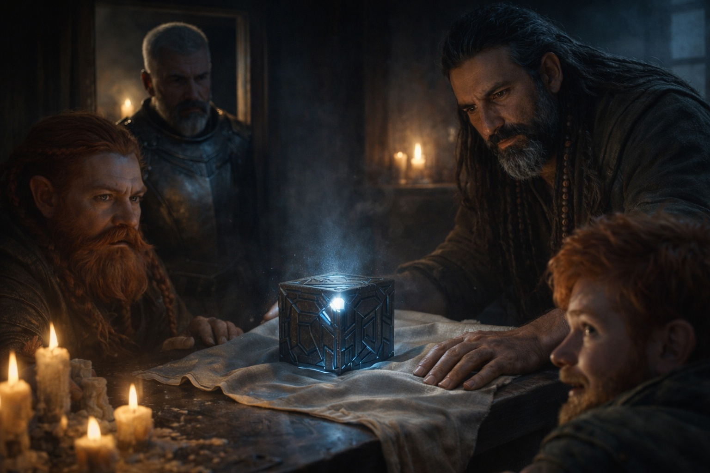
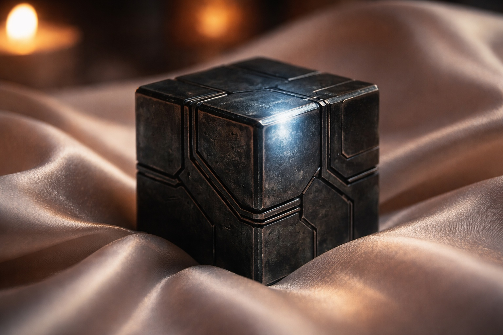
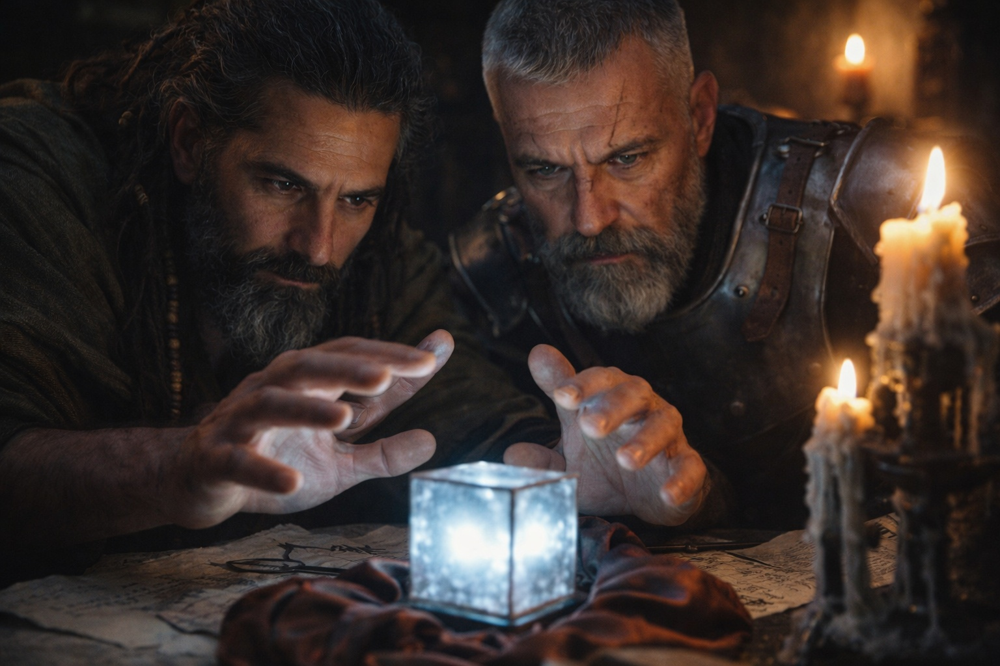

## Chapter 10 | Part 2

---

The window stood open above the stable roof. Eldric checked the drop before looking at the people inside.

He could reach that roof. The older dwarf might need help.

Two dwarves sat beside a table.

The older one was rubbing a swollen knee. The younger one's heel kept tapping against the floor.

Between them rested a metal cube.

Eldric noticed it before Xandor said anything.

Not because it glowed.

Because his attention kept returning to it.

"You feel something," Xandor said.

"Insistence."

Xandor nodded once. "Good word. I don't know what causes it."

"Dulint," Xandor said, "this is Eldric."

The older dwarf looked him over.

"You're the man who saw the Grukmar pattern."

"I'm the man nobody believed."

"Same man."

Eldric almost liked him.

Balin made an impatient sound.

"Can we get to the cube?"

Dulint looked at him.

"You've waited this long."

"Which is why I'm finished waiting."

Eldric stepped closer.

One face of the cube was faintly brighter than the others.

"Does it always orient like that?"

"Not always the same direction," Dulint said.

Xandor moved beside the table.

"It has been pointing north since breakfast," Xandor said. "Now and then the light grows stronger. Dulint says the men appeared after it first lit up."

"You saw them?" Eldric asked Dulint.

"Near enough to see the steel under their cloaks."

"And you found something in your books?" Eldric asked Xandor.

Xandor picked up a sheet covered in copied fragments.

"A name, at least. **Sense phase**. The writer calls it a function of the Nexus." Xandor held the sheet nearer the lamp. "The old word is difficult. Sense is as close as I can get."

Balin folded his arms.

"And what does Sense do?"

"I have been asking this page the same question since yesterday."

Xandor tapped the page.

"It speaks of finding resonance. Nothing here tells me what the writer meant by that. The explanation may have been on a page we no longer have."

"Does he mean another object like this?" Eldric asked.

"Perhaps. A person or a place might fit the word just as well."

"That doesn't narrow it much."

"No," Xandor said. "But I would rather leave a gap than fill it with an answer we might rely on."

Balin pointed at the cube.

"So what do we actually know?"

Dulint answered.

"It points. People found us."

"Can you hide it?"

"We tried wrapping it and burying it," Dulint said. "The followers still went straight toward it."

That interested Eldric more than any ancient terminology.

"Can you destroy it?"

Dulint drew the cube closer. "I won't hit it with a hammer in an upstairs room. If you've another method, I'll listen."

"Turn it off?"

Xandor shook his head.

"Nothing we have tried has stopped it."

Eldric looked at the cube again.

"It finds something, and the men find it. Is that what you think?"

Xandor smiled faintly.

"For now. I would like to know more before anyone has to run again."

"From how far away? And who else can hear it?"

"Unknown."

Xandor laid the page down. "We haven't found the edge of its reach."

Balin looked at his uncle.

"I like him."

Dulint grunted. "He says 'unknown' faster."

Eldric moved the stool away from the window.

"Tell me about the pursuit."

That was a problem he understood.

---

**End of Chapter 10.2 —> 10.3: [The Knot at Riverhold: The Beacon](/the-knot-at-riverhold-the-beacon/)**
