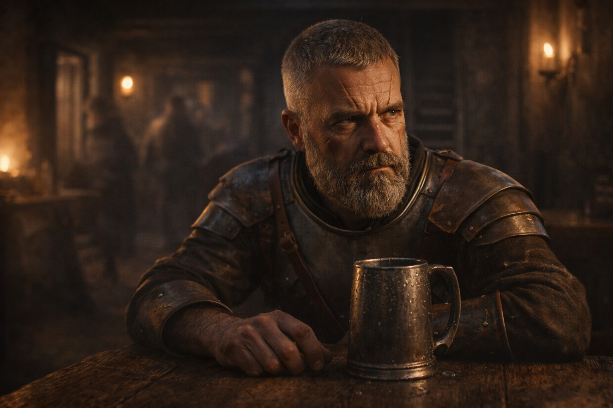
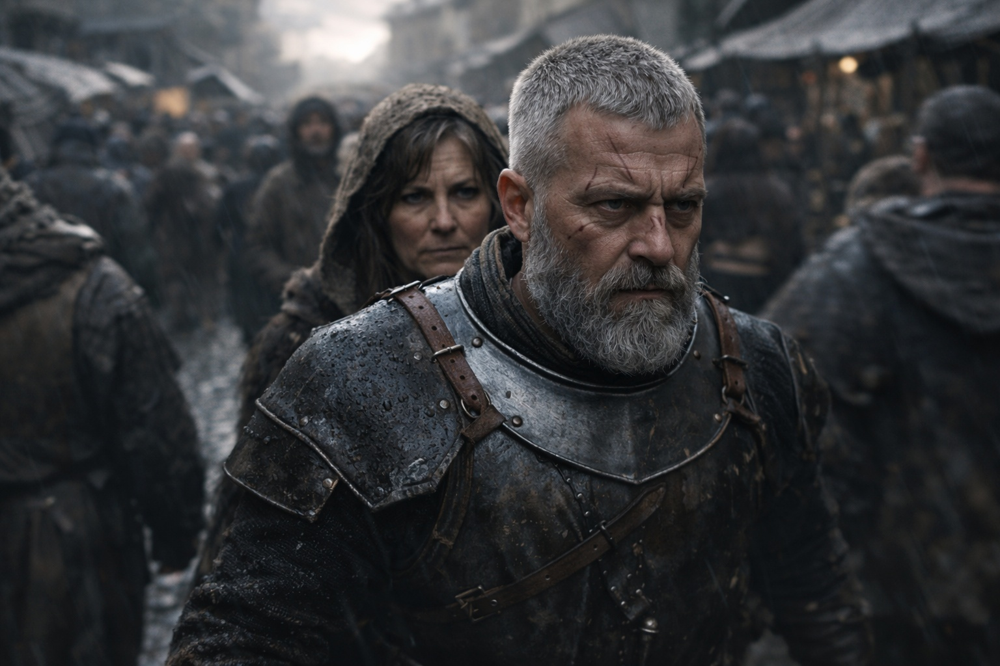
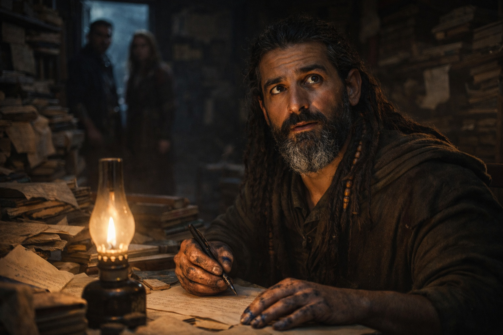

## Chapter 10 | Part 1

--- 

The tavern had three exits. Eldric had counted them before his first drink and mapped them before his second. By the third, he'd planned his route through each one.

He wasn't a soldier anymore. Hadn't been a commander in over a year.

The ale was weak, but weak ale was cheaper than strong ale, and Eldric's coin had stopped replenishing itself around the same time his commission had. Dismissed with honors, they'd called it. The kind of honors that meant *please stop embarrassing us with your inconvenient observations*.

He tried not to count the days.

Three hundred and forty-seven since his dismissal.

Ninety-three since Varian's body had been found.

Eighty-eight since Garrick's.

*Organized*, he had told them. *The Grukmar raids aren't random. They're coordinated. Someone is unifying the tribes.*

They had nodded.

Then sent him away.

Varian and Garrick had died afterward.

"Eldric."

He looked up.

Sera stood beside the table, travel-worn and dusty.

"Sera." He gestured to the empty chair. "Didn't expect you this far from Zuraldi."

"Didn't expect to be here." She sat. "I'm looking for Xandor."

That got his attention.

"He's in Riverhold. Scholar's Rest."

Relief came and went across her face.

"Why?"

Sera hesitated.

Eldric waited.

"Dwarves came through Zuraldi. Stonehold folk. An older merchant and his nephew. They were carrying something."

"Valuable?"

"I don't know." She leaned closer. "But the people following them did."

Eldric's eyes moved automatically to the nearest exit.

"When?"

"Four days ago. Maybe five."

Merchant pace put them in Riverhold already.

Pursuit pace put their enemies here too.

Somewhere around Garrick's funeral, Eldric had stopped trusting coincidence.

"I need to see Xandor."

"That's why I came."

They crossed Riverhold through the evening market.

Eldric tracked the crowd without thinking about it: hands hidden beneath cloaks, people holding position instead of moving, carts blocking lines of sight, alleys that narrowed into traps.

Nothing obvious followed them.

That meant little.

At the Scholar's Rest, Xandor opened the door before Sera knocked twice.

"Eldric."

"You sent her?"

"No. I was about to send someone else."

"Why?"

Xandor looked toward the inner room.

"Because Dulint and Balin arrived yesterday."

Eldric knew the names from Sera's description.

"And?"

"They brought something I can't classify yet."

Better answer.

"Show me."

Xandor opened the inner door.

---

**End of Chapter 10.1 —> 10.2: [The Knot at Riverhold: The Summons](/the-knot-at-riverhold-the-summons/)**
