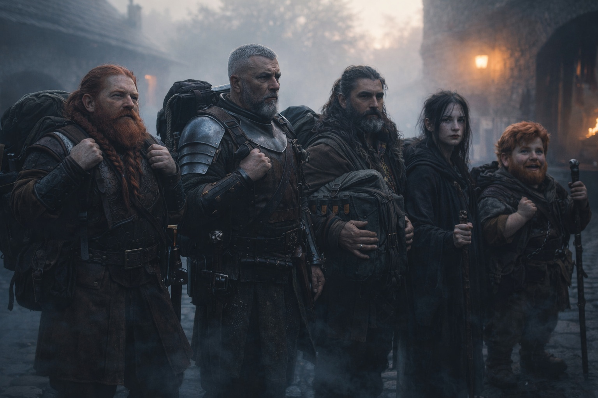
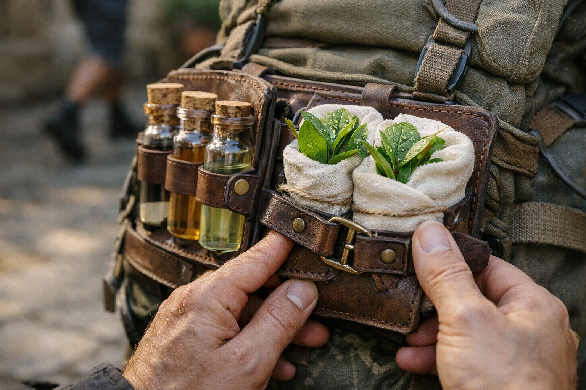

## Chapter 16 | Part 5

--- 

Dawn came too quickly.

The group gathered in the inn's courtyard, packs loaded, weapons checked, faces set with varying degrees of determination. Xandor had his plants secured in a special carrier—traveling companions of decades, he'd explained. Eldric wore his old military gear like armor against the world. Maris looked pale but steady, the Beacon's constant screaming somehow less visible in her expression.

And Balin. Young, eager despite the fear. Ready.

"Supplies confirmed?" Dulint asked.

"Six days' worth, with some reserve." Xandor nodded. "The route you chose gives us options for resupply if needed."

*The route I chose. The delay I forced.*

Dulint pushed the thought away. There was no room for doubt now.

The Beacon pulsed in Dulint's pack, its warmth pressing against his back. It had been getting stronger—pointing north with increasing insistence, as if it could feel itself getting closer to whatever it was searching for.

"The screaming's quieter this morning," Maris said quietly. "Still there, but... less. Does that mean anything?"

"It might mean we're heading the right direction," Xandor suggested. "Less resistance when we're moving toward what it wants."

*Or it might mean nothing at all,* Dulint thought. *We're navigating by pain and guesswork.*

"Then we go." He shouldered his pack, feeling the Beacon's warmth. "North. Toward Frostgard. Toward whatever answers this thing is searching for."

No one argued. No one cheered. They simply moved—five people bound together by an artifact none of them understood, walking toward a future none of them could see.

Dulint looked back once as Riverhold's walls shrank behind them. Somewhere beyond those walls, beyond the mountains and valleys and dangerous roads, Stonehold waited. His people. His home. Everything he was trying to protect.

Every step north was a step away from them.

*Slowly,* the seer had said. *Fail slowly.*

He was trying. It was all he could do.

And Dulint carried the weight of fearing how it might end.

---

**End of Chapter 16.5 —> 17.1: [The Second Choice: The Safe Dark](/the-second-choice-the-safe-dark/)**