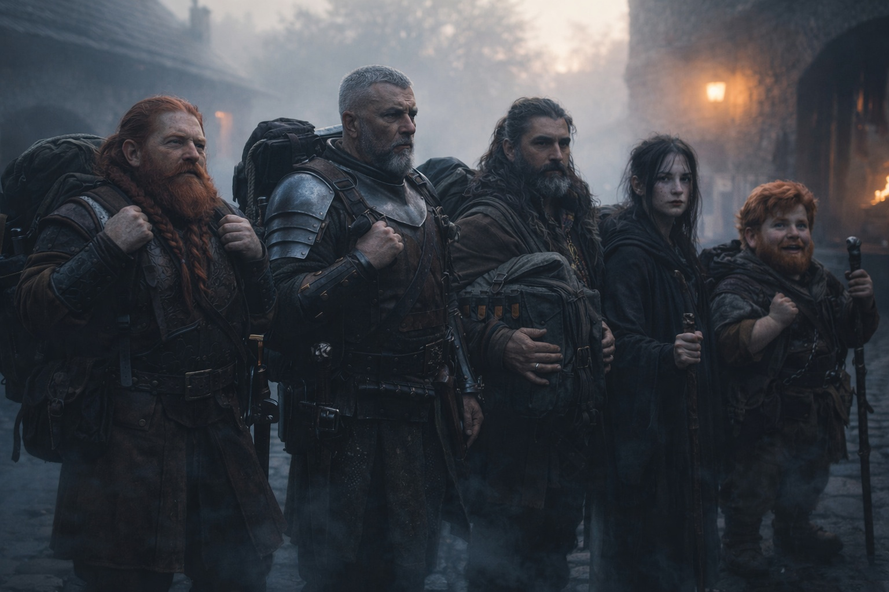
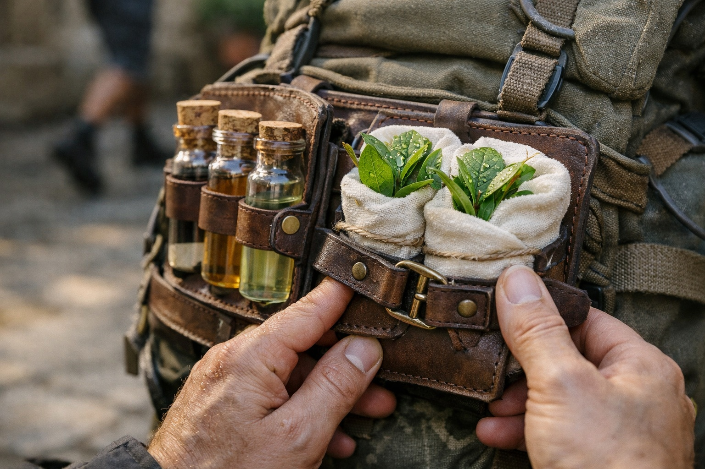

## Chapter 16 | Part 5

--- 

Dawn came too quickly.

The group gathered in the inn's courtyard. Packs loaded. Weapons checked. Xandor secured his plants in their travel carrier while Eldric tightened the straps on his old military pack. Maris stood near the gate, pale but steady.

Dulint caught Balin before he shouldered his pack and retightened the loose buckle at his nephew's chest.

"Supplies confirmed?" he asked.

"Six days' worth, with some reserve." Xandor nodded. "The route you chose gives us options for resupply if needed."

*The route I chose.*

Without the warning, he might have agreed to the shorter route. He had not told them that.

The Beacon pulsed in his pack, warming his back. Its light had grown stronger and kept pointing north.

"The screaming's quieter this morning," Maris said quietly. "Still there, but... less. Does that mean anything?"

"It might mean we're heading the right direction," Xandor suggested. "Less resistance when we're moving toward what it wants."

*Or it might mean nothing at all,* Dulint thought. *We're navigating by pain and guesswork.*

"Then we go." He shouldered his pack. "North."

They passed through Riverhold's gate as the sun cleared the wall.

Dulint looked back once.

Then he faced the valley road.

---

**End of Chapter 16.4 —> 16.5: [The Seer's Warning: The Truth](/the-seers-warning-the-truth/)**
