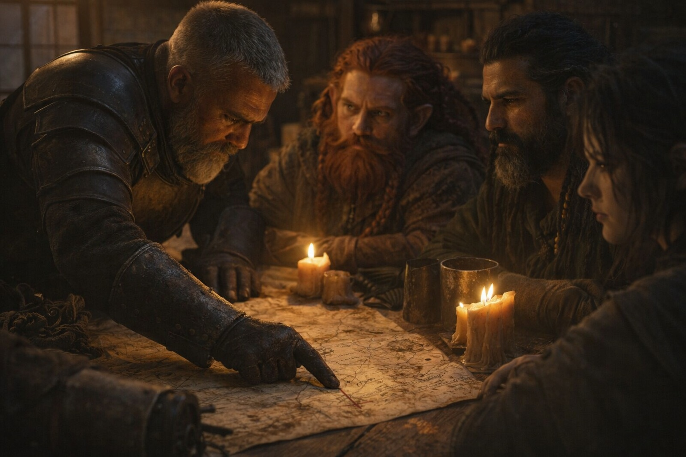
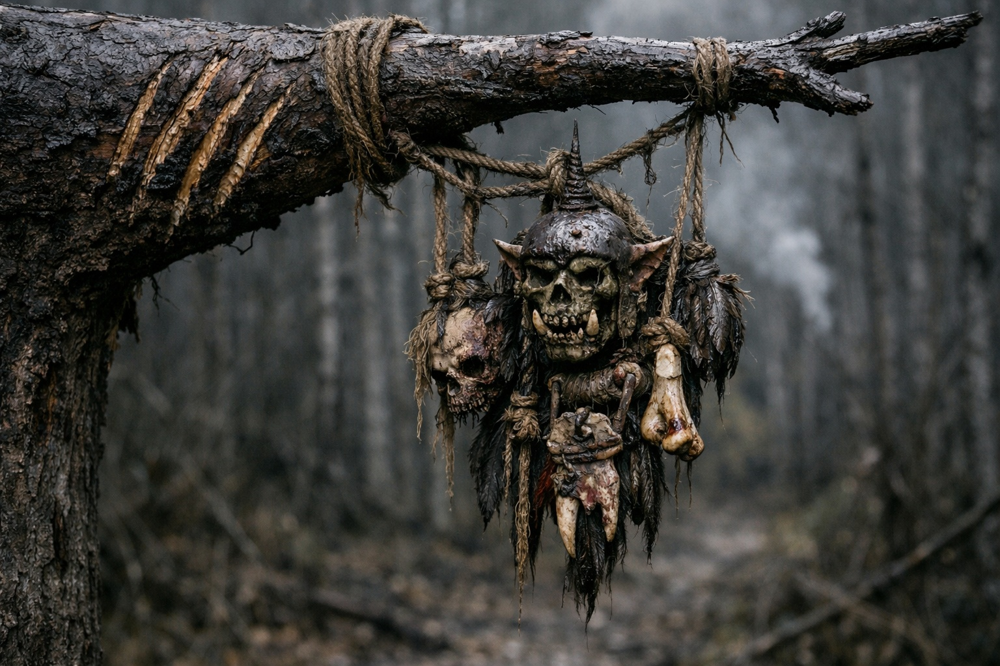
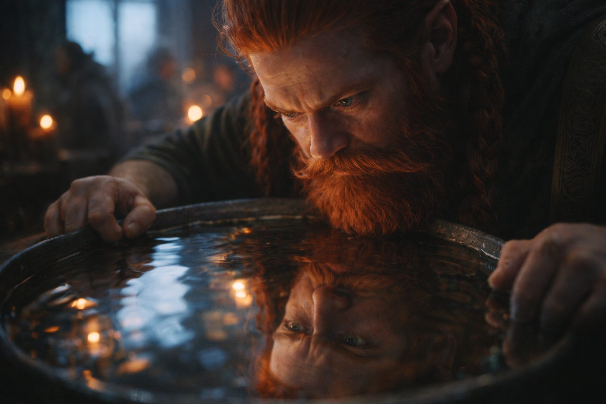
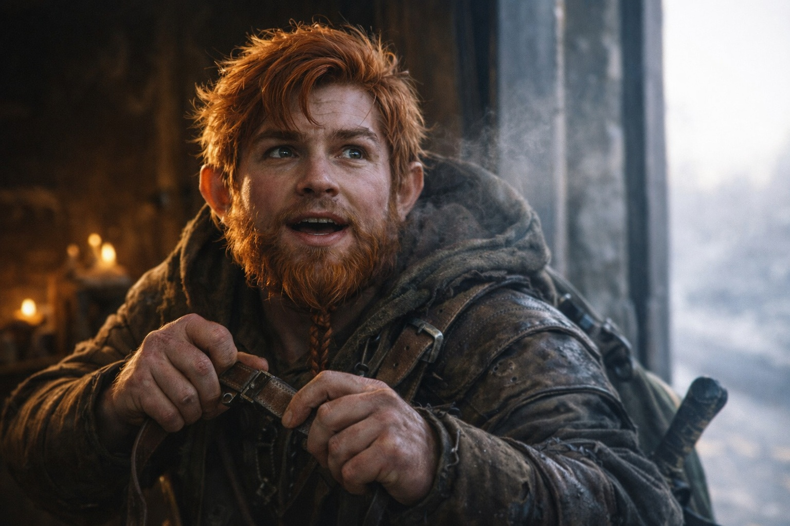
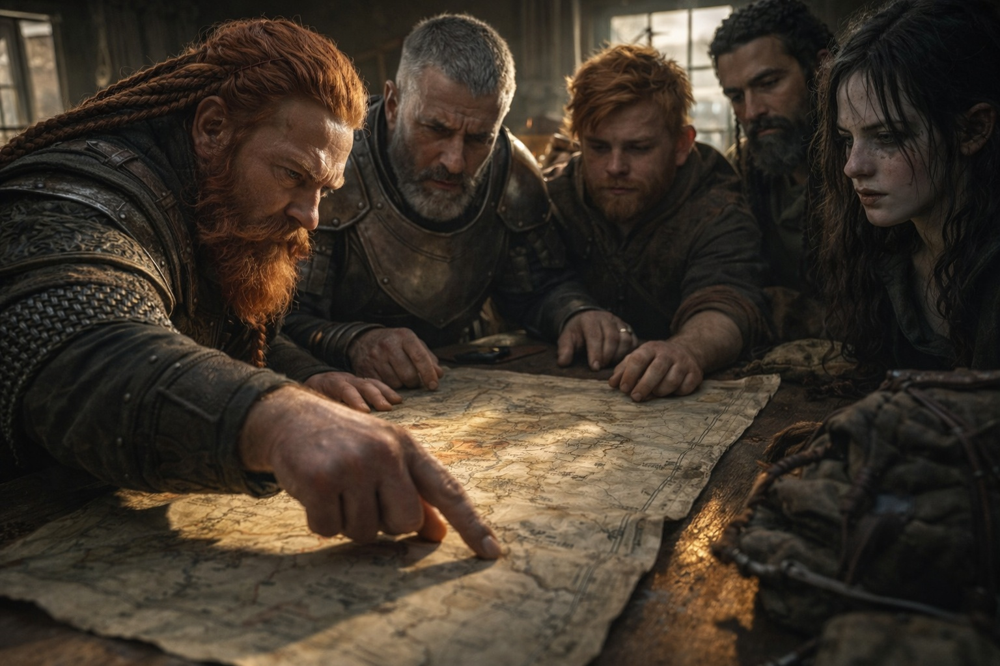

## Chapter 16 | Part 3

--- 

The argument began at dawn.

Eldric spread the map across the table, his finger tracing two lines north. "Fast route. Three days. Mountain passes, exposed terrain, but we move quickly."

"And walk straight through Grukmar patrol territory," Dulint countered. "We've seen the signs. They're organized. They're hunting."

"They're always hunting. Speed gets us through before they can react."

"Speed gets us killed."

The others watched the exchange silently. Xandor, neutral as always. Balin, clearly itching to move. Maris, pale and quiet, the Beacon's constant presence wearing on her.

"The longer route." Dulint pointed to a different line. "Six days. Valley paths, more cover. Harder terrain, but safer."

"Three extra days." Eldric's voice was flat. "Three days where the artifact keeps broadcasting. Three days where whatever's tracking us gets closer."

Eldric's arithmetic was sound.

The seer's voice answered it anyway.

*Fail slowly.*

"The Grukmar in those mountains aren't scouts," Dulint said. "They're ambush teams. Organized, experienced. We walk the fast route, we're betting everything on getting through before they find us."

"And the slow route?"

"We take longer, but we control the engagement if one happens. Cover, sight lines, terrain advantage."

Xandor spoke finally. "Both positions have merit. The question is which risk we prefer—speed with exposure, or caution with time."

"The artifact's broadcast doesn't care about our preferences," Eldric said. "Every day we delay is another day something finds us."

Dulint looked at Balin. His nephew was already leaning toward the map, ready to move.

"We take the valley route," Dulint said.

Eldric's jaw tightened, but he didn't argue further.

Dulint did not tell them why.

---

**End of Chapter 16.3 —> 16.4: [The Seer's Warning: The Truth](/the-seers-warning-the-truth/)**