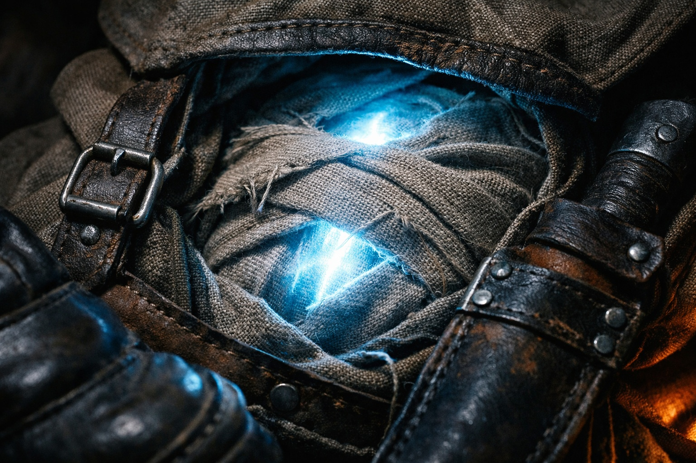
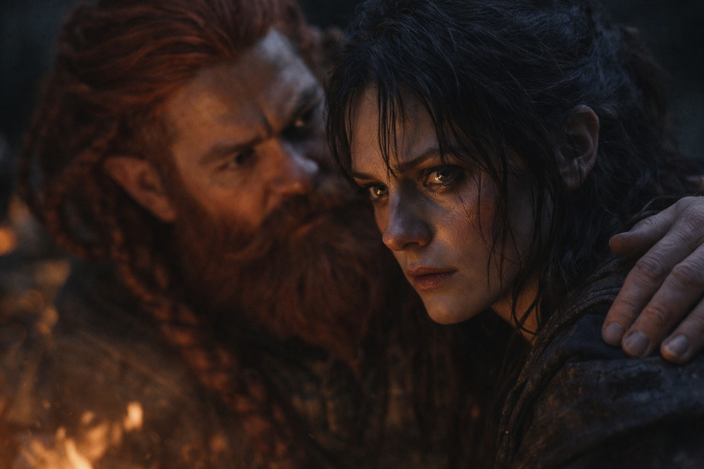

## Chapter 16 | Part 4

--- 

Maris found him that night.

Dulint had taken first watch—not because it was his turn, but because sleep wouldn't come anyway. She appeared from the shadows of their makeshift camp, moving quietly, settling beside him without invitation.

"You don't sleep either," she said.

"Old dwarves." He almost smiled. "We don't rest easy."

"You've known something since before Riverhold." It wasn't a question. "Something you used when you chose the valley route."

Dulint stayed silent. The Beacon pulsed beside the bedrolls.

"I don't see anything," he said. "I went to someone who does."

Maris turned toward him.

"A seer," Dulint said. "Before we started this. She showed me what might happen."

"What things?"

"Stonehold burning. Balin gone. Other paths where both remain." He kept his eyes on the dark beyond the fire. "And one instruction. Fail slowly."

"And you're not telling the others."

"No."

"That's not your choice to make." Her voice was sharp. "Their lives. Their futures. They deserve to know what they're risking."

"Knowing might make Balin rush. It might make all of us choose from fear."

"Maybe. Or maybe we'd be better prepared."

Dulint looked at the coals. "I heard *fail slowly* and chose the valley. I don't even know if that's what she meant."

"Yet you let everyone argue as if terrain was the only reason."

"By lying to them."

"By protecting them."

Maris was quiet for a long time. When she spoke again, her voice was softer, but no less certain.

"That's still not your choice."

Dulint looked toward the bedrolls, where Balin slept among the others. "I was trying to keep him alive."

"That's still not your choice."

---

**End of Chapter 16.5 —> 17.1: [The Second Choice: The Safe Dark](/the-second-choice-the-safe-dark/)**
