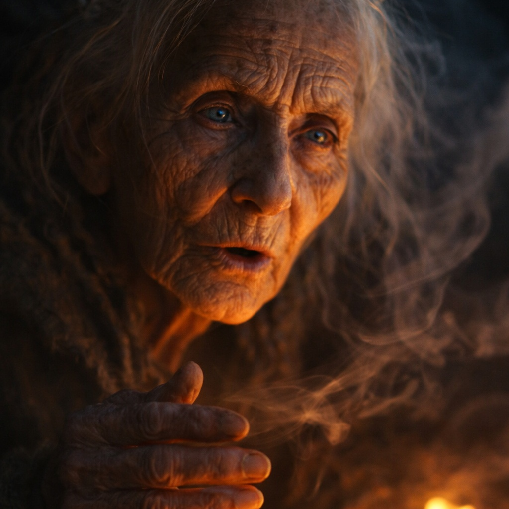
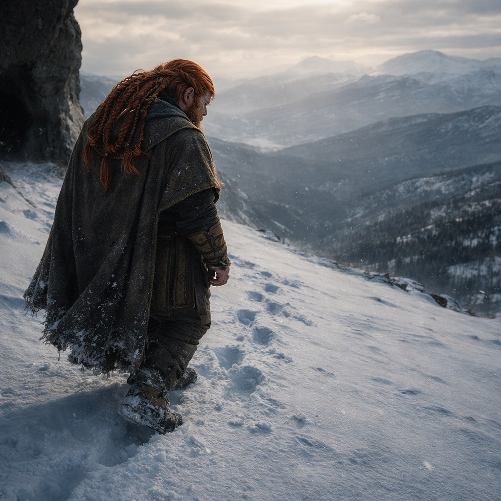

## Chapter 16 | Part 2

---

*Three weeks earlier.*

The seer lived in a cave above the treeline, where the mountain air grew thin and the path grew treacherous. Dulint had told no one where he was going. Told Balin he needed to scout ahead. Told himself he just wanted information.

She was sitting beside a cold brazier when he arrived. Whether she had expected him, Dulint couldn't tell.

"The dwarf with the singing stone." Her voice was thin and barely audible. "You carry something loud."

"The artifact?"

"I don't know what you carry." She tilted her head, eyes focusing on something beyond him. "I know the wake it leaves. And I can follow some of the paths around the man carrying it."

Dulint's heart hammered. "Tell me."

"You will fail."

Dulint gripped his pack strap. "There must be something—"

"Every road I can follow ends in loss." She stepped closer. Up close she looked smaller than he had expected, all tendon and old bone.

"What kind of loss?"

"In one path, Stonehold burns and I cannot find your nephew beyond it." Her gaze slipped past him again. "In better paths, Balin remains. Stonehold remains. You..." She frowned. "I lose sight of you before the end."

"Dead?"

"I said I lose sight of you."

"How do I—"

"Slowly."

She said nothing more.

"Slowly?"

For the first time, uncertainty crossed her face.

"Fail slowly."

"That doesn't tell me what to do."

"No." She turned back toward the cold brazier. "It tells you what I saw. What you do with it is yours."

Dulint stood there another moment, waiting for more. None came.

He left with a warning he did not understand and one word he could not forget.

*Slowly.*

---

**End of Chapter 16.2 —> 16.3: [The Seer's Warning: The Route](/the-seers-warning-the-route/)**
