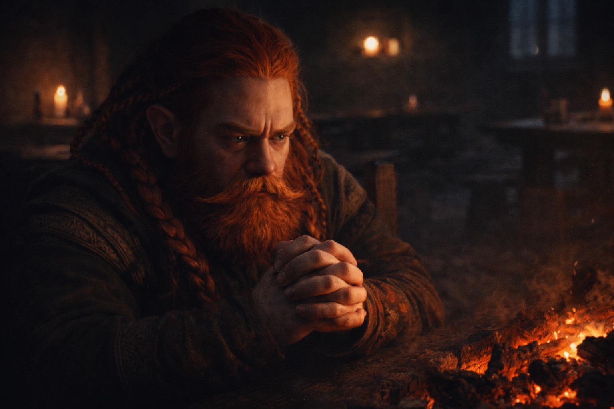
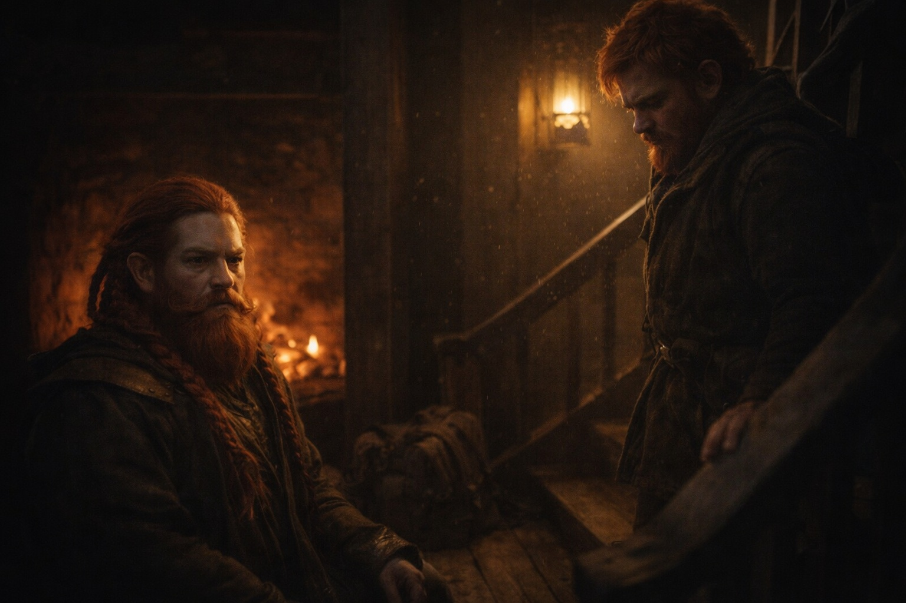
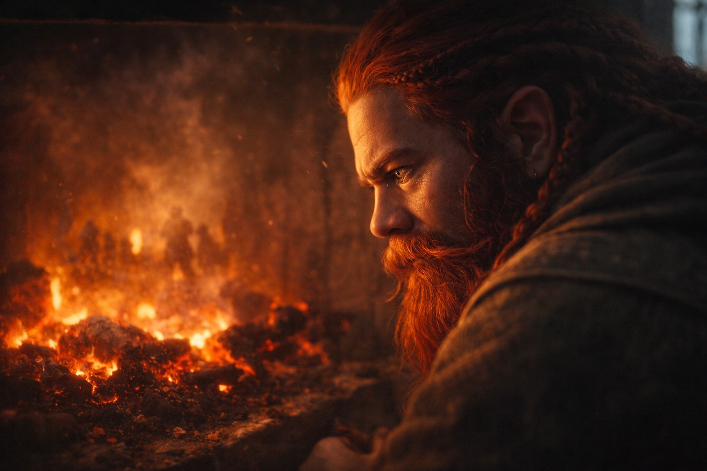

## Chapter 16 | Part 1

---

Dulint couldn't sleep.

The night before departure, and his mind wouldn't quiet. He sat in the corner of the inn's common room, long after the others had gone to their beds, watching the fire die and hearing words that wouldn't stop echoing.

*You will fail.*

The seer's voice had been flat when she said it. That made the words worse.

He could still see her weathered face, her eyes fixed somewhere past him.

*You will fail.*

He heard footsteps on the stairs and forced his face still. Balin appeared, young face creased with concern.

"Uncle? It's late."

"Old men don't need much sleep." The lie came easily, worn smooth from repetition.

"You've been different since we left Stonehold." Balin sat across from him, uninvited but welcome. "Something's weighing on you."

*Stonehold burning. Balin gone.*

"There's always something weighing on old dwarves," Dulint said. "We've had longer to accumulate weights."

"Uncle—"

"It's nothing that helps you to know." Honest, in its way. Knowing would only make Balin rush. Rushing would get them all killed.

*Fail slowly,* the seer had said.

Balin studied him for a long moment, then nodded reluctantly. "Get some rest. Tomorrow we leave."

"I know."

When Balin was gone, Dulint turned back to the dying fire. He remembered what the seer had described: Stonehold burning. Balin absent from the paths she could follow.

He should tell them.

Instead he watched the last log split and settle into the coals. If Balin knew, he would try to outrun the warning. Dulint knew that much about his nephew.

So he said nothing.

---

**End of Chapter 16.1 —> 16.2: [The Seer's Warning: The Visit](/the-seers-warning-the-visit/)**