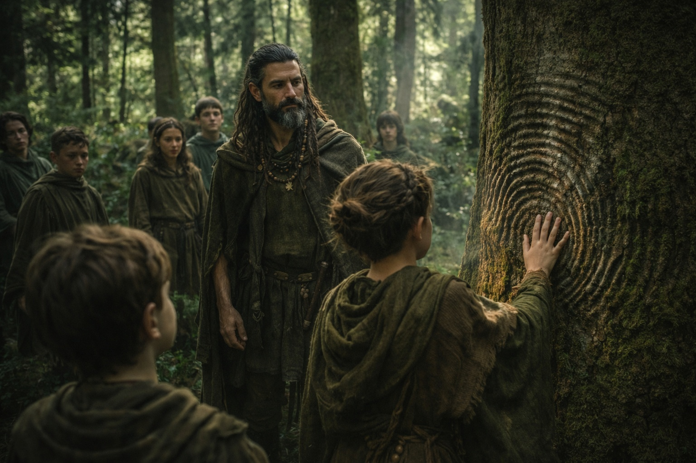

## Lore | The Zuraldarr

--- 

[Zuraldi](https://www.drusniel.com/the-zuraldarr/) stretched across the eastern reaches of Lumeshire, a rugged expanse of dense forests and craggy mountains. The land bred hardy folk, the Zuraldarr, whose strength matched the terrain they called home.

Anja stood atop a cliff, her eyes scanning the horizon. Below, the forests of [Zuraldi](https://www.drusniel.com/the-zuraldarr/) spread out like a green sea, broken only by the glint of rivers and the occasional clearing. To the east, the peaks of [Stonehold](https://www.drusniel.com/forge-and-fire-the-mountain-kingdom-of-stoneholds-stand-against-chaos/) loomed, marking the border with the dwarven kingdom.

"See those passes?" She pointed to narrow gaps between the mountains. "Our ancestors used them to outmaneuver every army that tried to take our land."

Her apprentice, Torben, squinted against the sun. "But we're part of Lumeshire now, aren't we?"

Anja nodded. "On our terms. The empire learned it was better to have us as allies than enemies."

## A History Written in Stone and Blood

In the village square, Elder Hilda traced her fingers over an ancient stone monolith. Carved into its surface were scenes of battle and triumph.

"This tells the story of the Battle of Broken Axe Pass," she explained to a group of wide-eyed children. "A thousand imperial soldiers entered the pass. Only ten left alive."

A young girl raised her hand. "But why didn't we kill them all?"

Hilda's weathered face creased in a smile. "To send a message. The Zuraldarr can't be conquered, only bargained with."

## The Caravan's Path

The mountain pass was loud with wheels and hooves. A long line of wagons wound through the rocky terrain, heavy with goods. Zuraldarr traders guided stocky mountain ponies along switchbacks that would have killed a lowland horse.

Marta, the trade matriarch, stood at the head of the caravan.

Her keen eyes scanned the treacherous path ahead, ever watchful for loose rocks or signs of bandits.

A dwarven merchant, his beard braided with gold threads, approached her. "Marta! Good to see you. How's the crop this year?"

"Bountiful as always, Thorin. Your people won't go hungry this winter."

The dwarf nodded appreciatively. "And you'll have enough axes and picks to last you till next spring. Though I must say, this mountain path never gets easier."

Marta grinned, a fierce pride in her eyes. "That's why you need us, my friend. No one knows these trails like the Zuraldarr."

As if to prove her point, she barked out a series of commands. The caravan shifted formation smoothly, navigating a particularly treacherous bend in the path without breaking stride.

"Impressive," Thorin muttered. "I see why the empire values your alliance."

Marta's expression turned serious. "They'd better. This trade route is the lifeblood of both our peoples. Lumeshire knows we control the fastest path between their lands and [Stonehold](https://www.drusniel.com/forge-and-fire-the-mountain-kingdom-of-stoneholds-stand-against-chaos/)."

As they talked, workers unloaded crates of dwarven metalwork and finely cut stones from some wagons, replacing them with sacks of grain, barrels of salted meat, and crates of fresh produce.

"Your beef is particularly popular this season," Thorin said. "The mountain grass gives it a flavor our people can't resist."

Marta nodded, pleased. "We'll be sure to increase the shipment next time. Now, shall we discuss the terms for those mithril tools you mentioned last season?"

Their handshake was firm. As the sun dropped behind the peaks, the caravan pulled off the trail to make camp. The ponies were fed before the drivers.

## Feasts of the Strong

The air filled with the sizzle of meat and the rich aroma of roasting beef.

 In the village center, a massive fire pit glowed red-hot. Above it, cuts of meat larger than a man's torso turned slowly on spits.

Torben's mouth watered as he watched the village butcher, a woman with arms like tree trunks, carve thick slabs from a roasted side of beef. Each steak was the size of a shield, charred on the outside and red within.

"Nothing builds strength like Zuraldarr beef," grunted the butcher, handing Torben a plate piled high with meat. "Eat up, boy. You'll need it for tomorrow's log rolling."

Nearby, Elder Hilda chuckled. "In my day, we had to fell a tree before we earned our steak." But her eyes twinkled with mirth as she said it, her own plate piled high.

## Witches of the Wood

As night fell, the festivities grew quieter. Eyes darted to the edge of the firelight, where shadows seemed to move of their own accord. A hush fell over the gathering as a figure emerged from the darkness.

Magda the Witch stood tall and lean, her gray hair wild and adorned with bones and feathers. Her eyes, sharp and knowing, swept over the crowd. Respect and fear rippled through the assembly in equal measure.

Xandra, the Leadership matriarch, stepped forward. "Welcome, Magda. Will you bless our feast?"

Magda's voice rasped like dry leaves. "I'll do more than that, child. The bones speak of change on the wind. Best we prepare."

She raised her gnarled staff, and the flames of the central fire turned an eerie green.

 In their light, shadows danced on the surrounding trees, taking shapes that made even the bravest Zuraldarr shift uneasily.

As quickly as it began, it was over. The fire returned to normal, and Magda melted back into the shadows. Conversations slowly resumed, but with a nervous energy.

"Witches," muttered a young warrior to his companion. "Can't live with 'em, can't live without 'em."

His friend nodded sagely. "Aye. They scare the piss out of me, but I'd rather have them with us than against us."

## Guardians of the Green

Morning fog still clung to the ground when the druids gathered. Deep in the woods, where the canopy blocked most of the light, a circle had been cleared. Not by axes. The trees had simply grown apart here, leaving a gap that none of the village elders could remember being made.

Xandor, his beard now more white than gray, led the circle.

He spoke without raising his voice. He didn't need to.

"The elves whisper to trees and coax flowers to bloom. But we are Zuraldarr. We don't ask nature for favors. We wrestle with it, challenge it, and earn its respect."

Around him, the other druids nodded. Their hands were calloused, their knuckles scarred. Each carried a staff cut from a different wood, and the air near them felt heavier than it should have.

A young druid stepped forward, pressing her hand against the trunk of an ancient oak. The tree's bark rippled at her touch, and a low groan emanated from deep within its trunk.

"Good," said Xandor. "The forest knows your strength. Now, let's see you split that boulder over there. Not with your hands, mind you. With the forest's power."

The young druid grinned. The boulder split with a sound like a bone breaking. Xandor said nothing, but his expression suggested it wasn't supposed to happen that fast.

## The Matriarchs' Council

Night fell, and in the Great Hall, six women gathered around a circular table. Each wore a sash denoting her role: Agriculture, Defense, Trade, Justice, Spirituality, and Leadership.

Anja, now wearing the sash of Defense, spoke first. "The empire's asking for more troops to guard the eastern border."

Marta, the Trade matriarch, frowned. "We're already stretched thin with the increased shipments to [Stonehold](https://www.drusniel.com/forge-and-fire-the-mountain-kingdom-of-stoneholds-stand-against-chaos/)."

"Perhaps," said Xandra, the Leadership matriarch, "it's time to remind Lumeshire of the terms of our agreement."

Hilda, representing Spirituality, nodded sagely. "The spirits of our ancestors whisper caution. We must maintain our strength, our independence."

The women debated long into the night. When dawn broke, they emerged with a decision. Whether it was the right one, none of them could say.

As the meeting concluded, Xandra turned to Hilda. "What of Magda's warning?"

Hilda's face grew solemn. "The witch's words carry weight. I suggest we consult both her and the druids before making our final decision."

Xandra nodded, but she didn't look reassured.

---

The next morning, Torben found Anja on the same cliff where she'd shown him the passes.

"You said we joined Lumeshire on our terms," he said.

Anja was quiet for a while. The wind carried the sound of hammers from the training grounds below, and the faint smell of woodsmoke from the druids' clearing.

"I said what Hilda taught me," she said finally. "The terms were set a long time ago. Whether they still hold..." She trailed off, watching the eastern peaks where Stonehold's borders began. "Ask me again next season."

Torben waited for more. It didn't come.

Below them, the village moved through its morning. Children sparred in the training grounds. Farmers worked the terraced fields. In the forest, loggers felled trees under the druids' watch, taking only what they were told to take.

Everything looked the way it always had. But Magda's warning hung over the village like smoke that wouldn't clear, and the Matriarchs' Council had made a decision no one was talking about.

Anja turned from the cliff and walked back toward the village without looking at the eastern passes again.

**End of Lore 2 — continues in Lore 1: [The Mysteries of the Wyrmreach Dominion](/dark-depths-the-wymreach-dominion/)**