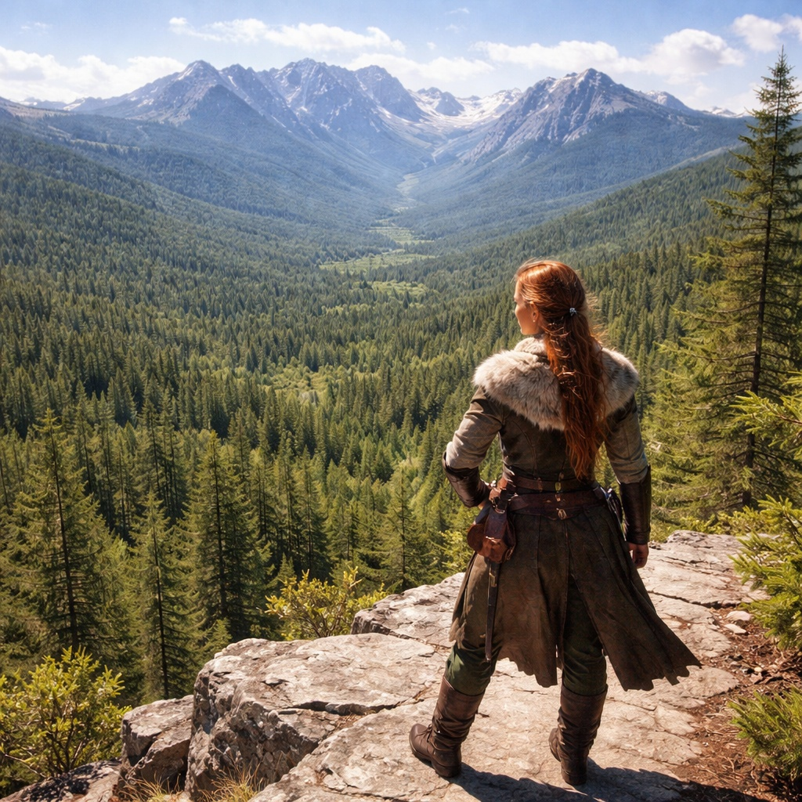
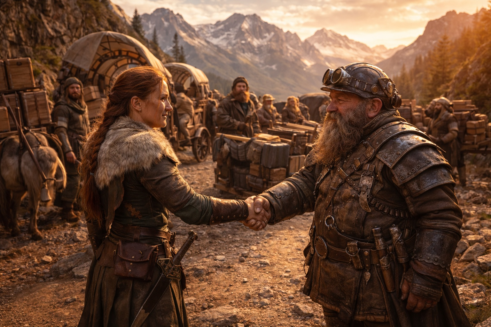

## Lore | The Zuraldarr

---

Wind off the eastern peaks pulled at Anja's cloak. From the cliff she could follow the forests of [Zuraldi](/the-zuraldarr/) to the mountain passes. The village songs claimed no army had ever taken those roads without permission.

Torben stood beside her, squinting toward [Stonehold](/forge-and-fire-the-mountain-kingdom-of-stonehold-stand-against-chaos/). A river flashed through a gap in the trees below.

"See those passes?" Anja pointed to narrow gaps between the mountains. "Our ancestors used them to outmaneuver every army that tried to take our land."

Her apprentice looked back at her. "But we're part of Lumeshire now, aren't we?"

Anja nodded. "On our terms. The empire learned it was better to have us as allies than enemies."

## A History Written in Stone and Blood

In the village square, Elder Hilda traced her fingers over an ancient stone monolith. Carved into its surface were scenes of battle and triumph.

"The Battle of Broken Axe Pass," she told the children, following a row of worn figures with her thumb. "The song says a thousand imperial soldiers came in. Ten walked out."

A young girl raised her hand. "But why didn't we kill them all?"

Hilda smiled. "Someone had to carry the message." She rubbed dirt from the last figure. "That is how my mother told it. An imperial copy calls it a withdrawal. Neither gives the names of the ten."

## The Caravan's Path

Later that day, Marta's caravan reached a bend above the trading shelf. Wheels ground against loose stone. The Zuraldarr drivers shortened the traces before guiding their mountain ponies around it.

Marta, the trade matriarch, stood at the head of the caravan.

She watched the loose stones shift beneath the lead wagon.

A dwarven merchant, his beard braided with gold threads, approached her. "Marta! Good to see you. How's the crop this year?"

"Enough to fill your wagons, Thorin. If you brought the price we agreed."

The dwarf nodded toward the loaded wagons. "Axes and picks, as promised. Though I should charge for the climb."

"Then I should charge for bringing you down again." Marta held up a hand to stop the lead driver.

She sent two drivers to brace the rear wheels. The last wagon cleared the bend with its outer rim hanging over empty air.

Thorin waited until it was on level ground. "I remember that bend wider."

"You brought a wider wagon." Marta pointed toward the unloading shelf. "Lumeshire would send a column through here if we let them. Imagine turning that around."

On the shelf, workers exchanged the dwarven metalwork and cut stones for grain and barrels of salted meat. Marta counted each load as it passed.

"Double the beef next time," Thorin said. "The last barrels were gone before the thaw."

"Double the salt in your return load. Then we can talk about those mithril tools."

They shook hands. At dusk the caravan made camp on the shelf. Marta checked the ponies' feed before accepting her own supper.

## Feasts of the Strong

Back in the village, fat hissed into the feast fire. Torben edged closer to the spit, following the smell.

In the village center, a massive fire pit glowed red-hot. Above it, cuts of meat larger than a man's torso turned slowly on spits.

The butcher braced a roasted side of beef with his fork and cut Torben a slice that overhung his plate. He caught the juices on a heel of bread.

"Eat before it cools," he said. "You're on the first log team tomorrow."

Hilda held out her own plate. "In my day we had to fell the tree first." The butcher gave her a second slice without looking up.

## Witches of the Wood

The songs faltered when Magda came out of the trees. Torben heard the iron tip of her staff strike a stone beyond the firelight.

Bones and feathers hung in her loose gray hair. A warrior pulled his bench aside to make room, and she passed without thanking him.

Xandra, the Leadership matriarch, stepped forward. "Welcome, Magda. Will you bless our feast?"

Magda planted her staff beside the pit. "Ask me after winter. The bones have fallen badly twice. I would keep grain back."

She raised the staff, and the fire turned green. Her breath caught. She lowered the staff quickly and leaned on it with both hands.

The shadows on the trees changed shape. The warriors shifted on their benches.

The flame returned to its ordinary color. Magda left slowly, using the staff at each step. Xandra watched until she reached the trees.

"Does she ever bring good news?" a young warrior muttered.

His companion kept his eyes on his plate. "I'm keeping grain back."

## Guardians of the Green

At dawn, fog dampened the druids' robes as they gathered in a clearing. Hilda said the trees had grown apart for the first circle. A woodcutter claimed his grandmother still had the axe that cleared it. Xandor had heard both accounts.

Xandor led the circle.

He waited until the youngest druid put down her pack before speaking.

"Hilda says no axe touched this clearing. I cannot prove her right." He rested his staff against a root. "We can at least leave the trees standing today."

Around him, the other druids nodded. Their hands were calloused, their knuckles scarred. Each carried a staff cut from a different wood, and the air near them felt heavy.

The young druid pressed her hand against an oak. Its bark rippled and the trunk gave a low groan. She pulled back, shaking fingers that had gone stiff.

"Let your hand recover," Xandor said. "Then try the loose boulder. Only enough to open the crack."

She flexed her fingers and tried. The boulder split with a report that scattered birds from the canopy. She staggered, blood running from her nose. Xandor caught her elbow. "Enough. Sit down."

## The Matriarchs' Council

That evening, Marta returned from the pass to join five women around the Great Hall's council table. Anja shook road dust from her Defense sash while the others took their places: Agriculture, Trade, Justice, Spirituality, and Leadership.

Anja spoke first. "The empire's asking for more troops to guard the eastern border."

Marta, the Trade matriarch, frowned. "We're already stretched thin with the increased shipments to [Stonehold](/forge-and-fire-the-mountain-kingdom-of-stonehold-stand-against-chaos/)."

Xandra drew the imperial request toward her. "Read me the clause that obliges us to send them."

Hilda laid a copy of the agreement on the table. "This says we guard the passes. Their copy says the eastern border. My mother insisted those were the same duty."

They argued until dawn. In the end Xandra drafted a reply asking Lumeshire to produce the earlier agreement. No troop number went into it.

As the meeting concluded, Xandra turned to Hilda. "What of Magda's warning?"

"Ask her what she saw," Hilda said. "And ask the druids about the grain. Before we promise any of it away."

Xandra nodded, but she didn't look reassured.

---

After the council broke up, Torben found Anja on the cliff where she had shown him the passes.

"You said we joined Lumeshire on our terms," he said.

Anja was quiet for a while. The wind carried the sound of hammers from the training grounds below, and the faint smell of woodsmoke from the druids' clearing.

"I said what Hilda taught me," she said finally. "The terms were set a long time ago. Whether they still hold..." She trailed off, watching the eastern peaks where Stonehold's borders began. "Ask me again next season."

Torben waited for more. It didn't come.

Below them, the village moved through its morning. Children sparred in the training grounds. Farmers worked the terraced fields. In the forest, loggers felled trees under the druids' watch, taking only what they were told to take.

A messenger waited outside the Great Hall. Torben had seen him ask twice for the council's reply. No one had brought it out.

Anja turned from the cliff and walked back toward the village without looking at the eastern passes again.

**End of Lore 2 — continues in Lore 1: [The Mysteries of the Wyrmreach Dominion](/dark-depths-the-wymreach-dominion/)**
