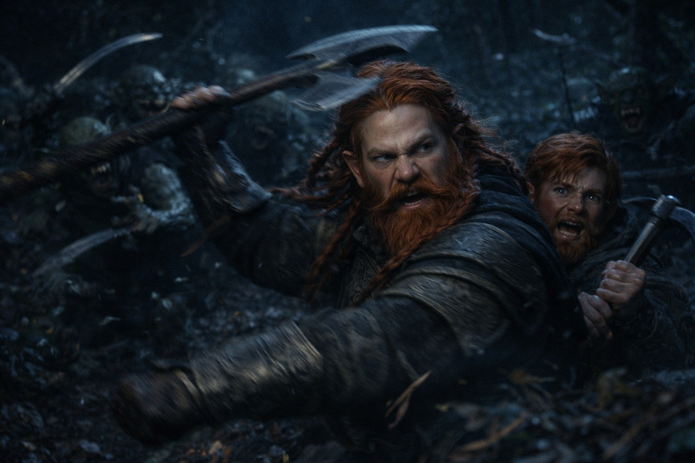
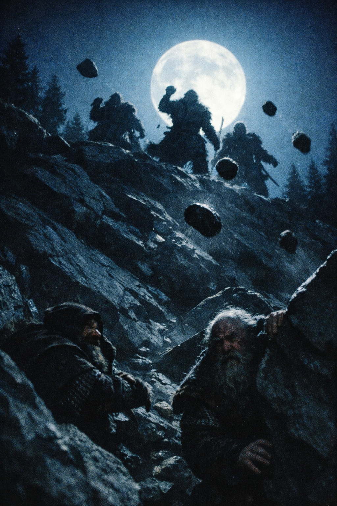

## Prologue | A Journey Interrupted

--- 

Dulint and Balin trudged along the mountain path, packs heavy with supplies and their secret weighing heavier still. The sun sat low, bleeding red across the peaks.

*"How much further, Uncle?"* Balin asked, adjusting the straps on his shoulders.

Dulint squinted at the distant peaks. *"We'll make camp soon, lad. No point risking our necks on these trails after dark."*

They found a small clearing tucked between towering pines. As Balin gathered firewood, Dulint unpacked their meager rations.

The fire caught. Dulint leaned back against a log, his joints popping like wet kindling.

*"Tell me again about the [Zuraldi](https://www.drusniel.com/the-zuraldarr/),"* Balin said, his eyes reflecting the flames. *"What are they like?"*

Dulint stroked his beard, a faraway look in his eyes. *"Strong folk, the [Zuraldi](https://www.drusniel.com/the-zuraldarr/). Built like the mountains they call home. They value strength, aye, but there's a wisdom to them too. Ancient knowledge, passed down through generations."*

*"And they'll help us?"* Balin's voice held a note of uncertainty.

*"If anyone can make sense of what we've found, it's them,"* Dulint nodded. *"Now get some sleep. We've a long road ahead."*

## Shadows in the Night

The night air bit into Dulint's skin as he stood watch. His eyes strained against the darkness, searching for threats in the shadows of the towering pines. A twig snapped. His hand flew to his axe.

*"Balin,"* he hissed. *"Wake up, lad."*

His nephew stirred, grumbling. *"What now, old man? Another raccoon got you jumpy?"*

A rough cry split the air. Not a raccoon.

Balin bolted upright, sleep forgotten. *"What in the name of-"*

*"Bandits,"* Dulint spat the word like a curse.

They emerged from the underbrush, a writhing mass of green skin and yellowed teeth.

Six, no, seven of the creatures. Curved blades glinted in the moonlight.

Dulint's muscles tensed, muscle memory from decades past taking over. He hefted his axe, its weight familiar and comforting.

*"Stay close, boy. And don't do anything stupid."*

Balin fumbled for his pickaxe, knuckles white around the handle. *"Bit late for that, isn't it?"*

The first goblin rushed Dulint. He sidestepped and swung his axe in a vicious arc. The creature dropped, dark blood spreading across the forest floor.

Another charged at Balin. The young dwarf swung wildly, his pickaxe whistling through empty air. The goblin's blade sliced across his arm, drawing a pained cry.

*"Balin!"* Dulint roared, cleaving through another attacker. *"Behind you!"*

His nephew spun, driving the point of his pickaxe into a goblin's chest. The creature's cry cut off abruptly.

Blood thudded in Dulint's ears. Two down, but more kept coming. Too many. He grabbed Balin's uninjured arm.

*"Run!"*

## A Desperate Escape

They plunged into the forest, branches whipping at their faces. Roots threatened to trip them with every step.

*"This way!"* Dulint veered left, towards a steep incline. His legs burned as they scrambled upwards, loose rocks clattering down the slope.

Balin's breath came in ragged gasps. *"Uncle... I can't..."*

*"You can and you will,"* Dulint growled. *"Unless you fancy becoming goblin stew."*

They crested the hill, only to find a sheer drop on the other side. A dead end.

Balin peered over the edge, his face pale in the moonlight. *"Now what?"*

The sound of pursuit grew closer. Dulint's mind raced, weighing their options. Each one worse than the last.

*"We climb down,"* he said grimly. *"Slow and steady. Like scaling the mine shafts back home."*

Balin nodded, swallowing hard. They began their descent, fingers searching for purchase on the rocky face.

A pebble skittered past Dulint's ear. He looked up to see goblin faces leering down at them.

*"Faster!"* he barked.

They half-climbed, half-slid down the cliff face. Dulint's arms burned in protest. Almost there. Just a few more-

His foot slipped. The world tilted. He fell, taking Balin with him.

They hit the ground hard. Dulint gasped for breath, blinking away spots. Above them, goblin cries of triumph echoed off the rocks.

*"Uncle?"* Balin's voice sounded far away. *"Uncle, get up!"*

Dulint forced himself to his feet, ignoring the pain that lanced through his body. The goblins were already halfway down the cliff.

*"Run,"* he wheezed. *"Run!"*

## Unexpected Friends

They stumbled forward, each step an agony. Dulint's thoughts fragmented. How long had they been running? Minutes? Hours?

A root caught his foot. He pitched forward, hitting the ground face-first. Dirt filled his mouth, the taste of defeat.

"Uncle!" Balin's hands grasped his shoulders, trying to pull him up. "Please, we have to-"

A whistling sound cut through the air. An arrow struck the tree beside them with a solid thunk.

More followed, a hail of projectiles raining down around them. But not at them. At their pursuers.

Goblin screams echoed through the forest, this time in pain and fear. Dulint raised his head, squinting into the darkness.

Shapes moved on the ridge above.

Tall, muscular figures hurling stones with deadly accuracy. The [Zuraldi](https://www.drusniel.com/the-zuraldarr/).

The goblins broke, fleeing back the way they had come. Dulint sagged with relief, his forehead pressing against the cool earth.

*"Kaizur!"* a voice called out. *"Are you harmed, friends?"*

Balin answered, his voice shaky. *"We'll live, thanks to you."*

Dulint struggled to his feet as their rescuers approached. He recognized one of the [Zuraldi](https://www.drusniel.com/the-zuraldarr/) - a burly man with a thick beard and kind eyes.

*"Jokin?"* Dulint squinted, hardly daring to believe their luck. *"Is that you, old friend?"*

The man's face split into a wide grin. *"Dulint, you old rock-biter! What trouble have you gotten yourself into this time?"*

Balin looked between them, confusion plain on his face. *"Uncle, you know him?"*

*"Aye,"* Dulint nodded. *"This is Jokin Xeberria. We've traded more times than I can count. His wife makes the best talo this side of the mountains."*

Jokin clapped Dulint on the shoulder, nearly knocking him over. *"Come, friends. You look like you could use a warm fire and a cold drink. We'll talk more once you're rested."*

## A New Challenge Emerges

As they made their way to the [Zuraldi](https://www.drusniel.com/the-zuraldarr/) village, Balin leaned in close to Dulint. *"Uncle, what were those things? I've never seen bandits fight like that before."*

Dulint's brow furrowed. *"I don't know, lad. But I aim to find out."*

The [Zuraldi](https://www.drusniel.com/the-zuraldarr/) village bustled with activity despite the late hour. News of the attack spread quickly, and curious faces peered out of windows as they passed.

Jokin led them to a large communal building, the walls carved with old designs worn smooth by generations of shoulders leaning against them. A fire burned inside.

*"Sit, sit,"* Jokin gestured to a pair of sturdy chairs. *"Maiarí will bring food and drink."*

As if summoned by her name, a plump woman with a kind face appeared, bearing a tray laden with bread and steaming bowls of soup.

*"Many thanks,"* Dulint said, his pronunciation clumsy but sincere. The woman beamed at him.

As they ate, Dulint recounted their harrowing escape. Jokin listened intently, his expression growing more serious with each word.

*"Creatures like that, here?"* he shook his head. *"It's unheard of. The last sighting of such beasts was decades ago, and even then, they never came this far north."*

Balin spoke up, his mouth full of bread. *"We need to speak with Xandor. It's urgent."*

Jokin's eyebrows rose. *"Xandor? You're looking in the wrong place. He keeps to Riverhold these days. Has for years."*

Dulint and Balin exchanged glances. Riverhold. A walled river town on the frontier, built for trade and trouble. Nothing like the mountain homes they were used to.

*"How long would it take us to reach Riverhold?"* Dulint asked, already dreading the answer.

Jokin stroked his beard thoughtfully. *"For you dwarves? Two days, if the weather holds and you don't stop to argue with the road. But the roads aren't safe these days, especially with those creatures about."*

Balin's face lit up. *"Two days? That's not so bad, Uncle. We could-"*

Dulint kicked him under the table, shooting him a warning look. *"We appreciate the information, Jokin. We'll have to consider our options."*

Jokin nodded, his eyes twinkling with curiosity. *"Of course, of course. You're welcome to rest here as long as you need. But tell me, old friend, what brings you so far afield? Surely you didn't come only to chase after our wayward druid?"*

Dulint shifted uncomfortably in his seat. *"It's... complicated. Let's just say we've found an artifact that needs Xandor's expertise."*

*"Ah,"* Jokin smiled knowingly. *"One of those situations. Well, your secrets are safe with us. Now, finish your soup before it gets cold. We can talk more in the morning."*

As Jokin left them to their meal, Balin leaned in close to Dulint. *"What do we do now, Uncle? We can't sit here hoping Xandor wanders through Zuraldi, but the roads..."*

Dulint sighed, suddenly feeling every one of his years. *"We rest tonight, lad. Tomorrow, we go to Riverhold."*

## Prophecy in Firelight

Night came, and the village emptied toward the outskirts. Dulint and Balin, still aching from the road, followed the crowd because standing still felt worse.

*"What's going on?"* Balin whispered to his uncle.

Dulint shrugged, his eyes narrowed with curiosity. *"Let's find out, lad."*

They came out into a clearing where hundreds had gathered in a wide circle. Torches and bonfires threw unsteady light across the faces. At the center stood a lone figure, and everyone was watching her.

The witch stood tall and thin, draped in a dark cloak. A crown of gnarled branches sat on her head, black against the stars. Embers drifted around her like insects drawn to something they couldn't see.

Silence fell as she raised her arms. When she spoke, her voice was low but it carried.

*"Children of [Zuraldi](https://www.drusniel.com/the-zuraldarr/), hear me. Something is coming. I have seen it — war, hard choices, and a reckoning none of us asked for."*

A murmur rippled through the crowd. Dulint felt Balin tense beside him.

*"Sharpen your axes,"* the witch continued. *"Shore up your walls. And hold to each other — because what's coming won't care if you're ready."*

The fires popped and spat. Her gaze swept the crowd, slow and deliberate.

*"But I've seen something else, too. Hope. Small and stubborn, carried by hands you won't expect. Watch for it."*

She lowered her arms. The bonfire surged, throwing sparks into the dark.

As the gathering began to disperse, the witch's gaze found them across the thinning crowd. She moved through the villagers like smoke, appearing at Dulint's elbow before he could react.

*"You carry something,"* she said, her voice low enough that only they could hear. Her hollow eyes fixed on Dulint's pack.

Dulint's hand moved instinctively to cover the pack's clasp. *"I don't know what you—"*

The witch's mouth curved, not quite a smile. *"Show me."*

Dulint hesitated. Then, with Balin close at his shoulder, he unhooked the pack and drew the cube out into the night air.

The witch didn't touch it. She circled once, humming a string of words Dulint couldn't catch, a rhythm more than a language. And on the last note, her voice dropped—deeper, older, like someone else was speaking through her.

*"You carry a weight that pulls,"* she said. *"A hunger that will draw what sleeps."*

Her gaze flicked up, pinning Dulint in place. *"Riverhold. Find Xandor."*

She looked back at the cube as if listening to something inside it. *"What the cube holds, the world will answer."*

Then she was gone, melting back into the shadows as if she had never been there.

Dulint and Balin exchanged shaken glances.

*"Uncle,"* Balin whispered, *"she knew about—"*

Dulint nodded grimly. *"Aye. And now we know which way to run."*

They walked back to Jokin's house without speaking. The pack felt heavier on Dulint's shoulder. Neither of them mentioned the witch's words, which was how he knew they were both thinking about nothing else.

Dulint lay on the pallet and stared at the dark, listening.

For a long time there was only the village settling—wood creaking, embers shifting, distant voices fading into sleep.

Then, somewhere close to dawn, the pack at his side warmed. The hum followed. Faint. Steady. Like a heartbeat he couldn't argue with.

**End of Prologue 2 — continues in Prologue 3: [The Scream](/the-scream/)**