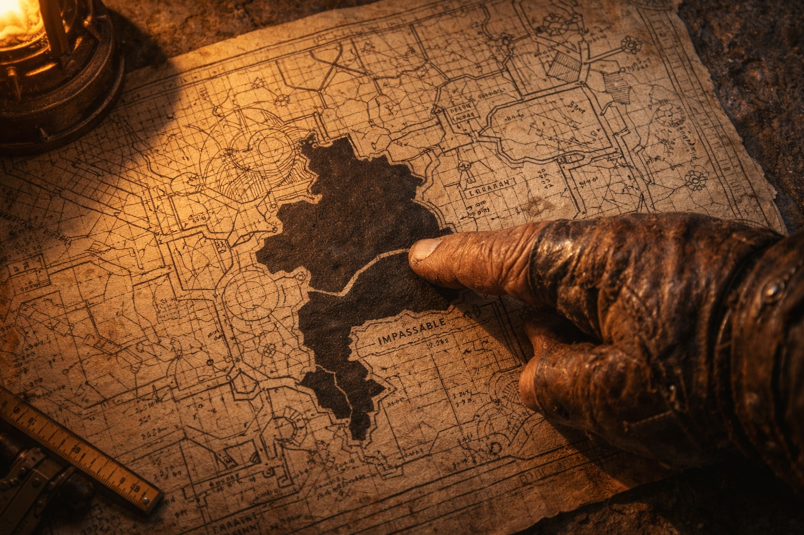
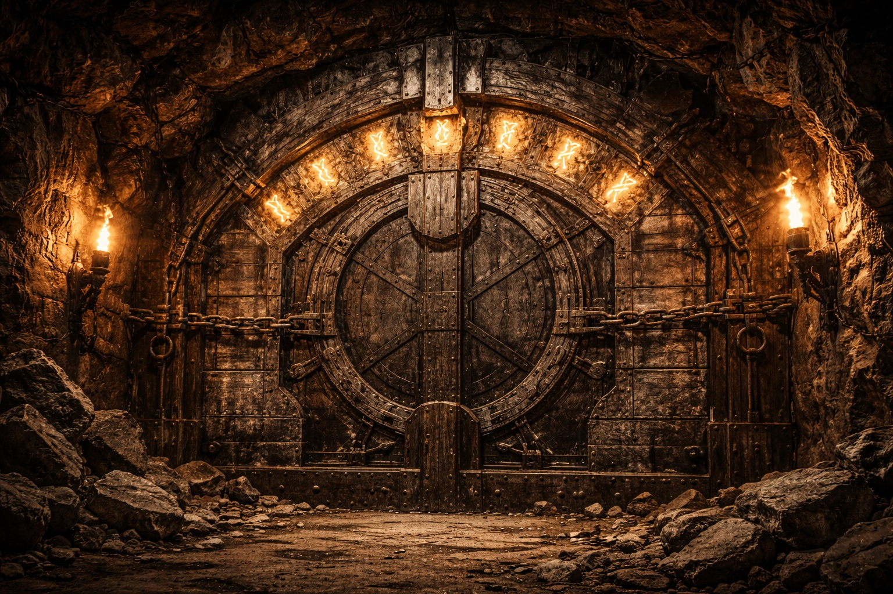
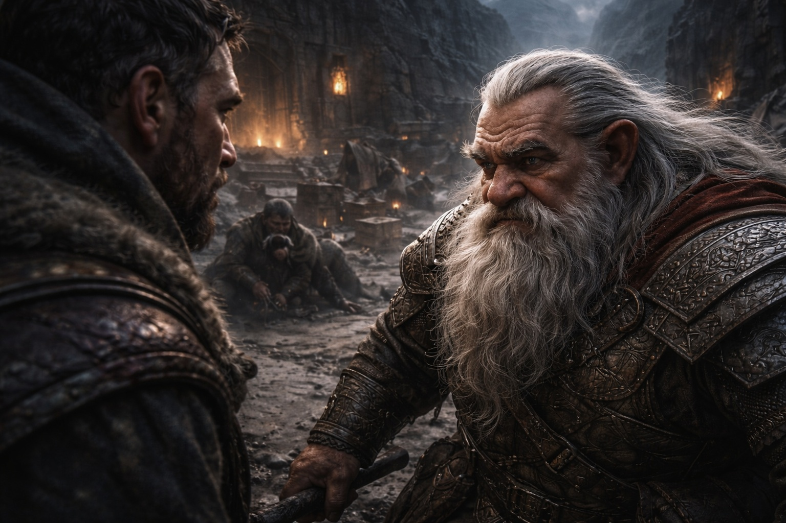

## Lore | Forge and Fire: The Mountain Kingdom of Stonehold

---

The crack was thirteen inches long.

Foreman Bragni held the tape against the damp rock and marked both ends with chalk. On the second measurement, the fissure had reached past his mark.

Thirteen inches. Perhaps fourteen.

He put the tape away and ran a finger along the fissure. This close to the Forgeheart he usually had to wipe sweat from his hands before measuring. The narrow strip of rock felt cold.

His finger came away numb.

"When did you first notice it?" Bragni asked.

Behind him, the survey crew shuffled nervously. Torgen, the eldest, cleared his throat. "Three days ago. We thought it was settlement. Normal settlement—the kind you get after a spring thaw."

"It's autumn."

"Yes."

Bragni touched the crack again. The cold was spreading now, a thin line of numbness tracing toward his wrist. He pulled his hand back.

"This isn't settlement," he said.

At the shaft station, Bragni spread the charts across the floor. The legend dated Shaft Six to the first stonemasons and listed a blessing by priests of Vondar. A later surveyor had written *old workings beyond terminus?* beneath the black fill, then crossed it out.

Blessed stone didn't crack. That was the doctrine.

Bragni laid his chalk beside the blessing date. White dust settled over the figures.

"Has there been any seismic activity?" Bragni asked. "Tremors? Rumbles from below?"

The crew exchanged glances. Torgen spoke again. "Not exactly tremors. More like... pressure. The miners say it feels like something pushing against the walls from the other side."

"The other side of what?"

"That's the thing." Torgen's voice dropped lower. "There isn't supposed to be another side. According to the charts, Shaft Six terminates at solid bedrock. There's nothing beyond it."

Bragni studied the solid black fill: *impassable rock, confirmed by survey*. The disputed note was older than the stamp certifying it. There was no drawing of the supposed workings.

He rolled up the chart. "Take me to the far end."

They walked twenty minutes back down the shaft. Bragni brushed the wall wards as he passed, a habit from childhood. Warmth remained in the grooves, though the temple's last maintenance mark was difficult to read.

He stopped. "This one."

The next ward was dark. He ran his thumb over its outline; the grooves were intact, but cold.

Torgen nodded. "We noticed that too. Reported it to the temple. They said they'd send someone."

"When?"

"Next month."

*Next month.* As if dead runes could wait like accounting errors.

Bragni moved on.

At the far end, he found his chalk marks below a fissure that now ran into the ceiling.

In the torchlight, its jagged edge seemed to pulse. Bragni climbed the inspection ladder and pressed his tape against it.

Seventeen inches.

He stared at the number. Then he measured again.

Nineteen inches.

"It's growing," he said.

"Impossible," Torgen replied. "Stone doesn't grow."

"Not this fast." Bragni climbed down. "When was your last measurement?"

"This morning. Twelve inches."

Bragni checked the chalk on the wall against Torgen's twelve-inch entry. He could not account for the difference. Even his own marks were already out of date.

Bragni placed his hand flat against the wall below the crack. The stone was cold enough to hurt his palm.

And he heard something.

A vibration ran up his wrist and settled in his teeth. He held his breath to hear whether the pumps were running.

"Do you hear that?" he whispered.

The crew fell silent. One by one, they shook their heads.

He counted the pulse against the pump rhythm he knew. It did not match. When he took his hand away, he could no longer feel it.

He wiped his numb palm against his trouser leg.

"We're sealing this shaft," he said. "Immediately. Full barricade. Iron bracing. Warded stone."

"What?" Torgen stepped forward. "The Mining Council hasn't approved—"

"The Council can inspect it after we brace it." Bragni stepped away from the wall. "Fetch the ironworkers. I want a priest here before they finish."

Torgen looked at the chalk marks once more.

Then he nodded and ran.

The barricade took three hours. Iron beams went into the rock, followed by chain and a thick facing of mortar. The priest's voice failed before he finished the wards; he completed the last mark leaning on an ironworker, blood on his sleeve.

Bragni supervised every step. When the final seal was placed, he pressed his hand against it.

The mortar warmed his palm. He left his hand there until he could feel his fingers again.

He filed his report that evening: *Shaft Six sealed. No excavation beyond the barricade pending inspection.* The form required a risk assessment. Bragni wrote *low* beside *sealed section*, then underlined *pending inspection*.

The Mining Council read it. They thanked him for his diligence. They approved a commendation for quick action.

The reply repeated his risk assessment and thanked the crew. It gave no date for the inspection.

---

*Report filed. Shaft Six sealed. Survey crew reassigned.*

*The Council's register marked the file closed.*

Three weeks later, Bragni woke in the night to find his bedroom wall cold to the touch.

He lit a lamp and searched the plaster for a crack. There was none.

He began a report on the back of the commendation, then folded it before he had written the room number.

In the morning the wall was warm. He put the folded paper in a drawer.

**End of Lore 1 — continues in Lore 2: [The Zuraldarr](/the-zuraldarr/)**
