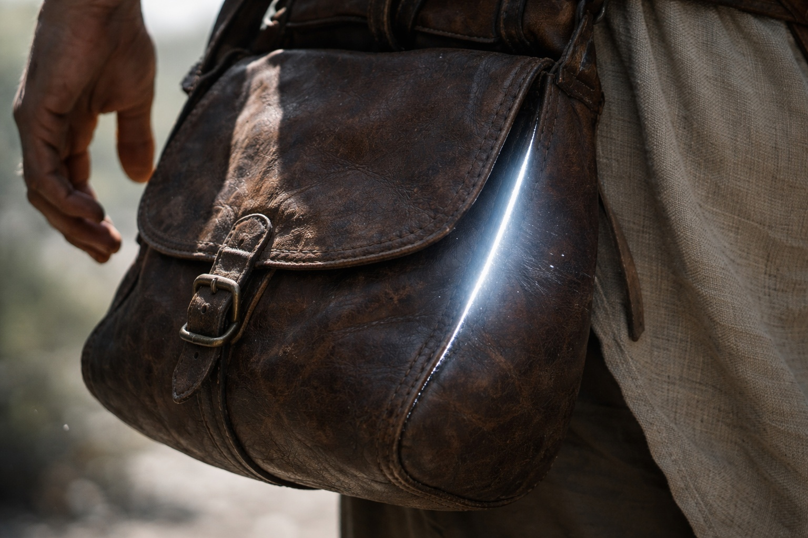
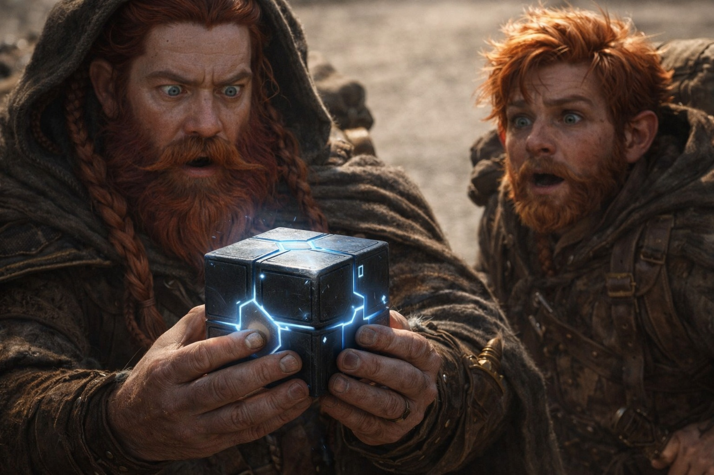

## Chapter 8 | Part 1

---

The road from Zuraldi ran through the hills.

Dulint walked with sixty-three years in his bones and a pack that seemed heavier with every league. Behind him, Balin complained about dust, heat, food, and the general injustice of walking to Riverhold to find a scholar neither of them had seen in years.

"Another day of nothing," Balin said. "Xandor had better be entertaining."

"Xandor is a scholar."

"So no, then."

Dulint adjusted the pack straps.

Something inside shifted.

He stopped.

"Uncle?"

"Thought I felt it move."

"The cube."

"What else in this bag has sharp corners and ruins my morning?"

Balin came closer.

Three weeks since they'd pulled the thing from the sealed wall beneath Stonehold. Last night the witch in Zuraldi had sent them toward Riverhold. Near dawn, the pack had warmed and begun to hum.

Now the leather against Dulint's back was hotter.

A thin colorless light leaked through the seams.

"That's new," Balin said.

"The light is."

"The rest?"

"The hum started before dawn."

Dulint set the pack down and opened it.

The cube came out hot enough that he shifted it from palm to palm.

Dulint wiped his palms on his coat before taking a firmer hold.

One face shone brighter than the others.

Dulint rotated the cube.

The light shifted to the face now aimed north-east.

He turned it again.

Again the light moved, keeping its bearing.

"Well," Balin said. "That's rude."

"What?"

"Even the rock knows where it's going."

The hum deepened until Dulint felt it in his teeth.

He had spent most of his life around stone under pressure. Good stone complained before it failed. Bad stone lied until the ceiling came down.

This felt like neither.

It felt like something answering from a long way off.

"Uncle?"

Dulint looked toward the north-eastern hills.

"Something changed," he said.

---

**End of Chapter 8.1 —> 8.2: [The Road from Zuraldi: The Absence](/the-road-from-zuraldi-the-absence/)**
