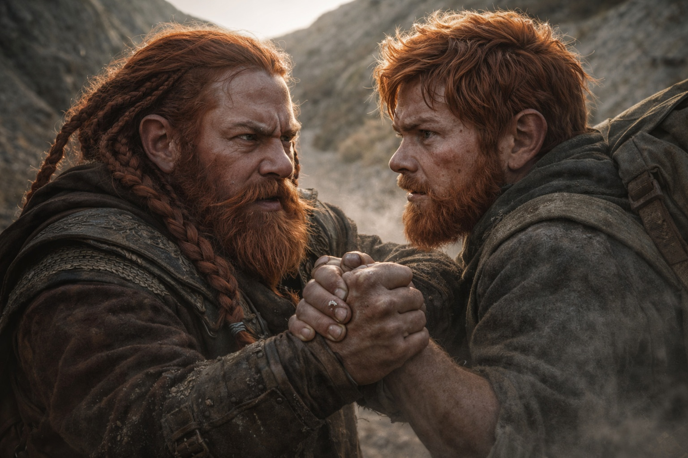
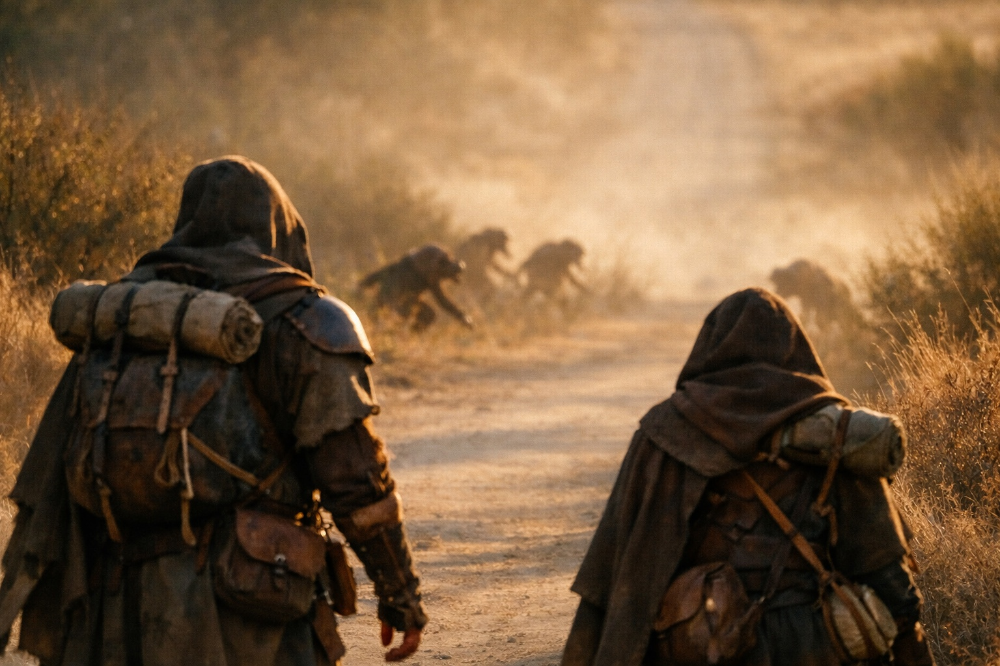

## Chapter 8 | Part 3

--- 

They were no longer traveling.

They were being followed.

Dulint's right knee marked every uneven step with a sharp pulse. The old DeepShaft injury had learned patience over the years. It knew he would eventually give it something to complain about.

Balin did not.

"You knew more than you told me."

Dulint kept walking.

"Uncle."

"I heard you."

"You always hear me. Answering is the rare part."

Dulint sighed.

Balin caught his forearm.

"I pulled that cube out of the wall. I was holding it before you were. Last night the witch says it pulls. This morning it starts glowing. Now four armed strangers appear behind us."

"I noticed."

"And you're doing the voice."

"What voice?"

"The one where you become very interested in the road because you're deciding how much truth I can survive."

Dulint stopped.

Damn the boy.

"I don't know what the cube is," Dulint said. "I don't know why it woke. I don't know who those people are."

"But?"

"But I think they're here because of it."

Balin released his arm.

"That's what you were leaving out."

"Aye."

"Which is lying."

"In the tunnels."

"We are on a road."

"Then apparently the rule travels."

Balin gave him a look that was almost satisfaction.

Dulint started walking again.

"Riverhold," he said. "Xandor is still our best chance."

"I know. I suggested him."

"I remember."

"Good. Age hasn't taken everything."

"Keep testing it."

They walked until the road curved between two grey hills.

Balin glanced back.

Then stopped.

"Uncle."

Dulint turned.

The four figures had crested the rise.

Close enough now to see weapons beneath their traveling cloaks.

They did not search the road. They did not study tracks.

Their faces remained oriented toward Dulint and Balin.

"They know exactly where we are," Balin said.

One of the pursuers stepped around a washout without breaking cadence. The next did the same. Their stride never shortened or lengthened, legs working with the repetition of pump rods.

Dulint felt the cube pulse against his back.

Balin heard the hum.

"We're tagged."

"Aye."

"By the cube."

Dulint adjusted the pack.

"Looks that way."

Balin drew his mining knife.

"What now?"

"Now we stop theorizing and find out how hard it is to hide."

---

**End of Chapter 8.3 —> 8.4: [The Road from Zuraldi: The Followers](/the-road-from-zuraldi-the-followers/)**
