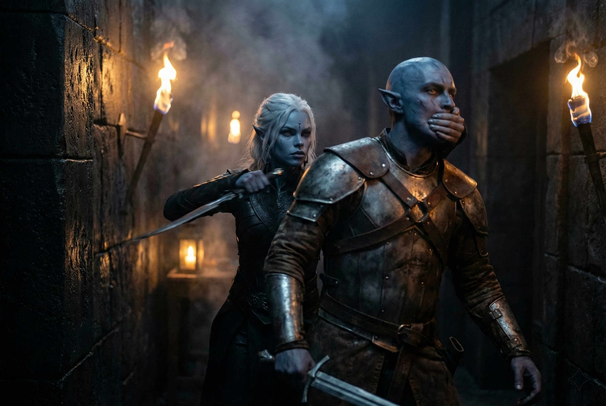

---
order: 155
title: "Blood in the Dark: Shyntara's Flight"
description: "The rubble blocked the corridor completely."
date: 2024-05-26
language: en
chapter: 6
subchapter: 5
storyline: drusniel
canon_phase: main
canon_sequence: D-006-005
narrative_weight: medium
category: Umbra'kor
author: Shyntara
type: Main
tags: ['#blood in the dark', '#drusniel', '#umbrakor']
thumbnail: image.jpg
featured: false
counterpart_path: site/content/posts/es/umbrakor/sangre-en-la-oscuridad-la-huida-de-shyntara/index.mdx
counterpart_title: "Sangre en la Oscuridad: La Huida de Shyntara"
---

## Chapter 6 | Part 5
---

*Shyntara*

---

The rubble blocked the corridor completely.

Blood ran into Shyntara's eye as she pulled at a fallen beam. It would not shift. Drusniel was on the other side, but when she called his name, nothing answered.

He knew the exits. She had to reach one of them.

She wiped her eye with her sleeve and listened. Boots were coming down the passage behind her.

She turned and moved deeper into the compound.

She had killed three attackers on the way here, each from behind. Her father had taught her where armor left a throat exposed and how long she had before a man turned. She kept to the shadows.

But there were too many. No matter how skilled she was, numbers told. And these weren't house retainers or hired street fighters. These were professionals.

The attackers moved in teams she did not recognize.

*Mercenaries.*

They carried Vrinn steel, but she knew Vrinn's household fighters. These men covered one another differently.

She let another pair pass before crossing the corridor.

A family escape passage brought her into the outer gardens. Smoke rolled along the cavern ceiling, hiding the lamps above the compound.

*Mother. Father.*

She had stepped over her mother to reach the passage. One sleeve had caught beneath Shyntara's boot. She had stopped to free it.

There was no saving them now.

*Drusniel.*

She had searched the hall for him. Her father lay against the far wall; the smaller body beside the overturned table belonged to a servant. No Drusniel. Men were returning through the kitchens, and she had run out of time to search.

*He's not dead. He can't be dead.*

She had not found his body. She held to that.

The surface tunnel lay ahead. She had followed Drusniel into it twice, afraid of what he was hiding. If he had escaped, he might use it again.

At the tunnel entrance she looked back once.

If Drusniel had used this passage, his footprints might survive beyond the smoke.

She went into the tunnel.

---

**End of Chapter 6.5 —> 6.6: [Blood in the Dark: The Hollow Victory](/blood-in-the-dark-the-hollow-victory/)**
