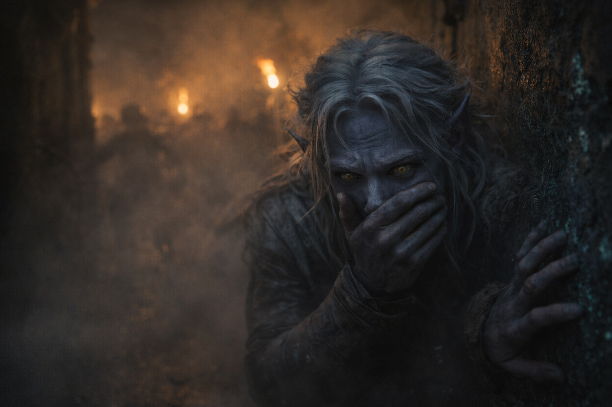
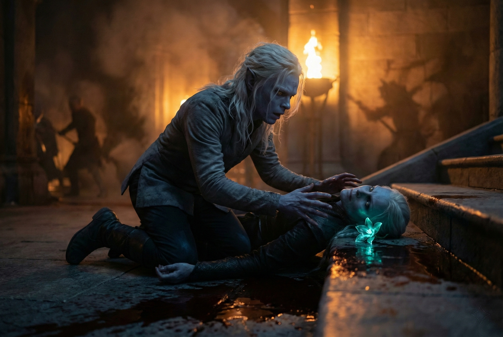

---
order: 151
title: "Blood in the Dark: The Chaos"
description: "Veyla stumbled out of the smoke ahead of him, one hand against the wall."
date: 2024-05-22
language: en
chapter: 6
subchapter: 1
storyline: drusniel
canon_phase: main
canon_sequence: D-006-001
narrative_weight: medium
category: Umbra'kor
author: Drusniel
type: Main
tags: ['#blood in the dark', '#drusniel', '#umbrakor']
thumbnail: image.jpg
featured: false
counterpart_path: site/content/posts/es/umbrakor/sangre-en-la-oscuridad-el-caos/index.mdx
counterpart_title: "Sangre en la Oscuridad: El Caos"
---

## Chapter 6 | Part 1
--- 

Veyla stumbled out of the smoke ahead of him, one hand against the wall.

Drusniel caught her arm. Veyla. One of his mother's oldest servants.

"Where are my parents?"

"Main hall—" She doubled over, retching. Blood spattered the stone. "They came through the kitchens. So many of them. Coordinated. Professional." Another cough, wet and terrible. "Run, young master. There's nothing you can—run..."

She collapsed. Drusniel lowered her to the stone.

His parents were in the main hall.

The corridors twisted ahead, familiar geography made alien by darkness and smoke. Drusniel moved by memory and touch, his assassin's training kicking in despite everything. Count the doors. Track the turns. Know your terrain even when you can't see it.

*The smoke. I can move it. I can—*

No. Find them first. Magic could wait. Magic wouldn't bring Veyla back. Magic wouldn't undo whatever was happening in the main hall.

Screams echoed from somewhere ahead. Steel struck steel.

A shape loomed out of the darkness. Drusniel froze.

Armored. Masked. Moving with the precise efficiency of someone who killed for a living. The figure turned, and firelight from somewhere behind it glinted off a blade already wet with blood. Dark blood. Drow blood.

*Family blood.*

Drusniel pressed himself into an alcove. A decorative niche his mother had always filled with small sculptures. Empty now—everything valuable had been moved to the vault when the Vrinn threat became clear.

Not that it mattered anymore.

He held his breath, jaw locked until it ached. His pulse hammered loud enough he was sure the man could hear it.

*One. Two. Three. Four. Five.*

The figure passed. Checked a side room—empty—and continued down the corridor. Professional. Thorough. Not rushing, because they didn't need to rush. They owned this compound now.

Drusniel waited until the footsteps faded. Until the smoke swallowed the silhouette completely.

Then he moved again.

The main hall was ahead. He could see flickering light through the smoke—torches, or maybe parts of the building burning. Shadows moved against the glow. Fighting. Someone was still fighting.

"Mother! Father!"

No response. Just the clash of steel and the screaming.

He pushed forward. Through the smoke. Through the fear. Through everything that told him to turn back, to run, to save himself.

And then he found her.

---

His mother lay at the base of the stairs.

She wasn't moving. Her eyes were open, staring at the ceiling she'd looked at ten thousand times over the course of her life. Blood pooled beneath her, spreading across the stone in a dark mirror of the bioluminescent flowers she'd arranged for dinner just hours ago.

Drusniel dropped to his knees beside her. His hands found hers—cold already, impossibly cold. She'd always had cold hands. She used to joke about it. "Cold hands, warm heart," she'd say, and his father would roll his eyes, and Shyntara would pretend not to smile.

"Mother. Mother, wake up. Please—"

She didn't respond.

A scream tore through the smoke. His father's voice. Defiant. Raging.

Alive.

Drusniel's head snapped up.

The main hall. Just ahead. His father was still fighting.

He forced himself to stand. Forced himself to leave her body on the stairs. Forced himself to move toward the screaming, toward the only family he might still be able to save.

His mother's hand slipped from his as he rose.

---

**End of Chapter 6.1 —> 6.2: [Blood in the Dark: The Slaughter](/blood-in-the-dark-the-slaughter/)**
