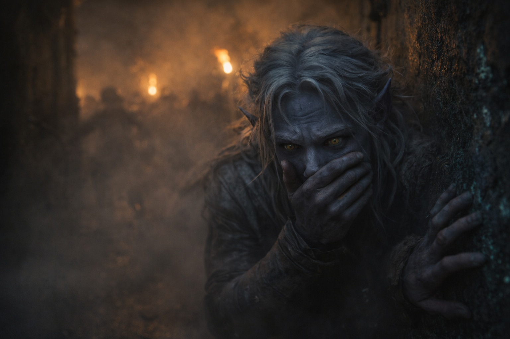
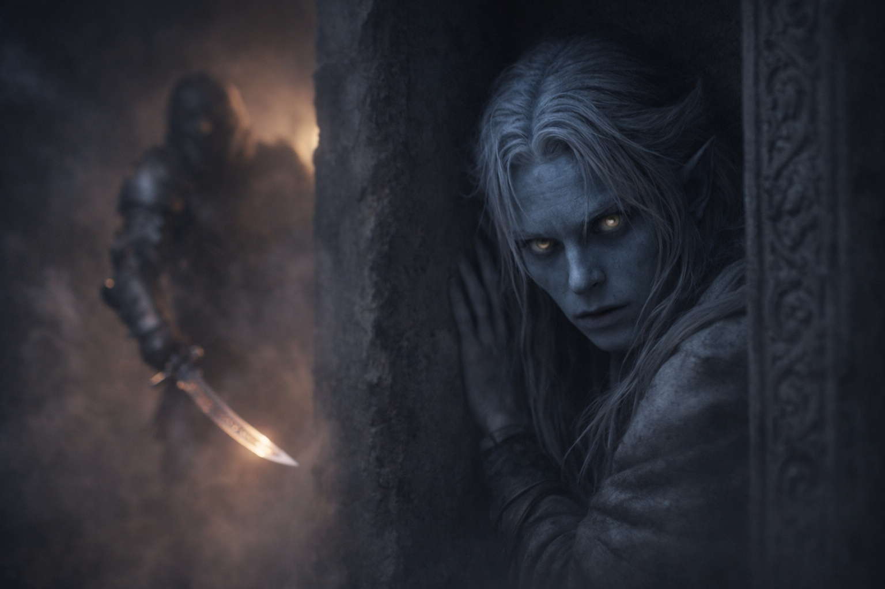
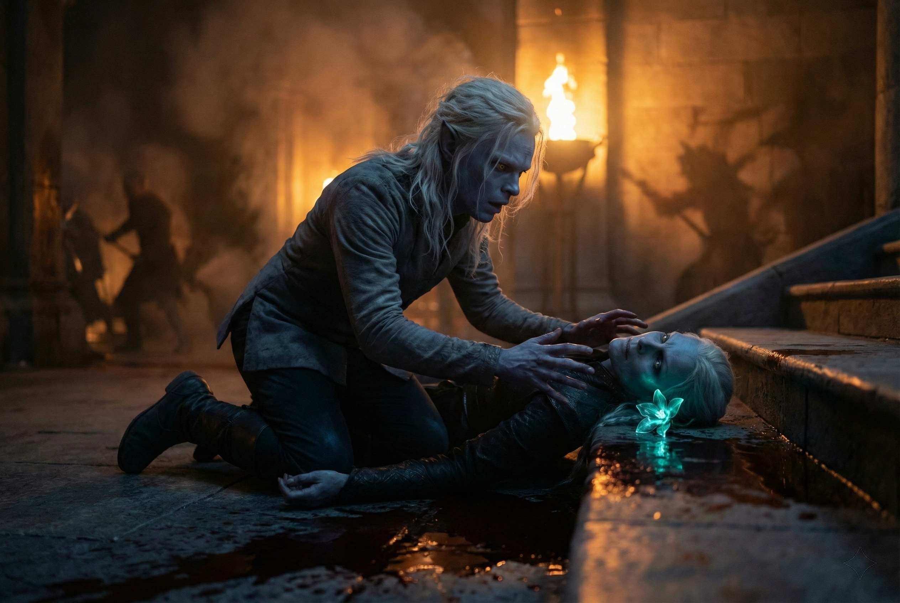

---
order: 151
title: "Blood in the Dark: The Chaos"
description: "Veyla stumbled out of the smoke ahead of him, one hand against the wall."
date: 2024-05-22
language: en
chapter: 6
subchapter: 1
storyline: drusniel
canon_phase: main
canon_sequence: D-006-001
narrative_weight: medium
category: Umbra'kor
author: Drusniel
type: Main
tags: ['#blood in the dark', '#drusniel', '#umbrakor']
thumbnail: image.jpg
featured: false
counterpart_path: site/content/posts/es/umbrakor/sangre-en-la-oscuridad-el-caos/index.mdx
counterpart_title: "Sangre en la Oscuridad: El Caos"
---

## Chapter 6 | Part 1
---

Veyla stumbled out of the smoke ahead of him, one hand against the wall.

Drusniel caught her arm. Veyla. One of his mother's oldest servants.

"Where are my parents?"

"Main hall..." She doubled over, retching blood onto the stone. "Through the kitchens. They knew which doors..." A wet cough cut her off. "Run, young master. Please. Run."

Her legs gave way. Drusniel lowered her to the stone and felt for a pulse. Nothing beneath his fingers.

His parents were in the main hall.

Smoke hid the corridor junctions. Drusniel kept one hand against the wall, recognizing doorframes by the chips in their edges. At the kitchen passage he turned toward the sound of steel.

*The smoke. I can move it. I can...*

He left the smoke alone. Clearing it would let them see him, and his parents were still ahead.

Screams echoed from somewhere ahead. Steel struck steel.

A figure emerged from the dark. Drusniel stopped.

The masked man wore armor and carried his blade low. Blood ran from its tip as he turned.

Whose blood?

Drusniel pressed into an empty display niche. His mother had moved its little sculptures to the vault when the Vrinn threat became clear; without them, he just fitted.

He held his breath, jaw locked until it ached. His pulse hammered loud enough he was sure the man could hear it.

The man checked a side room, pushing the door all the way back before entering. Drusniel waited for him to come out and pass.

When the footsteps faded, he eased himself out of the niche.

Firelight flickered through the smoke ahead. He caught the shape of an arm raised to strike. Someone was still fighting in the main hall.

"Mother! Father!"

No response. Just the clash of steel and the screaming.

He stumbled toward the fighting with his sleeve over his mouth.

And then he found her.

---

His mother lay at the base of the stairs.

Her eyes were open. One slipper had come off; it lay upright on the lowest step, just beyond her foot. Blood spread beneath her.

Drusniel crouched beside her and took her hands. They had always been cold. She used to put them against his neck when he bent over his books and laugh when he flinched. He rubbed them between his palms.

"Mother. Mother, wake up. Please—"

She didn't respond.

A scream tore through the smoke. His father's voice. Defiant. Raging.

Alive.

Drusniel's head snapped up.

The main hall. Just ahead. His father was still fighting.

He got one foot beneath him. He could still reach his father.

His mother's hand slipped from his as he rose.

---

**End of Chapter 6.1 —> 6.2: [Blood in the Dark: The Slaughter](/blood-in-the-dark-the-slaughter/)**
