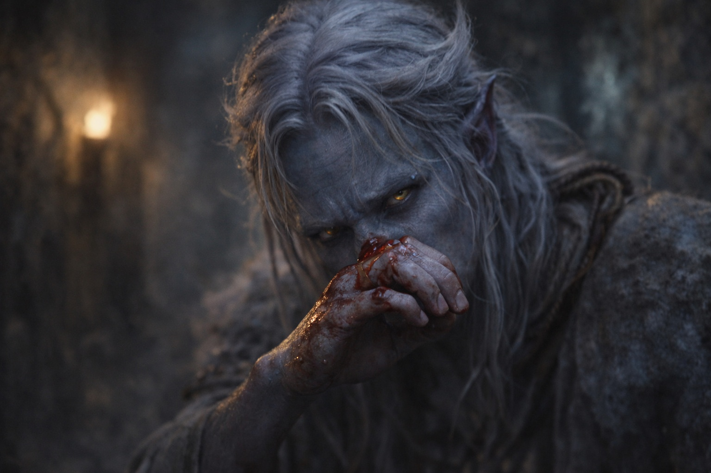

---
order: 153
title: "Blood in the Dark: The Escape"
description: "The corridor twisted ahead, branching into servant passages and storage rooms."
date: 2024-05-24
language: en
chapter: 6
subchapter: 3
storyline: drusniel
canon_phase: main
canon_sequence: D-006-003
narrative_weight: medium
category: Umbra'kor
author: Drusniel
type: Main
tags: ['#blood in the dark', '#drusniel', '#umbrakor']
thumbnail: image.jpg
featured: false
counterpart_path: site/content/posts/es/umbrakor/sangre-en-la-oscuridad-el-escape/index.mdx
counterpart_title: "Sangre en la Oscuridad: El Escape"
---

## Chapter 6 | Part 3
---

The corridor twisted ahead, branching into servant passages and storage rooms. Drusniel ran without thinking, guided by instinct and the half-remembered maps his father had made him memorize years ago.

*Emergency exits. Rally points. The passages no one uses. The routes that might save your life when everything else fails.*

His father's voice, patient and precise, drilling information into a son who hadn't wanted to listen.

*Pay attention. This matters.*

Footsteps followed him. At each junction a man called a direction and another answered.

"This way. He went left. Check the storage rooms."

Drusniel slipped into a side passage and flattened himself against the wall. He pressed his mouth into his sleeve to quiet his breathing.

*Calm. Precision requires calm.*

Zaelar's voice in his head. The training that had seemed abstract just hours ago.

He slowed his breathing as Zaelar had taught him, making himself wait before he drew the next breath.

*Feel the air. Let it tell you what's happening.*

He reached through the air toward the footsteps. Pressure built behind his eyes as he made out two men approaching from the main corridor. A third disturbed the current at the far exit.

He had no weapon. If the third man reached him first, he would have to get past a blade.

His father's compound had a ventilation system drawing fresh air from the deeper caverns. Drafts moved through channels in the walls and emerged through grates at regular intervals.

There. A strong current, pulling through the grate behind him. Cold air from the deep tunnels.

*Don't command. Suggest.*

The leading attacker rounded the corner and raised his blade. Drusniel could see the old scars on the man's bare forearm.

"Nowhere to run, boy."

Drusniel gathered the draft. He had held currents stronger than this in the tower, but now he could not keep his mind on the shape.

*Precision requires calm.*

His mother's face flashed through his mind. Empty eyes. Blood spreading.

He pushed the image away. Not now. Not yet.

He released.

The blast struck the attacker in the chest. He stumbled back into the man behind him, leaving the passage clear for a moment. Drusniel's vision blurred.

Drusniel ran.

His lungs burned. His head throbbed. He gasped for breath, vision swimming at the edges. Blood trickled from his nose, warm against his upper lip.

*Not again. Not yet.*

The third attacker appeared ahead of him, blocking the passage. The one who'd circled around. Faster than Drusniel had expected.

He reached for a draft and found only still air. Pain climbed from his ribs into his throat.

He dropped low, a movement drilled into him long before he had wanted magic. The blade passed over his head, close enough for him to feel the air it displaced.

Drusniel rolled. Came up running. Felt the man's fingers catch his sleeve and tear free.

The exit was ahead. A servant's door, hidden in the wall, leading to the outer tunnels. He'd found it years ago while exploring. Had wondered why anyone would need a secret door in a storage corridor.

Now he knew.

He caught the concealed latch and threw his shoulder against the door. It scraped open just far enough to let him through.

Behind him, shouting. "He's in the tunnels! Move! Don't let him—"

He knew the tunnels. At the first fork he took the narrower branch, then doubled back through a connecting shaft while the shouts went the other way.

When his legs gave out, he crawled into a crevice and wedged himself against the cold stone.

Blood from his nose dripped onto his hands. He tried to wipe his face and found his cheeks wet too.

*If I hadn't stayed so long at the tower...*

The thought surfaced and he killed it.

Somewhere in the darkness behind him, the killers were still hunting.

---

**End of Chapter 6.3 —> 6.4: [Blood in the Dark: The Evidence](/blood-in-the-dark-the-evidence/)**
