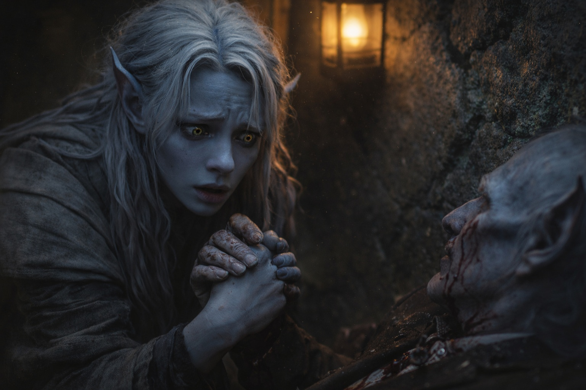
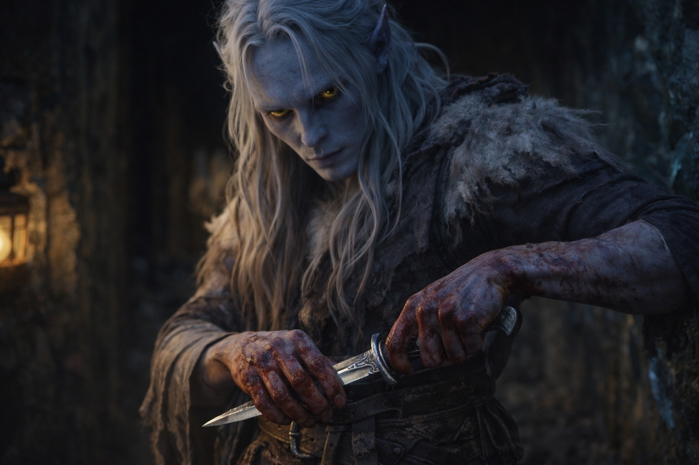

---
order: 154
title: "Blood in the Dark: The Evidence"
description: "The sounds of pursuit faded eventually. Either they'd lost him in the labyrinth of tunnels or they'd given up."
date: 2024-05-25
language: en
chapter: 6
subchapter: 4
storyline: drusniel
canon_phase: main
canon_sequence: D-006-004
narrative_weight: medium
category: Umbra'kor
author: Drusniel
type: Main
tags: ['#blood in the dark', '#drusniel', '#umbrakor']
thumbnail: image.jpg
featured: false
counterpart_path: site/content/posts/es/umbrakor/sangre-en-la-oscuridad-la-evidencia/index.mdx
counterpart_title: "Sangre en la Oscuridad: La Evidencia"
---

## Chapter 6 | Part 4
--- 

Time passed. He didn't know how much.

The sounds of pursuit faded eventually. Either they'd lost him in the labyrinth of tunnels or they'd given up. Either way, Drusniel stayed in his crevice until the silence became absolute. Until his heartbeat stopped hammering. Until the blood on his face dried to a crust.

Then, slowly, he uncurled himself and began to move.

The tunnels connected to the compound's lower levels—servant passages, storage chambers, the old routes his grandfather had built for emergencies exactly like this. Drusniel had explored them as a child, mapping the hidden ways the same way other children mapped the surface routes their parents let them use.

*Always know your exits,* his father had said. *Always know how to escape.*

He'd never asked what his father expected him to escape from. Now he knew.

The emergency routes wound through darkness. Drusniel moved by touch and memory, trailing his fingers along the stone walls, counting steps between turns. Left at thirty. Right at seventy. Through the narrow squeeze that Shyntara had found when she was twelve.

The compound above was silent now. No more screams. No more combat. Just the settling sounds of a building coming to terms with what had happened inside it.

He found the body near the wine cellar.

Old Meren. The family steward. He had served Drusniel's grandparents before his parents and had never once betrayed a confidence.

Now he lay crumpled against the wall, blood pooling beneath him. His formal jacket—the one he wore for family dinners—was slashed in three places. But his eyes were open. Moving.

Alive. Barely.

"Meren—"

Drusniel dropped beside him. The old man's hand caught his wrist with surprising strength. The strength of someone determined to deliver a final message.

"Young master." The words came out wet, bubbling. A chest wound. Nothing Drusniel could help with, even if he had the tools. "Vrinn. They came from... they said..." A cough, dark with blood. "Said they wanted the whole house. No witnesses. Run. Have to... run..."

"I'm not running. Not yet." Drusniel gripped the old man's hand. "Who led them? Did you see—"

"Vrinn colors. Vrinn weapons." Meren swallowed against the blood in his throat. "But not Vrinn fighters. The way they moved..."

His grip loosened.His grip loosened. His chest stopped moving.

His eyes fixed on that distant place, and didn't come back.

*Vrinn.*

His gaze fell on something near Meren's hand. A dagger, lying on the stone floor. Its blade was clean—recently wiped, perhaps, or never used. But the hilt bore an unmistakable insignia.

Three interlocking circles over a curved blade.

House Vrinn.

Drusniel picked it up. The metal was cold against his palm.

The dagger was too clean.

His mother's blood was still drying on his hands.

Three anomalies. *The client.* Meren's unfinished warning. The spotless blade.

His mother was still dead.

He closed his fist around the dagger.

*I will kill every last one of them.*

He tucked the dagger into his belt and kept moving.

---

**End of Chapter 6.4 —> 6.5: [Blood in the Dark: Shyntara's Flight](/blood-in-the-dark-shyntaras-flight/)**
