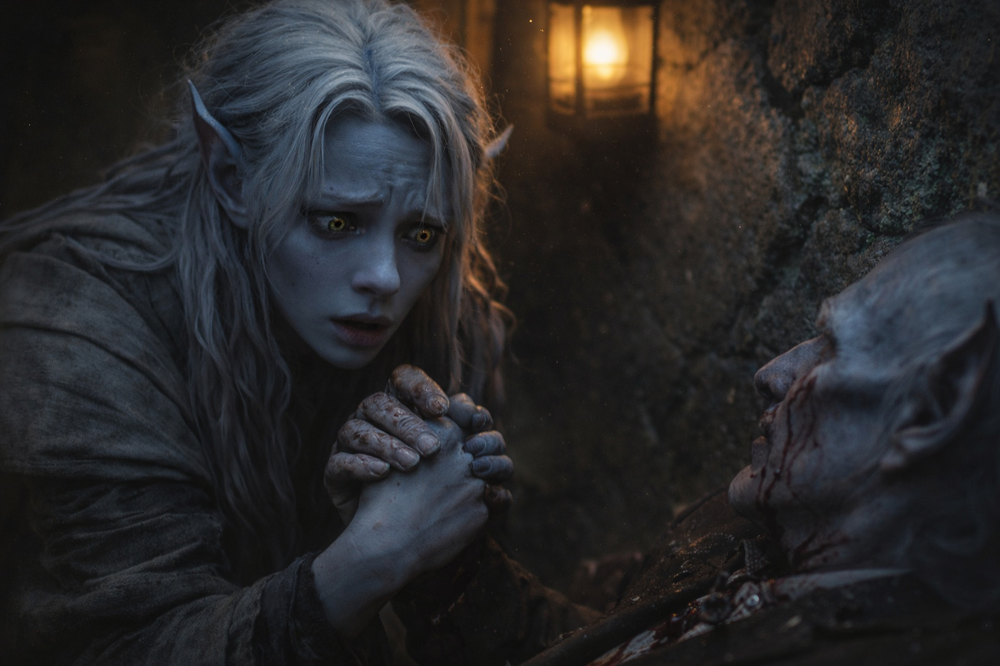
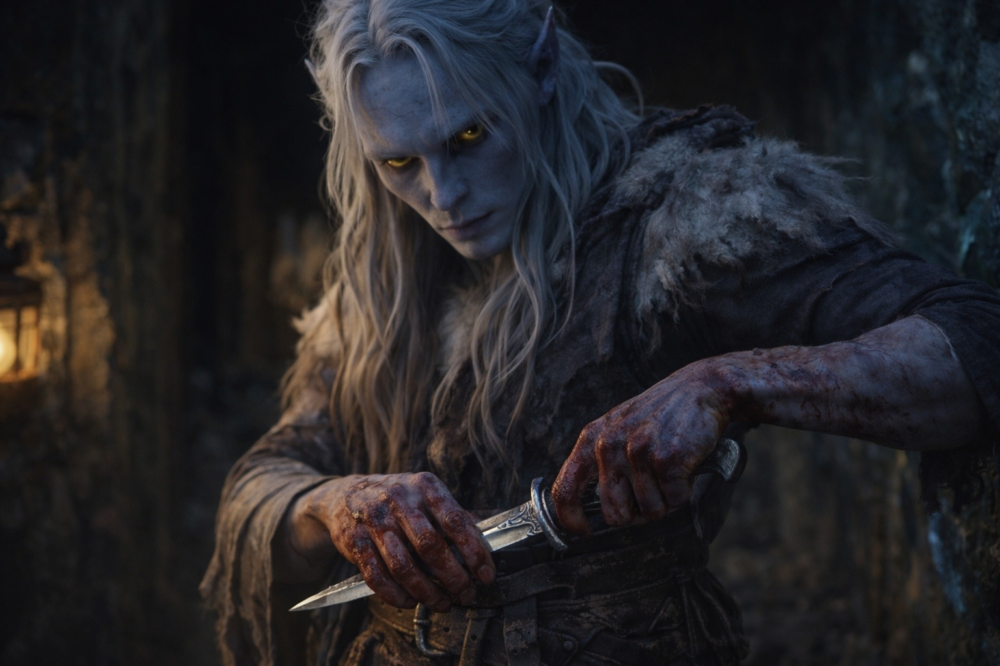

---
order: 154
title: "Blood in the Dark: The Evidence"
description: "The sounds of pursuit faded eventually. Either they'd lost him in the labyrinth of tunnels or they'd given up."
date: 2024-05-25
language: en
chapter: 6
subchapter: 4
storyline: drusniel
canon_phase: main
canon_sequence: D-006-004
narrative_weight: medium
category: Umbra'kor
author: Drusniel
type: Main
tags: ['#blood in the dark', '#drusniel', '#umbrakor']
thumbnail: image.jpg
featured: false
counterpart_path: site/content/posts/es/umbrakor/sangre-en-la-oscuridad-la-evidencia/index.mdx
counterpart_title: "Sangre en la Oscuridad: La Evidencia"
---

## Chapter 6 | Part 4
---

Dried blood pulled at his upper lip whenever he swallowed. He waited.

The pursuit faded. He stayed in the crevice long after the last shout, listening for a boot scraping stone. At last he could hear his own breathing without having to fight it.

Then, slowly, he uncurled himself and began to move.

The tunnels joined the compound's lower storerooms. His grandfather had built these escape routes; Drusniel had explored them as a child, until his father insisted he learn where they led.

*Always know your exits,* his father had said. *Always know how to escape.*

He'd never asked what his father expected him to escape from. Now he knew.

He felt his way to the fork beneath the cistern, then turned toward the narrow squeeze Shyntara had found when she was twelve. His torn sleeve caught on the same spur of rock it always had.

Above him, a timber cracked. Dust sifted through a joint in the ceiling. He heard no fighting.

He found the body near the wine cellar.

Old Meren. The family steward. He had served Drusniel's grandparents before his parents and had never once betrayed a confidence.

He lay crumpled against the wall in his formal dinner coat, slashed through the chest. His eyes moved when Drusniel approached.

Alive. Barely.

"Meren..."

Drusniel crouched beside him. Meren caught his wrist and pulled him close enough to hear.

"Young master." Blood bubbled at Meren's lips. Drusniel pressed a hand over the wound in his chest. "Vrinn. They said... the whole house. No witnesses." His grip tightened. "You must leave."

"Not yet." Drusniel kept pressure on the wound. "Who led them? Did you see?"

"Vrinn colors. Vrinn weapons." Meren swallowed against the blood in his throat. "But not Vrinn fighters. The way they moved..."

His grip loosened. His chest stopped moving.

Drusniel kept his hand over the wound.

*Vrinn.*

A dagger lay beside Meren's hand. The blade was clean, perhaps wiped, perhaps unused. On the hilt Drusniel recognized the insignia.

Three interlocking circles over a curved blade.

House Vrinn.

Drusniel picked it up. The metal was cold against his palm.

The dagger was too clean.

His mother's blood was still drying on his hands.

*The client.* Someone had paid for this. Meren had tried to tell him who; now Drusniel could not ask him again.

His mother was still dead.

He closed his fist around the dagger.

*I will kill every last one of them.*

He tucked the dagger into his belt and kept moving.

---

**End of Chapter 6.4 —> 6.5: [Blood in the Dark: Shyntara's Flight](/blood-in-the-dark-shyntaras-flight/)**
