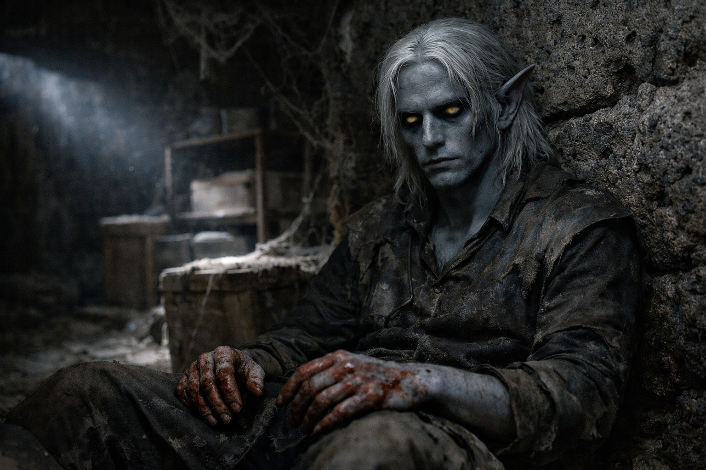
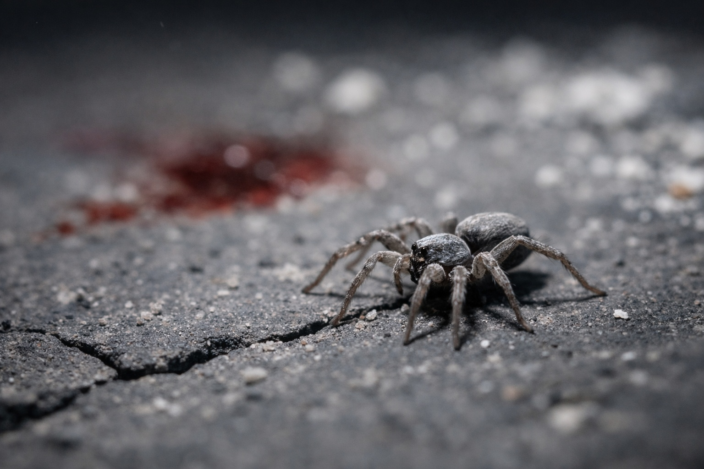

## Chapter 6 | Part 6
--- 

*Drusniel*

---

Drusniel emerged from the tunnels into a forgotten storage chamber. Dust on every surface. Crates that hadn't been moved in decades. Air that tasted of age and neglect.

He sat against a wall until his breathing slowed.

Blood had dried on his hands. Some of it was his.

A spider crossed the floor and disappeared into a crack.

Drusniel stood.

---

The presence found him as he was climbing toward the surface passages.

*Drus.*

The familiar warmth brushed against his awareness. Reaching through the numbness. Reaching through the dark.

*Drus, are you alive? I felt something terrible. I've been trying to reach you for hours.*

He reached back toward the connection. The effort felt like lifting stones with broken hands.

*I'm alive.*

*Thank the deep gods.* Relief came through the link, warm enough that Drusniel let himself believe it for a moment. *What happened? I felt pain, fear, then nothing. The connection just... stopped. I thought you were—*

*They're dead.*

Silence.

Then, gentler: *Your parents?*

*Everyone. Everyone is dead.* His mental voice cracked. He felt the fracture lines running through himself, the places where he might shatter if he pressed too hard. *House Vrinn—they came in the night. Professional. Coordinated. They killed the servants first. Then they found my parents.*

*I'm so sorry.* The presence wrapped around him, warm and comforting. *I'm so, so sorry, Drus. I can't imagine—I don't have words. Your mother, your father—they were good people. They didn't deserve—*

Something in the timing was wrong.

*No one deserves what happened.* The words came out flat. Empty. *But they're dead anyway. Meren's dead. Veyla's dead. Everyone who ever smiled at me in that compound is dead, and I couldn't do anything to stop it.*

*You survived.* The voice was firm now. Steady. *That matters. You survived, and that means their killers haven't won. Not yet.*

Drusniel leaned into the comfort anyway.

*I have nowhere safe before daylight.*

*Go to Zaelar.*

The response came after a pause—half a heartbeat too long, as if the voice was checking something before speaking.

*What?*

*Whatever else Zaelar is, he has shelter. Food. A locked door.*

Zaelar had offered Wyrmreach.

Power.

For the first time since the main hall, Drusniel knew what he wanted it for.

*What about you?* Drusniel asked. *If I go to Wyrmreach—*

*I'll be here.* The presence softened. *Get somewhere safe first.*

Drusniel touched the dagger at his hip.

*I'll go to Zaelar. Tonight.*

*Good.* The presence began to fade. *Be careful, Drus.*

The warmth withdrew.

The Vrinn dagger rested against his hip, spotless beneath the dried blood on his clothes.

Drusniel started for Zaelar's tower.

---

**End of Chapter 6.6 —> 7.1: [The Package: The Broken Instrument](/the-package-the-broken-instrument/)**