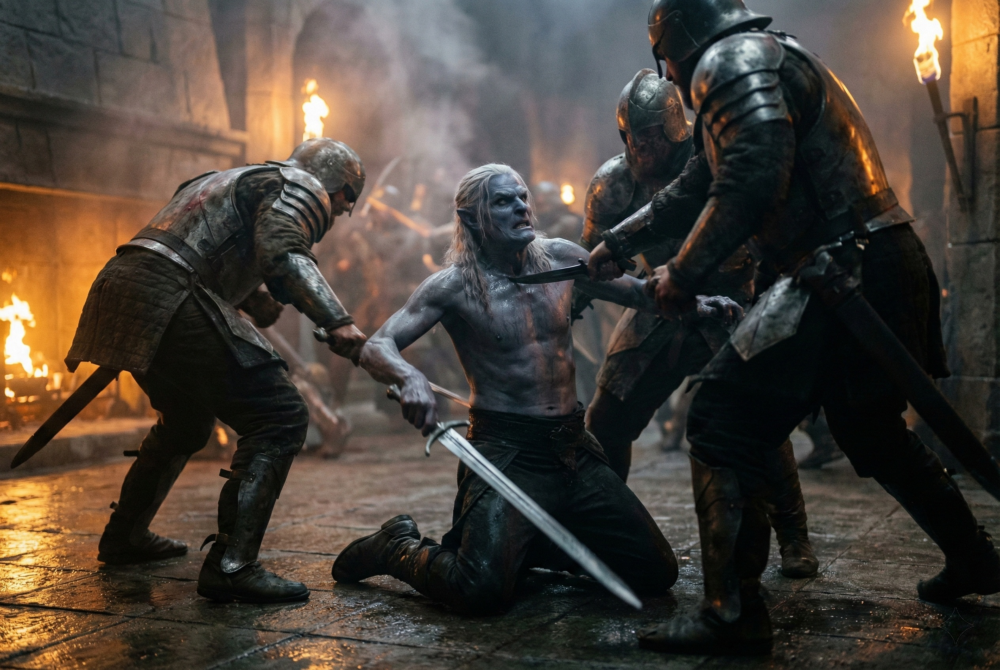

---
order: 152
title: "Blood in the Dark: The Slaughter"
description: "His father fought like a cornered animal."
date: 2024-05-23
language: en
chapter: 6
subchapter: 2
storyline: drusniel
canon_phase: main
canon_sequence: D-006-002
narrative_weight: medium
category: Umbra'kor
author: Drusniel
type: Main
tags: ['#blood in the dark', '#drusniel', '#umbrakor']
thumbnail: image.jpg
featured: false
counterpart_path: site/content/posts/es/umbrakor/sangre-en-la-oscuridad-la-matanza/index.mdx
counterpart_title: "Sangre en la Oscuridad: La Matanza"
---

## Chapter 6 | Part 2
--- 

His father fought like a cornered animal.

Drusniel reached the main hall entrance in time to see it—his father backed against the far wall, blade in hand, three attackers circling. Blood ran from a wound on his arm, another on his side. He moved like he didn't feel them.

The dinner table was overturned. Wine pooled across the stone, mixing with blood. The bioluminescent flowers lay scattered and crushed, their soft glow dying. Hours ago, they'd sat around that table. His father had laughed. His mother had poured wine.

Now his mother was dead, and his father was dying.

"Come on, then." His father's voice was steady despite everything. "You came for House Thel'varin? Here I am. Let's see what you're made of."

The attackers circled. They were careful—they'd seen what happened to the first wave. Two bodies lay at his father's feet already. One was missing a hand. The other had taken a blade through the throat.

There were too many of them. More were coming through the side passages. Four now. Five.

"Father!"

The word tore from Drusniel's throat before he could stop it.

His father's head turned. Their eyes met across the chaos.

"Run, Drusniel!"

"I can help—"

"RUN!"

The attackers didn't wait. The diversion had given them their opening. Two of them broke toward Drusniel. The remaining three pressed the advantage against his father.

Drusniel saw the first blade fall. His father parried—barely—but the second attacker was already moving. Steel bit into his shoulder. His father staggered but didn't fall.

*He's not going to fall. He's going to make them work for it.*

The thought was cold and clear and utterly useless.

His father killed one more. A precise thrust through a gap in the armor, the instincts of a lifetime crystallizing in one final moment. Then the other two were on him.

The second strike caught his father in the side. The third opened his throat.

He fell.

His father fell.

Drusniel screamed.

The air answered.

Air burst outward from him. Papers lifted. Torches guttered. The attackers staggered—

Not enough.

"He's a mage," one of them said, recovering quickly. "Careful. Take him alive if you can. The client wants confirmation."

*The client.*

The word caught.

Before Drusniel could hold onto it, one of the attackers lunged.

"The boy." The lead attacker gestured toward Drusniel. "Get the boy. No survivors means no survivors."

Drusniel ran.

---

**End of Chapter 6.2 —> 6.3: [Blood in the Dark: The Escape](/blood-in-the-dark-the-escape/)**
