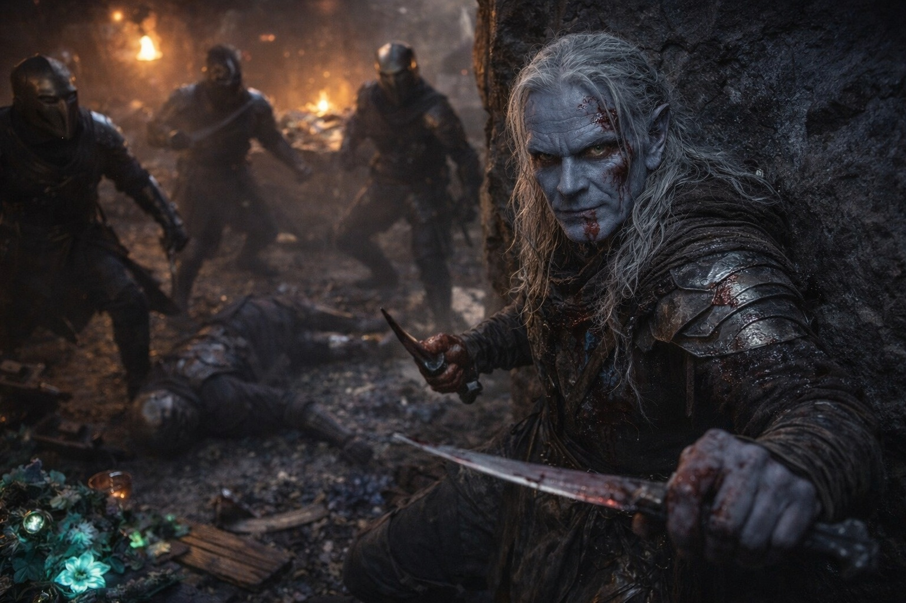
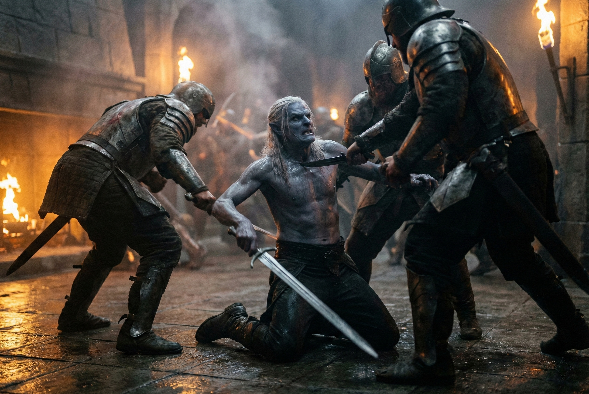

---
order: 152
title: "Blood in the Dark: The Slaughter"
description: "His father fought like a cornered animal."
date: 2024-05-23
language: en
chapter: 6
subchapter: 2
storyline: drusniel
canon_phase: main
canon_sequence: D-006-002
narrative_weight: medium
category: Umbra'kor
author: Drusniel
type: Main
tags: ['#blood in the dark', '#drusniel', '#umbrakor']
thumbnail: image.jpg
featured: false
counterpart_path: site/content/posts/es/umbrakor/sangre-en-la-oscuridad-la-matanza/index.mdx
counterpart_title: "Sangre en la Oscuridad: La Matanza"
---

## Chapter 6 | Part 2
---

His father had backed against the far wall, where no one could get behind him.

Drusniel reached the main hall doorway. Three attackers surrounded his father. Blood ran down his sword arm and soaked his side, but he kept the point between himself and the nearest man.

The dinner table was overturned. Wine pooled across the stone, mixing with blood. The bioluminescent flowers lay scattered and crushed, their soft glow dying. Hours ago, they'd sat around that table. His father had laughed. His mother had poured wine.

Now his mother was dead, and his father was dying.

"House Thel'varin," his father said, his voice carrying across the hall. "You wanted its head. Here I am."

The attackers circled carefully. Two bodies already lay at his father's feet. One was missing a hand. The other had taken a blade through the throat.

There were too many of them. More were coming through the side passages. Four now. Five.

"Father!"

The word tore from Drusniel's throat before he could stop it.

His father's head turned. Their eyes met across the chaos.

"Run, Drusniel!"

"I can help..."

"RUN!"

The attackers didn't wait. The diversion had given them their opening. Two of them broke toward Drusniel. The remaining three pressed the advantage against his father.

His father barely caught the first blade. The next struck his shoulder before he could turn to meet it. He staggered but did not fall.

*He's not going to fall. He's going to make them work for it.*

The thought was cold and clear and utterly useless.

His father drove his point through a gap in one man's armor. Before he could pull it free, the other two closed on him.

The second strike caught his father in the side. The third opened his throat.

He fell.

His father fell.

Drusniel screamed.

The air answered.

Air burst outward, lifting papers and driving the attackers back a step. Pain clamped around Drusniel's ribs; he staggered against the doorframe.

Not enough.

"Mage," one of them said, recovering his footing. "Mind his hands. The client wants a body he can identify."

*The client.*

The word caught.

Before Drusniel could hold onto it, one of the attackers lunged.

"The boy." The lead attacker gestured toward Drusniel. "Get the boy. No survivors means no survivors."

Drusniel ran.

---

**End of Chapter 6.2 —> 6.3: [Blood in the Dark: The Escape](/blood-in-the-dark-the-escape/)**
