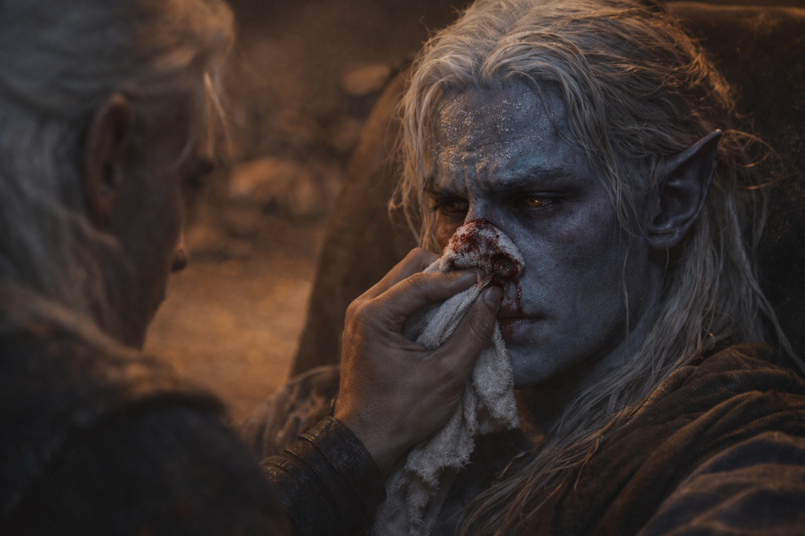
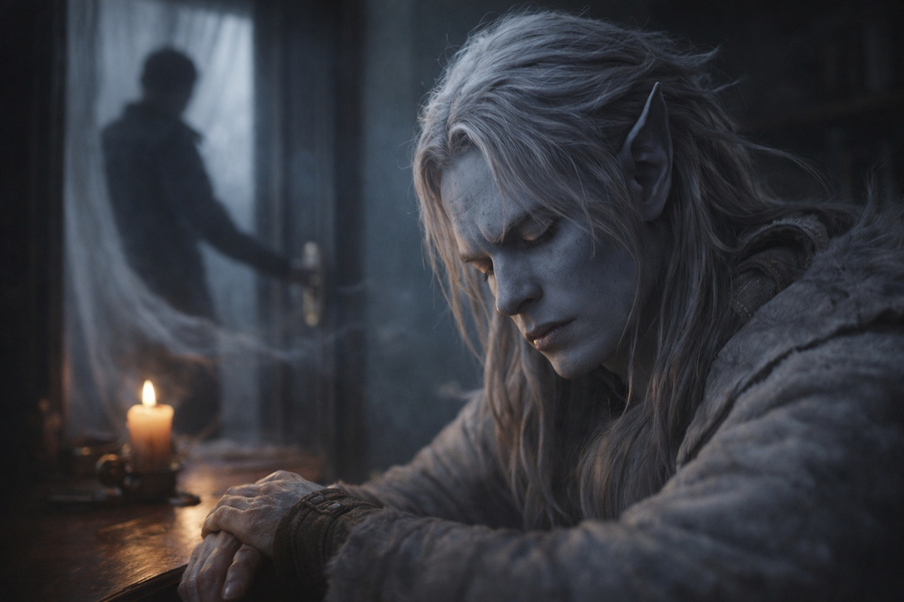

## Chapter 4 | Part 1
--- 

Month one.

The forge draft warmed Drusniel's ankles through gaps in the floorboards. He had asked to practice away from the ceiling vent; Zaelar had let him choose the room. Now candles stood along the study wall, the farthest twenty feet away.

"Use the draft from the forge." Zaelar settled into his chair by the window. "Feel it, then redirect."

He closed his eyes and followed the forge heat upward, searching for a current that passed near the candles.

The nearest candle guttered. The effort shortened his next breath.

"Good. Further."

He pushed the rising draft sideways. The second candle flickered. The third—

His concentration shattered. The current scattered, and three candles went out at once while papers lifted from Zaelar's desk in a chaotic gust.

"Sorry." Drusniel opened his eyes. His breathing came harder than it should, as if he'd sprinted rather than stood still.

"Precision drops beyond arm's reach." Zaelar gathered his papers without concern. "You're working with existing airflow, not creating it. The further you push, the more you must account for interference: other currents, obstacles, temperature changes."

"How far can I push this?"

"Further than you know." A faint smile. "But not yet."

Five minutes of practice and he had to lean against the desk. At home, he could practice only while the patrol passed outside, when its footsteps covered his breathing.

"Again," he said.

---

Month three.

The practice dummy stood in the heat of a wall torch. At home, the Council had imposed a standstill along the disputed mining routes. Patrols stayed doubled, but his father spent his evenings contesting the ruling instead of checking training hours. Drusniel left with the dawn supply traffic and slipped away before the carts reached the market.

"Start by making it rock," Zaelar said from the doorway. "The air has to carry enough force to move the wood now."

"Understood."

Drusniel gathered the current rising from the torch. When it pressed against his awareness, he directed it toward the dummy.

The dummy rocked but stayed upright. Drusniel's breath caught as he released the current.

"Again," Drusniel said.

"Rest first. You're—"

"Again."

He caught the torch draft again and drew in the forge current from the corner vent. His temples throbbed as he compressed them together and released.

The dummy flew backward, crashing against the wall. Drusniel staggered. Warmth trickled from his nose.

<video controls playsInline preload="metadata" poster="./image.jpg" width="100%">
	<source src="./Drow_Magic_Discovery_Cinematic_Video.mp4" type="video/mp4" />
	Your browser does not support the video tag.
</video>

He touched his upper lip. Blood.

"There." Zaelar was beside him, pressing a cloth to his face. "That's your current limit."

"I can do more."

"Not without doing damage you aren't ready for." He guided Drusniel to a chair. "A nosebleed means you've gone too far. Keep forcing it and a night's rest won't be enough."

Drusniel bent over the cloth, trying not to drip onto his clothes.

"Tomorrow," he said through the cloth. "I want to try again."

Zaelar placed a fresh cloth beside his hand.

"Tomorrow," he agreed.

---

Month five.

"Close your eyes."

The floor was warm beneath Drusniel's boots. Outside, summer had dried the ridge paths; he could reach the tower in less than half the time of his first visit. He still waited for dusk to return when the clouds broke.

He closed his eyes.

He felt the window draft against his face and the forge heat beneath it. Following both at once brought a dull ache to his forehead.

"What do you feel?"

"Air." Drusniel pushed his awareness outward. "Window draft. Heat from below. My breathing."

"What else?"

He followed the window draft past the chairs. Where it divided, something stood in its way.

The obstruction moved toward the door.

"You moved." Drusniel kept his eyes closed. "You're by the door now. You were by the window."

He opened his eyes. Zaelar stood exactly where he'd sensed him, one hand on the door handle.

"You followed the displacement." Zaelar kept his hand on the latch. "With practice, you could notice someone entering before you heard them."

"That's useful."

"It would have been useful the first time you walked here, wouldn't it?"

"What about water? You said I could work with that too."

"We'll begin by sensing it." Zaelar moved toward the window. "There's a basin in the corner. Try to find the water without looking."

He let go of the air before trying. The basin registered as a weight below his awareness, and holding it there made his fingers cold.

"I feel... something. The basin?"

"Yes. Sensing comes before moving it." Zaelar moved the basin closer. "There are teachers who could take you further with water than I can."

Drusniel withdrew his attention. Feeling returned painfully to his fingers.

"I want to try that again tomorrow."

<video controls playsInline preload="metadata" poster="./power-confidence_sora.jpg" width="100%">
	<source src="./Drow_Magic_Progress.mp4" type="video/mp4" />
	Your browser does not support the video tag.
</video>

---

**End of Chapter 4.1 —> 4.2: [Forbidden Knowledge: The Old Texts](/forbidden-knowledge-the-old-texts/)**
