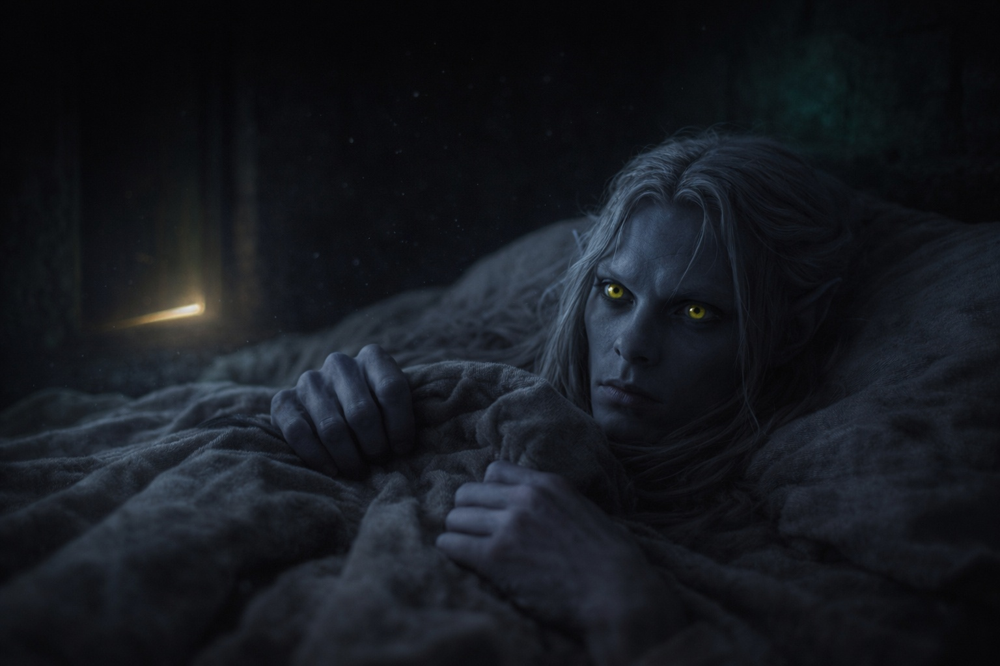

## Chapter 4 | Part 5
--- 

"No."

Drusniel stood by the desk, still chilled from the morning walk. He'd spent three days considering the map. He would give his answer before Zaelar could open it again.

"No to Wyrmreach?" Zaelar set down his tea without apparent concern. "Or no to the courier offer specifically?"

"Both. I'm not leaving. Not now." Drusniel kept his voice steady. "My family needs me here."

Zaelar studied him for a long moment.

"Of course." He inclined his head. "The offer stands. The crossing worsens after summer; if you reconsider, timing matters."

Then he reached for a text on his desk.

"Shall we continue? I have a new exercise for air sensing. More difficult than before."

Drusniel had expected another argument. He took the chair before Zaelar could change his mind.

"Let's continue," he said.

---

The walk back to Umbra'kor felt wrong.

At the bend where surface air usually gave way to the tunnels' stillness, a cool eddy touched the back of his neck.

He reached behind him with his air sense. The effort tightened his temples. Something disturbed the current beyond the bend, but he couldn't hold its shape.

*You're imagining things.*

He quickened his pace, keeping close to the wall so no one could pass on that side.

The guards' lamps appeared ahead.

He walked straight toward them. Only inside the gate did he turn to look back.

The tunnel behind him sat dark and empty.

---

Shyntara was waiting in the family quarters.

Her sword belt lay across a chair, leaving oil on the fabric. She turned from the window when he entered.

"Where do you go?"

He stopped in the doorway. "Training. I told you."

"At dawn? Until dusk?" She looked at the grit on his boots. "You haven't used our yard in months."

"I don't need the yard."

"You need a sparring partner. Unless you're training for something else."

"I failed." The words came out harder than he intended. "Everything is different."

"Your feet are quicker. Yesterday you turned before the kitchen door opened." She stepped closer. "Who's teaching you?"

Drusniel's pulse quickened. He kept his breathing steady, his expression neutral. Years of living in a house of assassins had taught him that much.

"I found other ways to train. Upper tunnels. The surface access points where it's quiet."

"Quiet doesn't account for the blood on your cuffs. What are you doing up there?"

"Finding out what I can still do." He kept his hands at his sides. "The temple won't teach me."

Shyntara looked at his sleeves again.

"Father has the Council to contend with. I have the patrols. Don't make me search the upper tunnels for you as well."

"Then stop noticing."

"I can't." Her voice dropped lower. "You're my brother. Whatever you've gotten yourself into—"

"I haven't gotten into anything."

"Then give me a name. Someone I can ask if you don't come back."

"I'll come back."

"You're not answering." She picked up her sword belt and left.

Drusniel stood alone in the common room, pulse loud in his ears.

When he looked toward the dark corridor, the watched feeling from the tunnel returned.

He went to his room and lay in darkness, waiting for the presence to return.

---

**End of Chapter 4.5 —> 5.1: [The House Rivalry: The Gathering Storm](/the-house-rivalry-the-gathering-storm/)**
