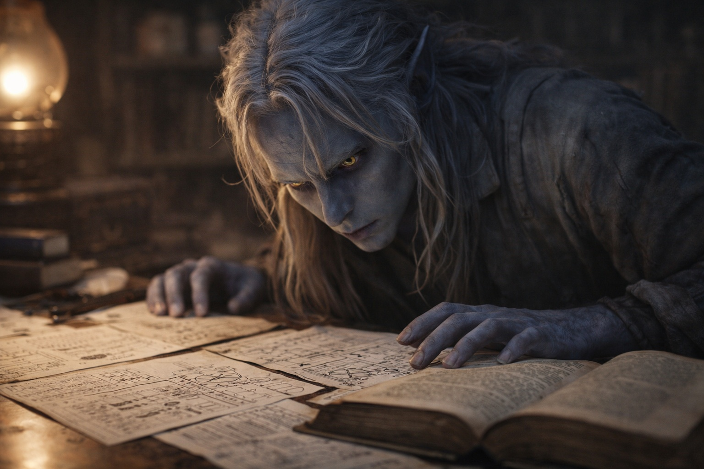

## Chapter 4 | Part 2
--- 

The library smelled of dust and something older: preservation oils, fungal treatments, the accumulated breath of centuries pressed between leather covers.

Drusniel ran his fingers along spines he couldn't read. Five months of training, and Zaelar had finally brought him here: a circular chamber at the tower's heart, lined floor to ceiling with texts that predated anything in Umbra'kor's archives.

"These predate Venemora's arrival." Zaelar stood by a reading table, arranging hourglasses with the methodical precision he brought to everything. "Before your people forgot what they could be."

"Forgot?"

"Venemora brought divine blessing. Structure. Order." He turned an hourglass, watching sand begin to fall. "She also brought narrowing. Before her, drow practiced elemental magic freely. Air, water, fire, earth—all paths open. After her arrival, only her blessing mattered. Everything else became heresy."

Drusniel pulled a volume from the nearest shelf. The binding cracked under his touch, pages brittle with age. Symbols covered the margins—some vaguely familiar, most completely alien.

"I can't read this."

"No. The old script died with the old ways." Zaelar crossed to him and took the book gently. "But I've spent decades translating what matters. The essential knowledge." He gestured toward a side table stacked with loose pages. "My notes. Everything I've learned about elemental affinity among the drow."

Drusniel moved to the table. The papers were organized with obsessive precision—diagrams, annotations, measurements and timelines. Each translation carried a small reference number in the upper corner.

Forty-six. Forty-seven. Forty-nine.

He checked again. Forty-eight was missing.

Drusniel said nothing.

"The last one with your particular affinity," Zaelar said quietly, "was named Velryn. Three centuries ago. Air and water both, like you."

"What happened to her?"

Zaelar's pause lasted a beat too long. "That's... complicated. She achieved great things. Changed the shape of the war between surface and underground. The records describe abilities most mages would consider impossible."

"And then?"

"Then she vanished." He set the old book aside. "The histories disagree on whether she died or simply... left. Her story is incomplete."

Drusniel filed that away.

When Zaelar crossed the room to return the old volume, Drusniel checked the index at the edge of the table. Reference forty-eight had been struck through once, lightly enough that the shelf mark remained.

He memorized it.

Later, while Zaelar searched the upper stacks for another translation, Drusniel followed the mark to a row of elemental theory. Forty-eight was folded inside the back cover of a volume filed under an obsolete sigil.

He opened it.

His own name.

*Drusniel Thel'varin—elemental potential confirmed—air dominant, water secondary—trial timeline viable—projected outcome: likely failure (pattern suggests recoverable)*

Dated three months before the Duskborn Trials.

His throat went dry. "What is this?"

Zaelar's attention shifted to the page in Drusniel's hands. His expression didn't change, but his stillness did. The kind of quiet that meant he was choosing his next words very carefully.

"My research notes. I told you I've been watching promising candidates for years."

"You knew about me." Drusniel's voice came out flatter than he intended. "Before the trial. You knew I would fail."

"I suspected you might fail. The elemental purity is too strong for Venemora's blessing to recognize. I've seen it before." Zaelar moved closer, his tone patient. "I was going to approach you afterward, regardless of outcome. Offer training. Help you understand what you actually are."

"Projected outcome." Drusniel held up the page. "That's not suspicion. That's prediction."

"I've studied this long enough to recognize patterns." Zaelar's hands folded behind his back. "The outcome I expected came to pass. That doesn't mean I caused it—only that certain affinities follow predictable trajectories."

Drusniel looked again at the date.

Prediction was not causation. It was still prediction.

"You're the first in generations with this combination," Zaelar continued, his voice softening. "Do you understand how valuable that makes you? Not to Venemora's system. Not to elders who measure worth by their narrow standards. To anyone who understands what elemental magic can truly become."

"Keep studying." Zaelar gestured toward the stacks. "I have preparations to make for tomorrow's lesson. You've earned access to this room, Drusniel. Use it."

He left. The door closed with a soft click.

Drusniel stood alone among the ancient texts, staring at his own name in Zaelar's handwriting.

The note predated the trial by three months.

He tucked the page into his sleeve and continued reading.

---

**End of Chapter 4.2 —> 4.3: [Forbidden Knowledge: The Warning Signs](/forbidden-knowledge-the-warning-signs/)**