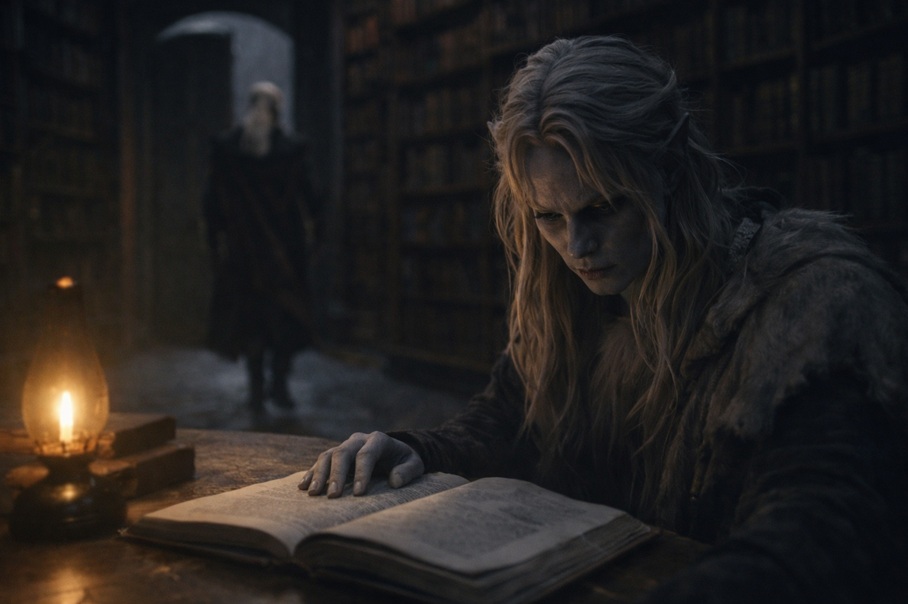

## Chapter 4 | Part 2
--- 

Preservation oil stained the cloth beneath the library's oldest books. Drusniel wiped a greasy thumb against his sleeve before touching the next spine.

Drusniel ran his fingers along spines he couldn't read. Five months of training, and Zaelar had finally brought him here: a circular chamber at the tower's heart, lined floor to ceiling with texts that predated anything in Umbra'kor's archives.

"These predate Venemora's arrival." Zaelar stood by a reading table, arranging hourglasses with the methodical precision he brought to everything. "Before your people forgot what they could be."

"Forgot?"

"Once, a drow could study the elements without answering to her priests." Zaelar turned an hourglass. "Now you have to come here in secret."

Drusniel pulled a volume from the nearest shelf. The binding cracked under his touch, pages brittle with age. Symbols covered the margins—some vaguely familiar, most completely alien.

"I can't read this."

"Start with my translations." Zaelar took the volume by its binding and set it on a support. "The originals will take longer. You can compare them as you learn the script."

Drusniel moved to the table. The papers were organized with obsessive precision—diagrams, annotations, measurements and timelines. Each translation carried a small reference number in the upper corner.

Forty-six. Forty-seven. Forty-nine.

He checked again. Forty-eight was missing.

Drusniel said nothing.

"The last drow I found with your combination was a woman named Velryn. Three centuries ago."

"What happened to her?"

"She fought in the war between surface and underground. These accounts describe what she could do."

"And then?"

"Then she vanished." He set the old book aside. "The histories disagree on whether she died or simply... left. Her story is incomplete."

Drusniel turned the page, looking for a date.

When Zaelar crossed the room to return the old volume, Drusniel checked the index at the edge of the table. Reference forty-eight had been struck through once, lightly enough that the shelf mark remained.

He memorized it.

Later, while Zaelar searched the upper stacks for another translation, Drusniel followed the mark to a row of elemental theory. Forty-eight was folded inside the back cover of a volume filed under an obsolete sigil.

He opened it.

His own name.

*Drusniel Thel'varin. Elemental potential confirmed: air dominant, water secondary. Trial date suitable. Expected outcome: failed connection; elemental training still viable.*

Dated three months before the Duskborn Trials.

His throat went dry. "What is this?"

Zaelar's mouth tightened. He reached for the page, then stopped short of taking it.

"My research notes. I told you I took an interest in the candidates."

"You knew about me." Drusniel's voice came out flatter than he intended. "Before the trial. You knew I would fail."

"I expected that result. I also knew you would still have something the trial hadn't measured."

"And you let me walk in without a warning."

"Would you have given up your place because an exile told you to?" Zaelar lowered his hand. "You wanted the trial. Now you want what comes after it."

Drusniel looked again at the date.

He would have gone anyway. That didn't explain why Zaelar had written *suitable* beside the date.

"Your affinity survived," Zaelar said. "That is what I can teach you to use."

"Keep studying." Zaelar gestured toward the stacks. "I have preparations to make for tomorrow's lesson. You've earned access to this room, Drusniel. Use it."

He left. The door closed with a soft click.

Drusniel stood alone among the ancient texts, staring at his own name in Zaelar's handwriting.

He copied the note onto a scrap of his own, including the date and reference number, and put the original back. Then he looked for the correspondence index.

---

**End of Chapter 4.2 —> 4.3: [Forbidden Knowledge: The Warning Signs](/forbidden-knowledge-the-warning-signs/)**
