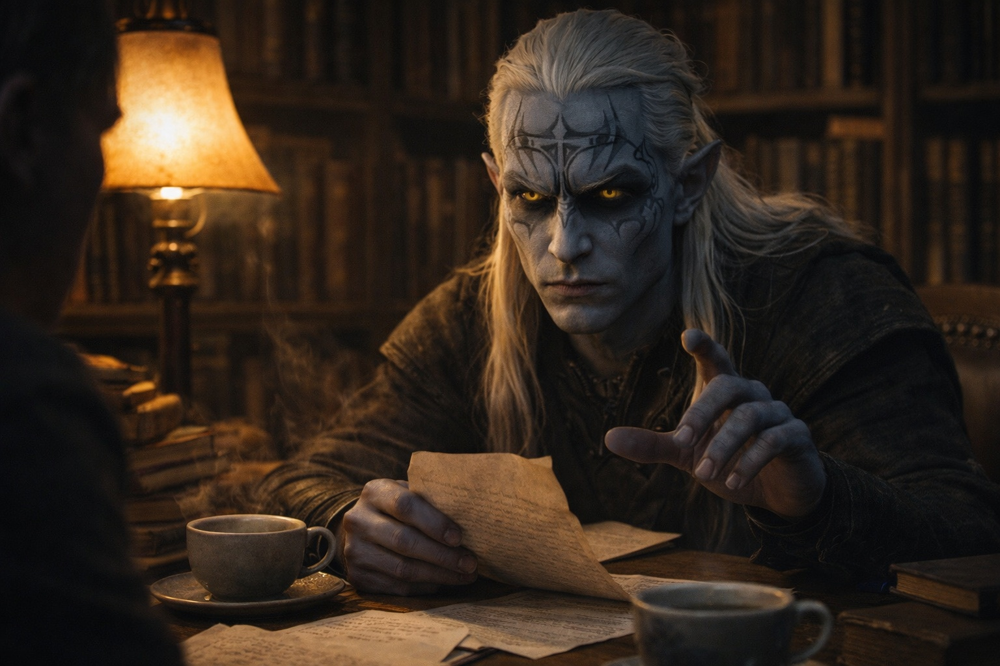

## Chapter 4 | Part 3
--- 

Two days later, Drusniel returned to the correspondence index. Its stiff pages rasped against his fingertips.

The research note had taught him how to follow Zaelar's shelf marks.

He found a cross-reference beside the date of his trial. The letter wasn't in the current file, but its older shelf mark remained in the margin.

It led to a volume of elemental theory. A folded sheet lay beneath the loose lining of its back cover.

The paper was newer than the book. The handwriting was Zaelar's.

*Candidate progressing as anticipated. Trial intervention produced expected result. Compromised-channel protocol stable. Acceleration remains viable.*

Drusniel read it twice.

*Trial intervention produced expected result.*

He copied the letter before returning the volume to its shelf. This time he kept the original on the table.

Zaelar returned an hour later, carrying two cups of tea.

"You've been productive." He set one cup on the reading table. "Find anything interesting?"

"Enough." Drusniel left the tea untouched and slid the letter across the table.

Zaelar's eyes moved to the paper.

"Where did you find that?"

"The index."

"Trial intervention produced expected result." Drusniel kept his voice level. "Your words."

Zaelar sat down. "Yes. An intervention. You were right that something was taken."

"Who took it?"

"The letter doesn't name anyone." He placed a finger beside the next line. "It records what followed."

"Compromised-channel protocol."

"The contact you've been relying on is compromised."

"And you waited until I found this to tell me."

"You have it now. Keep it."

Drusniel folded the letter once.

"Why would anyone manipulate me?"

"There are very few people with your affinities. Anyone who needed them would have reason to take an interest in you."

"I could leave," he said. "Stop coming here. Return to my family and forget any of this happened."

"You could." Zaelar's expression didn't change. "The power would remain. You'd have to discover its limits on your own, without guidance. And whoever sabotaged your trial would still be out there, still working whatever plan made you their target."

"Including you."

Zaelar left the letter where it lay.

"I won't stop you leaving. You know where the door is."

Drusniel looked toward the stairs. At home, he'd managed to turn a current from a lamp with no help from Zaelar. Beyond that he could give himself a headache and little else.

He folded the original around his copy, keeping the second sheet out of sight.

"I'll finish the lesson. And I'm taking the notes on the next exercise home."

Zaelar drew a notebook from beneath the translations.

"You'll find the method here. Check it against what I show you."

---

That night, the presence returned.

The contact came as he hid his copied notes beneath a loose drawer lining. He pushed the drawer shut. Even this brief reach made the day's headache return.

*Drus. You're troubled.*

*How much does Zaelar know about this connection?*

*He's been studying what happened to you.*

*I found a letter about my trial.* Drusniel kept his hand on the closed drawer. *It mentioned sabotage. Mental contact protocols.*

*Then you know why the messages may not always feel right.*

*Did you know before I went to him?*

*Don't trust him because I say so. Test what he teaches you.*

*I'm tired,* he sent. *I need to rest.*

*Rest, then. You've done enough today.*

The warmth withdrew.

He kept his attention on the empty room until he was sure the contact had ended. Only then did he open the drawer again.

He had told the voice about the letter. He hadn't mentioned the copy.

---

**End of Chapter 4.3 —> 4.4: [Forbidden Knowledge: The Distant Land](/forbidden-knowledge-the-distant-land/)**
