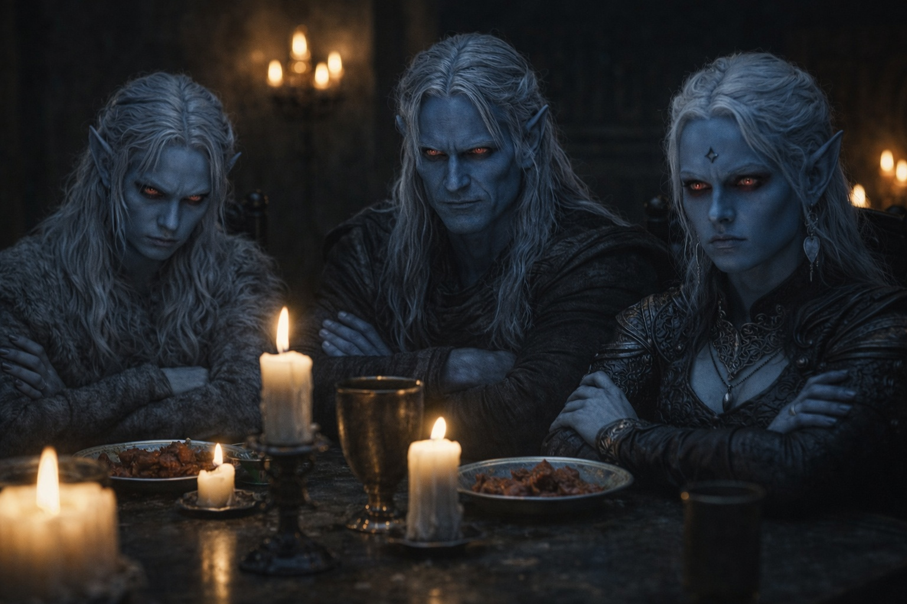

---
publication_order: 129
order: 129
title: Secrets and Shadows
date: 2024-04-30
language: en
chapter: 4
subchapter: 1
storyline: drusniel
canon_phase: main
canon_sequence: D-004-001
narrative_weight: medium
category: Umbra'kor
author: Drusniel
type: Main
tags: ['#secrets and shadows', '#drusniel', '#umbrakor']
thumbnail: image.jpg
featured: false
counterpart_path: site/content/posts/es/umbrakor/secretos-y-sombras/index.mdx
counterpart_title: Secretos y Sombras
---

## Chapter 4

---

*Two weeks before the Duskborn Trials.*

Drusniel slipped out of the family mansion before anyone stirred. The spore tunnels swallowed the sound of his footsteps. He took the long route, past the fungal farms, through the service passages nobody checked. Shyntara had been watching him more closely since their sparring match. His sister noticed everything, and she'd started noticing on a schedule.

The grove was their place. Hidden between root systems so dense that even the city's patrols avoided it. Annariel was already there, sitting cross-legged, a stolen scroll unrolled across his lap.

"You're late," Annariel said without looking up.

"Had to double back through the spore district." Drusniel sat across from him and looked at the scroll. The ink was faded, the margins cramped with annotations in a hand he didn't recognize. "Where did you get that?"

"Archive sub-level. The restricted section isn't locked, just roped off. Apparently nobody's opened that cabinet in decades." Annariel smoothed the edge with his thumb. "Listen to this: *'The adept who reaches without the temple's sanction will find the way harder but no less real. The connection exists independent of its naming.'*"

Drusniel leaned closer. The script was old Umbra'korian, dense and crabbed. "Independent of its naming. Meaning Venemora's blessing is just a name for something that already exists."

"That's one reading."

"What's the other?"

"That whoever wrote this was executed for heresy and the scroll survived by accident." Annariel rolled it up carefully. "But the point stands. What we've been doing in the grove, the reaching, the connection between us. This text says it's not impossible. Just unsanctioned."

Drusniel let that sit. Unsanctioned meant unofficial. Unofficial meant punishable. But the scroll described exactly what they'd been experiencing for months, written by someone centuries dead who'd found the same path on their own.

"We should try something different today," Drusniel said. "Not the numbers. Something bigger."

Annariel hesitated. Then he set the scroll aside and held out his hands.

They reached together. Not physically but with that strange inner sense they'd spent months training. Drusniel felt the familiar pressure at the edge of his awareness, the blurred shape of Annariel's thoughts. But today he pushed further. Deeper. Looking for the thread the scroll described.

Something shifted. For half a heartbeat, the space between their minds thinned. Drusniel could feel the texture of Annariel's concentration, the specific weight of his focus. Then it collapsed, and the grove was just a grove again.

They sat in the dim fungal light, breathing hard.

"Did you feel that?" Annariel whispered.

"Yes."

"That's not nothing, Drus."

"No," Drusniel agreed. His pulse was still hammering. "It's not."

---

They rested against a root system that curved overhead like a rib cage. The fungi above pulsed their dim light. Annariel turned the stolen scroll over in his hands, reading sections aloud, skipping others.

"Here's something." He kept his voice low even though they were alone. "A name. Zaelar."

Drusniel looked up. "The surface mage?"

"This text references him. Or someone with that name, centuries ago. A drow who practiced outside Venemora's blessing and wasn't destroyed by it." Annariel frowned at the cramped script. "The passage is damaged. But it says he proved something was possible. That the blessing isn't the only path to power."

"Or he's a cautionary tale. Exiled, living alone in a tower, with dungeons full of people who trusted him."

"Those are rumors."

"Rumors from people who went to see him and didn't come back."

Annariel pulled his knees up. "His power's real, though. Everyone agrees on that much. Whatever he did, however he did it, it worked."

Drusniel traced a crack in the root beside him. One long vein, splitting into two. "If the blessing isn't the only way, then the trials aren't the only test."

"One problem at a time." Annariel's voice had that careful steadiness that meant he was more worried than he sounded. "Pass the trials first. Then question everything."

Sound advice. Drusniel filed it away and ignored it completely.

---

That night at dinner, his father cut his meat with the same measured strokes he used to sharpen blades. Three cuts, each identical. He set down the knife, aligned it with the edge of his plate, and looked at Drusniel.

"You were seen near the lower archives today."

Drusniel's fork stopped. He hadn't been near the archives. Annariel had. But someone had reported movement in the restricted section, and his father's sources didn't distinguish between one young drow and another.

"I was in the spore district," Drusniel said. "Training routes."

"Through the restricted corridor?"

"The service passage connects. It's faster."

His father picked up the knife. Resumed cutting. Three strokes. Set the knife down. "The Thel'varin name appears in the trial records sixty-eight times. Forty-two of those are Shadowblade placements. Eleven are mage candidates." He paused. "The eleven all passed."

The implication hung over the table. Drusniel felt Shyntara watching from her end, her own plate untouched.

"I'll pass," Drusniel said.

"The question isn't whether you'll pass." His father's tone didn't shift. It never did. "The question is what you've been doing instead of preparing through proper channels."

"I've been preparing."

"With whom?"

Silence. Drusniel moved food around his plate. His father watched him do it.

"The Vrinn boy," his father said. Not a question. "Their second son. The one who shadows the archive halls."

"He's a friend."

His father aligned the knife again. "I have friends. They are men whose interests align with mine. When the interests shift, so do the friendships." He looked at Drusniel with no particular emotion. "How much does this boy know about our family's training methods?"

"Nothing. We just—"

"Then what exactly does he offer you?"

Drusniel couldn't answer that. Not honestly. Not here.

Shyntara set down her fork. The sound was small, precise, and it ended the conversation the way a blade ends an argument. Their father looked at her. She looked back. Something passed between them that Drusniel wasn't invited to read.

"Two weeks," Shyntara said. She wasn't looking at Drusniel. She was looking at their father. "Let him take the trial. If he passes, the question answers itself. If he fails, we reassign him to border detail and the Vrinn connection ends on its own."

Their father considered this for exactly four heartbeats. Then he picked up his knife and resumed eating.

Drusniel sat very still. He understood what had just happened. Shyntara had bought him two weeks by offering to clean up after him if it went wrong. Not out of kindness. Out of efficiency. A contained failure was better than an uncontrolled one.

Later, alone in his room, he traced the cracks in his ceiling. One long. Two branching. A third that disappeared behind a shelf.

The scroll Annariel had found described mages who reached without permission and found something real. His father described a world where every connection was transactional and every friendship temporary.

Both were probably right. The difference was which truth he was willing to live inside.

He was going to take the trial. And if the blessing didn't come, he was going to find out why.

**End of Chapter 4 — continues in Chapter 5.1: [The Separation](/the-trial-the-separation/)**
