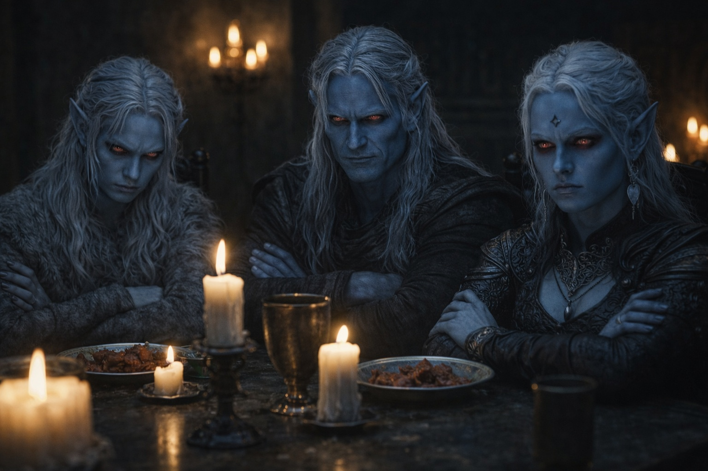

## Chapter 1 | Part 1
---

*Two weeks before the Duskborn Trials.*

Drusniel slipped out of the family mansion before anyone stirred. The spore tunnels swallowed the sound of his footsteps. He took the long route, past the fungal farms, through the service passages nobody checked. Shyntara had been watching him more closely for weeks. His sister noticed everything, and lately she'd started noticing on a schedule.

The grove was their place, hidden between root systems so dense that even the city's patrols avoided it. Drusniel ducked under a root and scraped damp bark against his collar. Annariel was already there, sitting cross-legged, a stolen scroll unrolled across his lap.

"You're late," Annariel said without looking up.

"Had to double back through the spore district." Drusniel sat across from him and looked at the scroll. The ink was faded, the margins cramped with annotations in a hand he didn't recognize. "Where did you get that?"

"Archive sub-level. The restricted section isn't locked, just roped off. Apparently nobody's opened that cabinet in decades." Annariel smoothed the edge with his thumb. "Listen to this: *'The adept who reaches without the temple's sanction will find the way harder but no less real. The connection exists independent of its naming.'*"

Drusniel leaned closer. The script was old Umbra'korian, dense and crabbed. "Independent of its naming. Meaning the temple doesn't create the connection. It only decides who may reach for it."

"That's one reading."

"What's the other?"

"That whoever wrote this was executed for heresy and the scroll survived by accident." Annariel rolled it up carefully. "But the point stands. What we've been doing in the grove, the reaching, the connection between us. This text says it's not impossible. Just unsanctioned."

The scroll described what they'd been attempting for months. Someone centuries dead had reached without permission too. Drusniel wondered whether the archive held anything else by the same hand.

"We should try something different today," Drusniel said. "Not the numbers. Something bigger."

Annariel hesitated. Then he set the scroll aside and held out his hands.

They reached together with the inner sense they'd spent months training. Drusniel felt the familiar pressure of Annariel's concentration and pushed beyond it, looking for the thread the scroll described.

For half a heartbeat, Drusniel felt where Annariel was directing his attention. Then the contact broke, leaving a pain behind his eyes that made him bend over his knees.

They sat in the dim fungal light, breathing hard.

"Did you feel that?" Annariel whispered.

"Yes."

"That was more than numbers, Drus."

"Yes." Drusniel waited for his breathing to settle. "We should write it down."

---

They rested against a root system that curved overhead like a rib cage. The fungi above pulsed their dim light. Annariel turned the stolen scroll over in his hands, reading sections aloud, skipping others.

"Here's something." He kept his voice low even though they were alone. "A name. Zaelar."

Drusniel looked up. "The surface mage?"

"This text references him. Or someone with that name, centuries ago. A drow who practiced beyond the temple's sanctioned rites and wasn't destroyed by it." Annariel frowned at the cramped script. "The passage is damaged. But it says he proved something was possible. That Venemora's connection isn't the only path to power."

"Or he's a cautionary tale. Exiled, living alone in a tower, with dungeons full of people who trusted him."

"Those are rumors."

"And the people who went to see him? Has anyone heard from them?"

Annariel pulled his knees up. "His power's real, though. Everyone agrees on that much. Whatever he did, however he did it, it worked."

Drusniel reached for the scroll. "If the blessing isn't the only way, then the trials aren't the only test."

"One problem at a time." Annariel's voice had that careful steadiness that meant he was more worried than he sounded. "Pass the trials first. Then question everything."

Sound advice. Drusniel filed it away and ignored it completely.

---

That night at dinner, his father cut his meat with the same measured strokes he used to sharpen blades. Three cuts, each identical. He set down the knife, aligned it with the edge of his plate, and looked at Drusniel.

"You were seen near the lower archives today."

Drusniel's fork stopped. He hadn't been near the archives. Annariel had. He kept his eyes on his plate.

"I was in the spore district," Drusniel said. "Training routes."

"Through the restricted corridor?"

"The service passage connects. It's faster."

His father picked up the knife. Resumed cutting. Three strokes. Set the knife down. "The Thel'varin name appears in the trial records sixty-eight times. Forty-two of those are Shadowblade placements. Eleven are mage candidates." He paused. "The eleven all passed."

Shyntara watched from the end of the table, her plate untouched.

"I'll pass," Drusniel said.

"The question isn't whether you'll pass." His father's tone didn't shift. It never did. "The question is what you've been doing instead of preparing through proper channels."

"I've been preparing."

"With whom?"

Silence. Drusniel moved food around his plate. His father watched him do it.

"The Vrinn boy," his father said. Not a question. "Their second son. The one who shadows the archive halls."

"He's a friend."

His father aligned the knife again. "Vrinn has disputed our mining rights for two generations. How much does this boy know about our training methods?"

"Nothing. We just—"

"Then what exactly does he offer you?"

Drusniel couldn't answer honestly here.

Shyntara set down her fork. Their father looked at her and waited.

"Two weeks," Shyntara said. She wasn't looking at Drusniel. She was looking at their father. "Let him take the trial. If he passes, the question answers itself. If he fails, we reassign him to border detail and the Vrinn connection ends on its own."

Their father cut another piece of meat before answering with a nod.

Shyntara had bought him two weeks. She resumed eating without looking at him.

Later, alone in his room, he copied the words he remembered from the scroll before they could slip away.

He was going to take the trial. And if the blessing didn't come, he was going to find out why.

**End of Chapter 1.1 —> 1.2: [Swords and Shadows](/swords-shadows/)**
