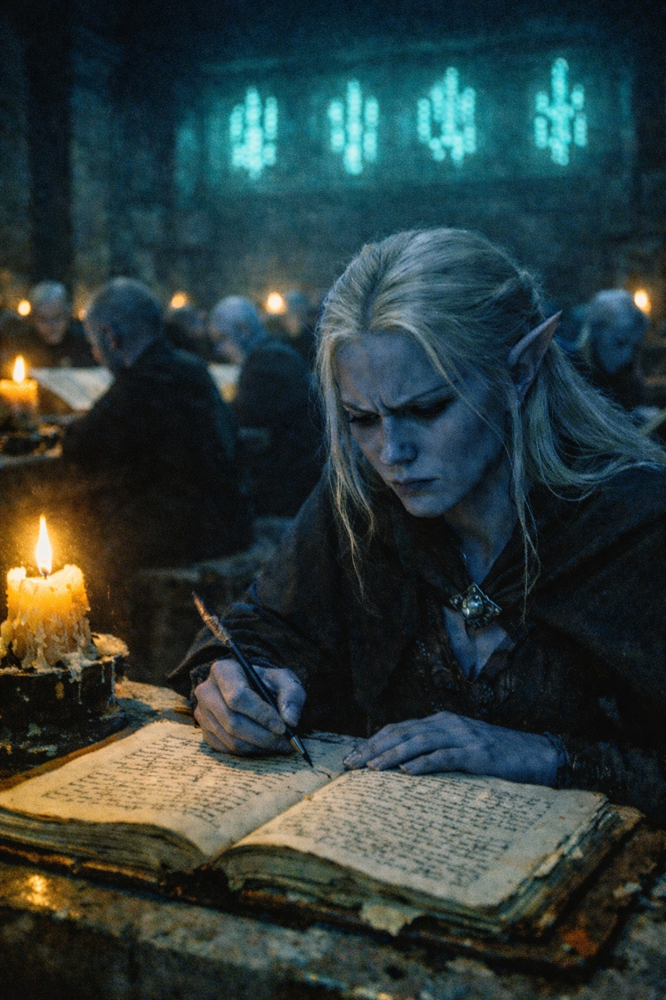
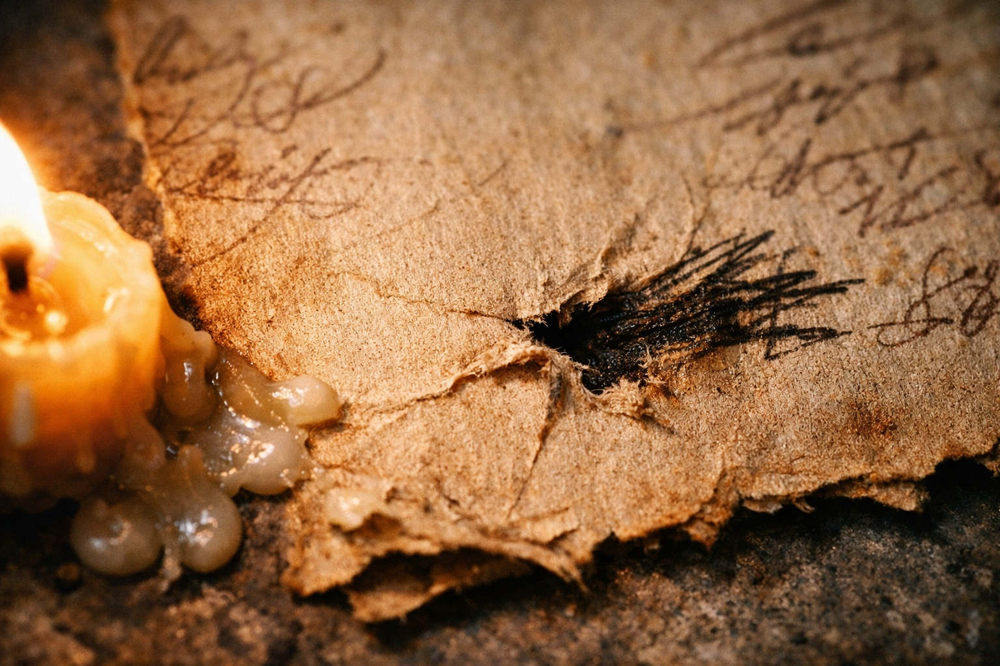
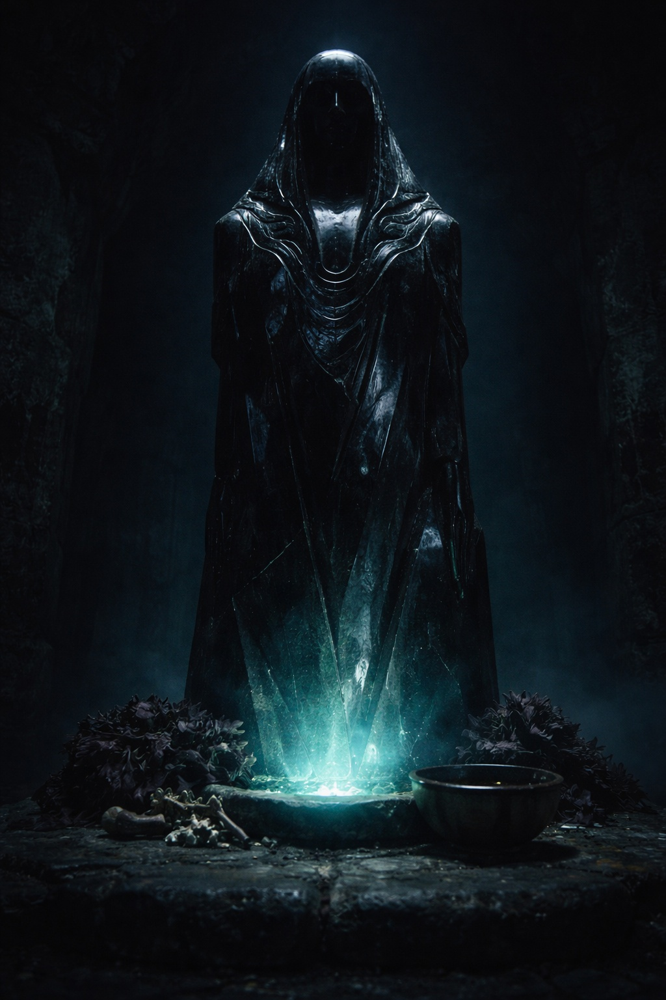
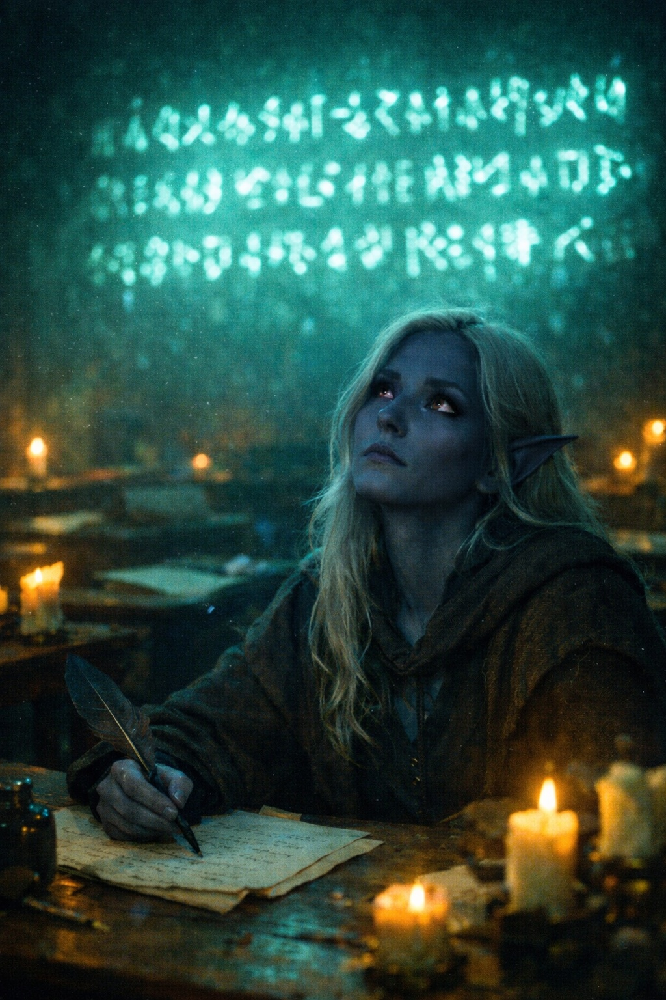

## Lore | The Umbra

---

The initiate's hand shook as she copied the passage.

Sylaera had spent six weeks copying census figures and debts between houses. This manuscript left brown flakes on the cloth beneath her hand. She slowed her pen to follow its cramped lettering.

*Some records place centuries between the first descent and the final abandonment of the surface. Others describe a departure within one generation. The dates cannot be reconciled with the house registers cited in either account.*

She paused. The marginalia in the original manuscript contained annotations from at least three different hands, their ink faded to different shades of brown.

*This contradicts the Temple account. (M.V.)*

*The Temple account is doctrine. Contradiction is heresy. (unsigned)*

*Then explain the surface artifacts in the Deepreach archives. (M.V.)*

The response to that final note had been scratched out. Deliberately, it seemed. The paper was torn where someone had pressed too hard.

---

> *"In darkness, we found power. Venemora gave it purpose."*

The proverb hung above the transcription chamber in letters of pale crystal. Sylaera had copied it at the head of every lesson. Now she searched for its wording in the manuscript and found no match.

The source texts didn't agree with each other. They barely agreed with themselves.

Some described Venemora as a goddess encountered in the depths. Others spoke of her as something the drow brought with them from the surface—a faith that adapted to darkness rather than originating from it. A third tradition, preserved only in fragments, suggested Venemora was neither goddess nor faith but a presence that had been waiting in the caverns long before the first drow descended.

The temple taught the first version. The others were filed in the restricted archives, available only to senior priestesses and their designated scribes.

Sylaera was a designated scribe. She wasn't sure anymore whether that was a privilege or a punishment.

---

> *"In the game of houses, you rise or you fall. There is no middle ground."*

Three houses had vanished from the census in the last decade. Sylaera had copied transfers of their surviving members into other households. Where a transfer was missing, the register left a blank beneath the words *dissolved by mutual consent*.

But the houses weren't her concern. The Rift was.

The patrol reports had crossed her desk by accident—misfiled among temple correspondence, addressed to a priestess who'd died two months previously. Sylaera should have forwarded them to the appropriate authority. Instead, she read them.

*Patrol Seven reports unusual emanations from the eastern boundary. Pattern does not match previous observations. Recommend increased monitoring.*

*Patrol Seven lost contact on day forty-three. Recovery team found equipment intact. No bodies recovered. No signs of combat. Recommend investigation.*

*Investigation postponed due to resource allocation. Patrol Seven listed as missing, presumed lost to environmental hazard.*

Three reports, each filed three months after the last. Sylaera checked the dates against an older patrol file. It, too, ended with a postponed investigation. She could not find the recovery team's testimony in either bundle.

---

Sylaera finished the transcription and returned the original to its shelf. Her hand had steadied, though she checked the shelf number twice before letting go of the manuscript.

The temple's circular called the Rift stable. It cited centuries of drow watchkeeping and renewed the same assurances for the coming year.

She had copied that assurance beside a request for another patrol. The request named the same boundary from which Patrol Seven had failed to return.

> *"No enemy hears a Shadowblade depart."*

The saying appeared on a training roll beneath the patrol file. Sylaera left a slip marking the place where the recovery testimony should have been.

She drew the next census sheet toward her. A name had been entered in the wrong column; she scraped it away and copied it again.

The temple bells rang the evening hour. In the transcription chamber, the phosphorescent letters continued to glow: *In darkness, we found power.*

She had reached the evening total when she noticed the patrol request was still addressed to the dead priestess.

**End of Lore 2 — continues in Prologue 1: [The Call to Zuraldi](/the-call-to-zuraldi/)**
